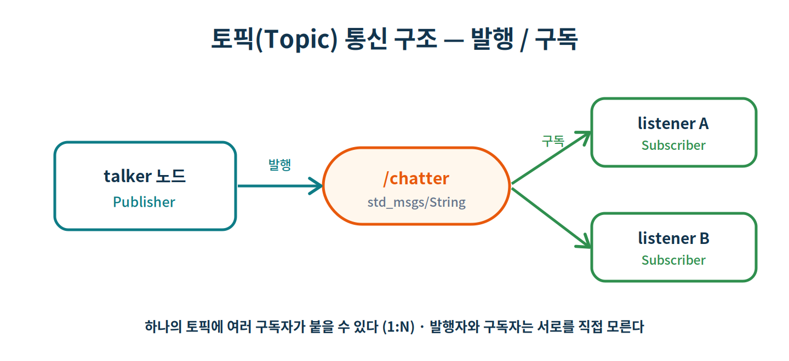
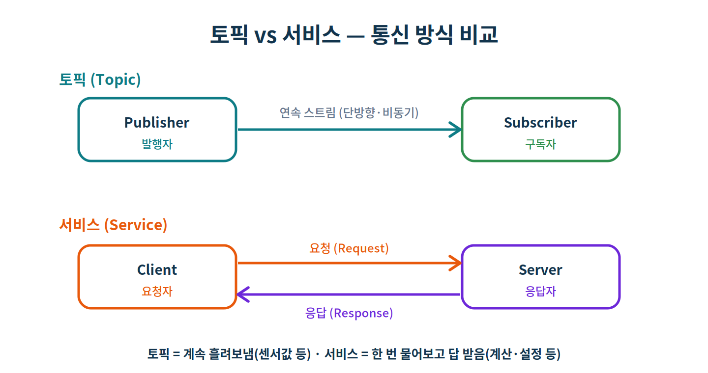
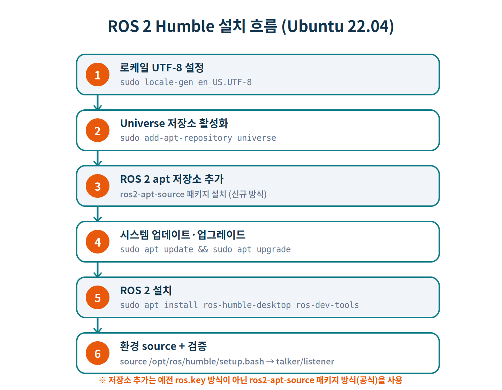
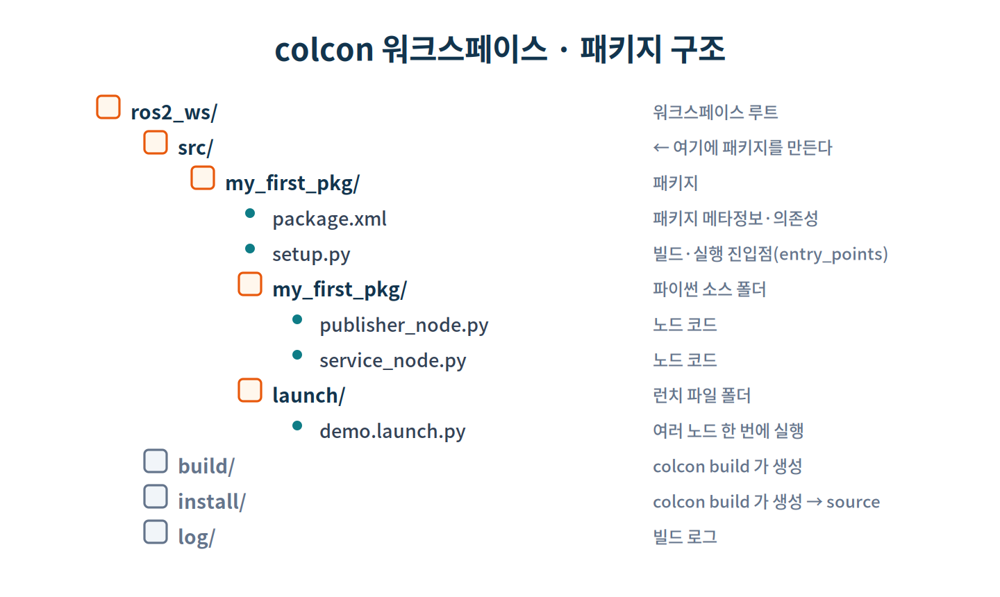
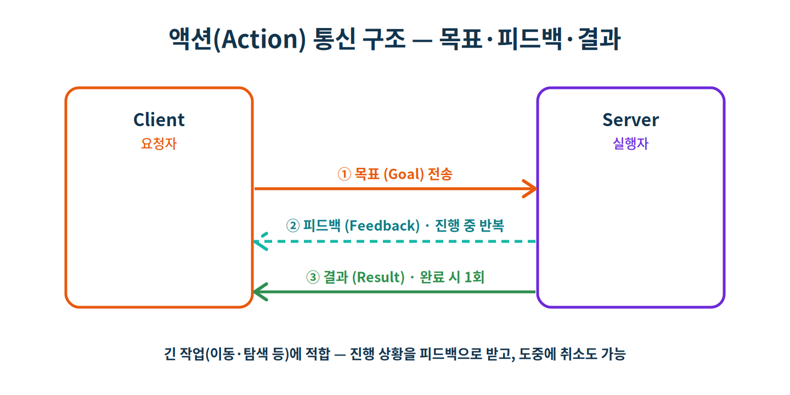

# Day 1 · ROS 2 기초 따라하기 — 노트북 단일 머신

> **과정** ROS2 + AI + 하드웨어 5일 과정 중 **1일차(9시간)**
> **환경** 노트북 1대 · Ubuntu 22.04 LTS (**새로 설치된 상태부터 시작**) · ROS 2 **Humble**
> **방식** 따라하기(hands-on) · **분량** 실습 1-0(설치) ~ 1-9
> **목표** 하드웨어 없이 노트북 한 대에서 ROS 2의 **핵심 개념(노드·토픽·서비스·파라미터·패키지·런치)** 을 손으로 익힌다.

이 문서는 ROS 2를 처음 접하는 수강생을 기준으로, **개념 설명 → 명령 실습 → 직접 코딩 → 결과 확인**의 순서를 한 단계도 건너뛰지 않고 진행합니다. 모든 명령은 노트북 한 대에서 실행되며, 2일차부터 라즈베리파이와의 분산 통신으로 확장됩니다.

> 〔노트북〕 이 문서의 모든 실습은 **노트북(단일 머신)** 에서 진행합니다. 별도 표시가 없으면 모두 같은 노트북의 다른 터미널 창입니다.

> ⚠️ `출력 ▶ (예시)` 블록의 카운터·시간·노드 ID·`hz` 측정값 등은 **실행할 때마다 달라지는 값**입니다. 값 자체보다 "어떤 형태로 나오는지"를 보세요.

---

## 목차

1. [먼저, ROS 2가 무엇인가요](#0-먼저-ros-2가-무엇인가요)
2. [실습 1-0 · Ubuntu 22.04에 ROS 2 Humble 설치](#실습-1-0--ubuntu-2204에-ros-2-humble-설치)
3. [실습 1-1 · 환경 점검 + turtlesim으로 노드·토픽 체감](#실습-1-1--환경-점검--turtlesim으로-노드토픽-체감)
4. [실습 1-2 · 직접 만드는 퍼블리셔 / 서브스크라이버](#실습-1-2--직접-만드는-퍼블리셔--서브스크라이버)
5. [실습 1-3 · 서비스(요청-응답)와 파라미터](#실습-1-3--서비스요청-응답와-파라미터)
6. [실습 1-4 · 패키지 만들기 + colcon 빌드 + 런치](#실습-1-4--패키지-만들기--colcon-빌드--런치)
7. [실습 1-5 · rqt와 CLI 진단 도구 + rosbag](#실습-1-5--rqt와-cli-진단-도구--rosbag)
8. [실습 1-6 · turtlesim 거북이 제어 (발행+구독 결합)](#실습-1-6--turtlesim-거북이-제어-발행구독-결합)
9. [실습 1-7 · 커스텀 메시지·서비스 정의](#실습-1-7--커스텀-메시지서비스-정의)
10. [실습 1-8 · 액션(Action) — 목표·피드백·결과](#실습-1-8--액션action--목표피드백결과)
11. [실습 1-9 · 런치 심화 — 인자·파라미터·리매핑](#실습-1-9--런치-심화--인자파라미터리매핑)
12. [과제](#과제)
13. [트러블슈팅](#트러블슈팅)
14. [최종 체크리스트](#최종-체크리스트)
15. [다음 시간 예고](#다음-시간-예고--day-2)
16. [한 장 요약](#-한-장-요약-복붙용)

---

# 0. 먼저, ROS 2가 무엇인가요

## 0-1. 왜 ROS가 필요한가

로봇 소프트웨어는 보통 여러 기능이 동시에 돌아갑니다. 카메라에서 영상을 받고, 거리 센서를 읽고, 모터를 돌리고, 그 와중에 사람의 명령도 처리해야 하죠. 이걸 하나의 거대한 프로그램으로 만들면 한 부분만 고쳐도 전체가 흔들리고, 기능을 재사용하기도 어렵습니다.

**ROS 2(Robot Operating System 2)** 는 이 문제를 "여러 개의 작은 프로그램이 메시지를 주고받으며 협력한다"는 방식으로 풉니다. 각 작은 프로그램을 **노드(node)** 라고 부르고, 노드끼리 데이터를 주고받는 통로를 **토픽(topic)** 이라고 합니다. 이름과 달리 ROS는 운영체제가 아니라, 로봇 프로그램을 이렇게 조립할 수 있게 해주는 **미들웨어 + 도구 모음**입니다.

## 0-2. 꼭 알아야 할 5가지 용어

| 용어 | 한 줄 정의 | 비유 |
|---|---|---|
| **노드 (Node)** | 하나의 일을 맡은 작은 프로그램 | 회사의 직원 한 명 |
| **토픽 (Topic)** | 노드들이 데이터를 흘려보내는 통로(이름표 달림) | 사내 방송 채널 |
| **메시지 (Message)** | 토픽으로 흐르는 데이터의 정해진 형식 | 정해진 양식의 문서 |
| **서비스 (Service)** | 한 노드가 다른 노드에 요청하고 답을 받는 1회성 통신 | 전화로 물어보고 답 듣기 |
| **파라미터 (Parameter)** | 노드의 동작을 바꾸는 설정값(실행 중 변경 가능) | 직원의 작업 지침서 |

## 0-3. 토픽은 어떻게 흐르나 (발행 / 구독)

토픽 통신의 핵심은 **발행(publish)** 과 **구독(subscribe)** 입니다. 데이터를 내보내는 노드를 **퍼블리셔**, 받아보는 노드를 **서브스크라이버**라고 합니다.



중요한 특징이 두 가지 있습니다. 첫째, **하나의 토픽에 여러 구독자가 붙을 수 있습니다(1:N)**. 둘째, **발행자와 구독자는 서로를 직접 알 필요가 없습니다.** `/chatter`라는 토픽 이름과 메시지 형식만 맞으면, 누가 보내고 누가 받는지는 신경 쓰지 않아도 연결됩니다. 이 "느슨한 연결"이 ROS의 유연함의 원천입니다.

> 💡 ROS 1과 달리 ROS 2에는 중앙 관리자(`roscore`)가 없습니다. 대신 **DDS**라는 통신 미들웨어가 같은 네트워크의 노드들을 자동으로 찾아 연결합니다. 그래서 2일차에 노트북과 라즈베리파이를 묶을 때도 별도 서버 없이 통신이 됩니다.

## 0-4. 토픽 vs 서비스 — 언제 무엇을 쓰나

토픽이 만능은 아닙니다. "센서 값을 계속 흘려보내는" 일에는 토픽이 맞지만, "두 수를 더해서 결과를 돌려줘" 같은 **요청-응답** 에는 **서비스**가 맞습니다.



| | 토픽 | 서비스 |
|---|---|---|
| 방향 | 단방향 (발행 → 구독) | 양방향 (요청 ↔ 응답) |
| 흐름 | 연속적 스트림 | 1회성 |
| 동기성 | 비동기 | 동기 (답을 기다림) |
| 적합한 일 | 센서값, 영상, 상태 방송 | 계산, 설정 변경, 동작 트리거 |

오늘은 토픽(1-2)과 서비스·파라미터(1-3)를 모두 직접 만들어 봅니다.

## 0-5. `ros2` 명령의 기본 구조

ROS 2의 거의 모든 작업은 터미널의 `ros2` 명령으로 합니다. 형태는 항상 `ros2 <기능> <세부명령>` 입니다.

```bash
ros2 run    <패키지> <실행파일>     # 노드 실행
ros2 node   list / info            # 노드 살펴보기
ros2 topic  list / echo / info / pub / hz   # 토픽 살펴보기·발행
ros2 service list / type / call    # 서비스 살펴보기·호출
ros2 param  list / get / set       # 파라미터 살펴보기·변경
ros2 interface show <메시지타입>    # 메시지/서비스 형식 확인
ros2 launch <패키지> <런치파일>     # 여러 노드 한 번에 실행
ros2 bag    record / play / info   # 데이터 녹화·재생
```

> ✅ **체크포인트 0**
> - [ ] 노드·토픽·메시지·서비스·파라미터의 뜻을 한 줄로 말할 수 있다
> - [ ] 토픽(연속·단방향)과 서비스(1회·양방향)의 차이를 안다
> - [ ] `ros2 <기능> <세부명령>` 구조를 이해했다

---

# 실습 1-0 · Ubuntu 22.04에 ROS 2 Humble 설치

**목표** 새로 설치된 Ubuntu 22.04 노트북에 ROS 2 Humble과 개발 도구를 설치하고, 데모 노드로 정상 동작을 확인한다.

전체 설치는 다음 6단계로 진행합니다.



> ⚠️ **저장소 추가 방식이 바뀌었습니다.** 예전 자료에 많이 나오는 `curl ... ros.key` 키링 방식은 더 이상 권장되지 않고, 키 만료 등으로 오류가 날 수 있습니다. 이 문서는 **현재 공식 방식인 `ros2-apt-source` 패키지**를 사용합니다.

> 〔노트북〕 모든 명령은 인터넷에 연결된 노트북의 터미널에서 실행합니다. 관리자 권한(`sudo`)이 필요하므로 비밀번호를 입력하게 됩니다.

## 1-0-1. 로케일(UTF-8) 설정

ROS 2 도구들은 UTF-8 로케일을 전제로 합니다. 로케일이 맞지 않으면 한글 로그가 깨지거나 일부 도구가 오작동할 수 있으니 가장 먼저 맞춰 둡니다.

```bash
$ locale          # 현재 로케일에 UTF-8이 있는지 확인
$ sudo apt update && sudo apt install -y locales
$ sudo locale-gen en_US en_US.UTF-8
$ sudo update-locale LC_ALL=en_US.UTF-8 LANG=en_US.UTF-8
$ export LANG=en_US.UTF-8
$ locale          # 다시 확인 — LANG, LC_* 에 UTF-8이 보이면 정상
```

```text
출력 ▶ (예시)
LANG=en_US.UTF-8
LC_CTYPE="en_US.UTF-8"
...
LC_ALL=en_US.UTF-8
```

> 💡 한글 메시지를 쓰고 싶다면 `ko_KR.UTF-8`을 추가로 생성해도 됩니다(`sudo locale-gen ko_KR.UTF-8`). 핵심은 **UTF-8**이라는 점입니다.

## 1-0-2. Universe 저장소 활성화

ROS 2가 필요로 하는 일부 의존 패키지는 Ubuntu의 **Universe** 저장소에 있습니다. 먼저 이를 활성화합니다.

```bash
$ sudo apt install -y software-properties-common
$ sudo add-apt-repository universe
```

```text
출력 ▶ (예시)
'universe' distribution component is already enabled for all sources.
```

이미 활성화돼 있으면 위와 같이 나오며, 그대로 다음으로 넘어가면 됩니다.

## 1-0-3. ROS 2 apt 저장소 추가 (ros2-apt-source)

이제 ROS 2 패키지를 받아올 저장소를 등록합니다. `ros2-apt-source` 패키지가 **저장소 GPG 키와 apt 소스 설정을 한 번에** 깔아 줍니다. 키가 갱신되면 이 패키지 업데이트로 자동 반영되므로, 예전 방식처럼 키 만료 오류를 겪지 않습니다.

```bash
# curl 설치
$ sudo apt update && sudo apt install -y curl

# 최신 ros2-apt-source 버전 번호 가져오기
$ export ROS_APT_SOURCE_VERSION=$(curl -s \
    https://api.github.com/repos/ros-infrastructure/ros-apt-source/releases/latest \
    | grep -F "tag_name" | awk -F'"' '{print $4}')

# 우분투 코드명에 맞는 deb 내려받기
$ curl -L -o /tmp/ros2-apt-source.deb \
    "https://github.com/ros-infrastructure/ros-apt-source/releases/download/${ROS_APT_SOURCE_VERSION}/ros2-apt-source_${ROS_APT_SOURCE_VERSION}.$(. /etc/os-release && echo ${UBUNTU_CODENAME:-${VERSION_CODENAME}})_all.deb"

# 설치 (저장소 + 키 등록 완료)
$ sudo dpkg -i /tmp/ros2-apt-source.deb
```

```text
출력 ▶ (예시)
Selecting previously unselected package ros2-apt-source.
Preparing to unpack /tmp/ros2-apt-source.deb ...
Unpacking ros2-apt-source (0.x.x) ...
Setting up ros2-apt-source (0.x.x) ...
```

> 💡 `${UBUNTU_CODENAME:-${VERSION_CODENAME}}` 부분이 Ubuntu 22.04의 코드명 `jammy`로 자동 치환됩니다. 즉 `jammy`용 deb가 받아집니다.

## 1-0-4. 시스템 업데이트·업그레이드

저장소를 새로 추가했으니 캐시를 갱신하고, **ROS 2를 설치하기 전에 시스템을 최신화**합니다.

```bash
$ sudo apt update
$ sudo apt upgrade -y
```

> ⚠️ 갓 설치한 Ubuntu에서는 이 `upgrade`를 **반드시 먼저** 실행하세요. `systemd`·`udev` 관련 패키지가 옛 버전인 상태로 ROS 2 의존성을 설치하면, 핵심 시스템 패키지가 제거되는 문제가 생길 수 있습니다.

## 1-0-5. ROS 2 Humble 설치

이제 본체를 설치합니다. 학습에 필요한 RViz2·turtlesim·데모·rqt 등을 모두 포함하는 **desktop** 버전과, `colcon` 등 빌드 도구를 포함하는 **dev-tools** 를 함께 설치합니다.

```bash
$ sudo apt install -y ros-humble-desktop
$ sudo apt install -y ros-dev-tools
```

- `ros-humble-desktop` — 핵심 라이브러리 + RViz2 + turtlesim + demo_nodes + rqt 등 (학습용으로 필수)
- `ros-dev-tools` — `colcon`, `rosdep` 등 개발/빌드 도구 (실습 1-4에서 사용)

> 💡 용량이 수백 MB라 네트워크 속도에 따라 몇 분~십수 분 걸립니다. 가벼운 `ros-humble-ros-base`도 있지만 GUI 도구(RViz·turtlesim)가 빠져 본 과정에는 맞지 않습니다.

## 1-0-6. 환경 설정(source)과 설치 검증

설치된 ROS 2를 터미널이 인식하려면 **setup 파일을 source** 해야 합니다. 매 새 터미널에서 필요하므로 `~/.bashrc`에 등록해 자동화합니다.

```bash
$ source /opt/ros/humble/setup.bash
$ echo "source /opt/ros/humble/setup.bash" >> ~/.bashrc
$ printenv ROS_DISTRO
```

```text
출력 ▶
humble
```

마지막으로 데모 노드로 실제 통신을 확인합니다. **터미널 두 개**를 엽니다(각 터미널은 위처럼 source되어 있어야 하며, `~/.bashrc`에 등록했다면 새 터미널은 자동 적용됩니다).

```bash
# 〔터미널 1〕 C++ 발행 노드
$ ros2 run demo_nodes_cpp talker
```

```text
출력 ▶ (예시)
[INFO] [talker]: Publishing: 'Hello World: 1'
[INFO] [talker]: Publishing: 'Hello World: 2'
...
```

```bash
# 〔터미널 2〕 파이썬 구독 노드
$ ros2 run demo_nodes_py listener
```

```text
출력 ▶ (예시)
[INFO] [listener]: I heard: [Hello World: 5]
[INFO] [listener]: I heard: [Hello World: 6]
...
```

터미널 1이 메시지를 발행하고 터미널 2가 그 메시지를 받아 출력하면 **C++·파이썬 양쪽 API가 모두 정상**이라는 뜻입니다. ROS 2 설치 성공입니다. (`Ctrl + C`로 두 노드를 종료합니다.)

> ✅ **체크포인트 1-0**
> - [ ] `locale`에 UTF-8 확인
> - [ ] Universe 저장소 활성화
> - [ ] `ros2-apt-source` 패키지 설치 (저장소·키 등록)
> - [ ] `apt upgrade` 후 `ros-humble-desktop`·`ros-dev-tools` 설치
> - [ ] `printenv ROS_DISTRO` → `humble`
> - [ ] `talker` / `listener` 데모 통신 확인

> 💡 이 설치 절차는 ROS 2 공식 문서(docs.ros.org)의 Ubuntu(deb) 설치 방법을 따릅니다. 강의 전 리허설 때 실제 노트북에서 한 번 끝까지 돌려 캡처해 두시길 권합니다.

---

# 실습 1-1 · 환경 점검 + turtlesim으로 노드·토픽 체감

**목표** ROS 2 환경이 제대로 잡혀 있는지 확인하고, 거북이 시뮬레이터(`turtlesim`)로 노드와 토픽이 실제로 어떻게 동작하는지 눈으로 본다.

## 1-1-1. 환경 점검

ROS 2 명령을 쓰려면 매 터미널에서 환경을 "source" 해야 합니다. 설치 시 `~/.bashrc`에 등록해 두었다면 새 터미널에서 자동으로 적용됩니다.

```bash
# 환경이 잡혀 있는지 확인
$ printenv ROS_DISTRO
```

```text
출력 ▶
humble
```

아무것도 안 나오면 아직 source가 안 된 것입니다. 다음을 실행하고 다시 확인하세요.

```bash
$ source /opt/ros/humble/setup.bash
$ printenv ROS_DISTRO
```

> 💡 매번 입력하기 번거로우면 한 번만 등록해 둡니다: `echo "source /opt/ros/humble/setup.bash" >> ~/.bashrc` 후 `source ~/.bashrc`.

## 1-1-2. turtlesim 실행

`turtlesim`은 ROS 학습용 거북이 시뮬레이터입니다. **터미널을 두 개** 엽니다.

```bash
# 〔터미널 1〕 거북이 창 띄우기
$ ros2 run turtlesim turtlesim_node
```

파란 창에 거북이 한 마리가 나타납니다. 이 창을 띄운 프로그램이 바로 **노드 하나**입니다.

```bash
# 〔터미널 2〕 키보드로 거북이 조종
$ ros2 run turtlesim turtle_teleop_key
```

터미널 2를 클릭해 포커스를 준 뒤 **방향키**를 누르면 거북이가 움직입니다. 즉, `turtle_teleop_key` 노드가 키 입력을 토픽으로 발행하고, `turtlesim_node`가 그 토픽을 구독해 거북이를 움직이는 구조입니다.

## 1-1-3. 노드와 토픽 들여다보기

**터미널 3**을 새로 열어 지금 떠 있는 노드와 토픽을 확인합니다.

```bash
# 〔터미널 3〕 현재 실행 중인 노드 목록
$ ros2 node list
```

```text
출력 ▶ (예시)
/turtlesim
/teleop_turtle
```

```bash
# 토픽 목록
$ ros2 topic list
```

```text
출력 ▶ (예시)
/parameter_events
/rosout
/turtle1/cmd_vel
/turtle1/color_sensor
/turtle1/pose
```

`/turtle1/cmd_vel`이 "거북이 속도 명령" 토픽입니다. 실제로 무엇이 흐르는지 들여다봅니다.

```bash
# 토픽에 흐르는 데이터를 실시간 출력 (거북이를 움직이는 동안)
$ ros2 topic echo /turtle1/cmd_vel
```

```text
출력 ▶ (예시)  — 방향키를 누를 때마다 출력됨
linear:
  x: 2.0
  y: 0.0
  z: 0.0
angular:
  x: 0.0
  y: 0.0
  z: 0.0
---
```

이 데이터의 **형식(메시지 타입)** 도 확인할 수 있습니다.

```bash
$ ros2 topic info /turtle1/cmd_vel
```

```text
출력 ▶ (예시)
Type: geometry_msgs/msg/Twist
Publisher count: 1
Subscription count: 1
```

```bash
# 그 메시지 타입이 어떤 필드로 구성되는지 보기
$ ros2 interface show geometry_msgs/msg/Twist
```

```text
출력 ▶ (예시)
Vector3 linear
    float64 x
    float64 y
    float64 z
Vector3 angular
    float64 x
    float64 y
    float64 z
```

## 1-1-4. 명령줄로 직접 토픽 발행하기

키보드 노드 없이도, 터미널에서 토픽에 직접 메시지를 쏠 수 있습니다.

```bash
# 거북이를 직진+회전 시키기 (1회 발행)
$ ros2 topic pub --once /turtle1/cmd_vel geometry_msgs/msg/Twist \
  "{linear: {x: 2.0}, angular: {z: 1.8}}"
```

거북이가 곡선을 그리며 움직이면 성공입니다. `--once` 대신 `--rate 1`을 쓰면 1초마다 반복 발행됩니다.

## 1-1-5. rqt_graph로 연결 보기

```bash
$ rqt_graph
```

GUI가 뜨면 좌측 상단 **새로고침(↻)** 을 누릅니다. `/teleop_turtle` → `/turtle1/cmd_vel` → `/turtlesim` 형태로 노드와 토픽의 연결이 그림으로 보입니다. 0-3에서 본 발행/구독 구조가 실제로 이렇게 동작하고 있던 것입니다.

> 💡 연결선이 안 보이면 ① 노드가 실행 중인지, ② ↻를 눌렀는지, ③ 좌측 상단 드롭다운이 `Nodes/Topics (all)`인지 확인하세요.

> ✅ **체크포인트 1-1**
> - [ ] `printenv ROS_DISTRO`가 `humble` 출력
> - [ ] turtlesim 거북이를 방향키로 조종 성공
> - [ ] `ros2 node list` / `ros2 topic list`로 노드·토픽 확인
> - [ ] `ros2 topic echo`로 흐르는 데이터 관찰
> - [ ] `ros2 topic pub`로 직접 거북이 움직이기 성공
> - [ ] `rqt_graph`로 연결 시각화

모든 터미널에서 `Ctrl + C`로 노드를 종료한 뒤 다음으로 넘어갑니다.

---

# 실습 1-2 · 직접 만드는 퍼블리셔 / 서브스크라이버

**목표** 남이 만든 노드를 실행만 하는 단계를 넘어, **내 손으로 발행 노드와 구독 노드를 작성**해 통신시킨다. 이번 실습은 패키지 빌드 없이 `python3 파일.py`로 바로 실행하는 **자기완결형** 방식으로 진행합니다(패키지/빌드는 1-4에서).

## 1-2-1. 작업 폴더 준비

```bash
$ mkdir -p ~/ros2_labs && cd ~/ros2_labs
```

## 1-2-2. 퍼블리셔 노드 작성

`~/ros2_labs/minimal_publisher.py` 파일을 만들고 아래를 입력합니다.

```python
#!/usr/bin/env python3
import rclpy
from rclpy.node import Node
from std_msgs.msg import String

class MinimalPublisher(Node):
    def __init__(self):
        super().__init__('minimal_publisher')          # 노드 이름
        self.pub = self.create_publisher(String, 'chatter', 10)
        self.count = 0
        self.timer = self.create_timer(1.0, self.on_timer)  # 1초마다 호출
        self.get_logger().info('minimal_publisher 시작')

    def on_timer(self):
        msg = String()
        msg.data = f'안녕 ROS2! 카운트={self.count}'
        self.pub.publish(msg)
        self.get_logger().info(f'발행: "{msg.data}"')
        self.count += 1

def main(args=None):
    rclpy.init(args=args)
    node = MinimalPublisher()
    try:
        rclpy.spin(node)
    except KeyboardInterrupt:
        pass
    finally:
        node.destroy_node()
        rclpy.shutdown()

if __name__ == '__main__':
    main()
```

**한 줄씩 뜯어보기**

- `import rclpy` — 파이썬용 ROS 2 클라이언트 라이브러리. 노드를 만들고 돌리는 핵심.
- `from rclpy.node import Node` — 모든 노드는 `Node` 클래스를 상속해 만든다.
- `super().__init__('minimal_publisher')` — 노드 이름을 정한다. `ros2 node list`에 이 이름이 뜬다.
- `create_publisher(String, 'chatter', 10)` — `chatter` 토픽에 `String` 메시지를 발행하는 퍼블리셔 생성. 마지막 `10`은 **큐 크기(QoS depth)** — 구독자가 잠깐 느려도 최근 10개를 버퍼링한다.
- `create_timer(1.0, self.on_timer)` — 1.0초마다 `on_timer`를 자동 호출한다.
- `on_timer` — 메시지를 만들어 `publish()`로 내보낸다.
- `rclpy.init()` → `rclpy.spin(node)` — ROS 2를 초기화하고, 노드를 "계속 살아 있게" 돌린다. `spin`은 타이머·콜백이 동작하도록 이벤트 루프를 돈다.
- `destroy_node()` / `shutdown()` — 종료 시 자원 정리.

## 1-2-3. 서브스크라이버 노드 작성

`~/ros2_labs/minimal_subscriber.py`

```python
#!/usr/bin/env python3
import rclpy
from rclpy.node import Node
from std_msgs.msg import String

class MinimalSubscriber(Node):
    def __init__(self):
        super().__init__('minimal_subscriber')
        self.sub = self.create_subscription(String, 'chatter', self.on_msg, 10)
        self.get_logger().info('minimal_subscriber 시작 — 수신 대기')

    def on_msg(self, msg):
        self.get_logger().info(f'수신: "{msg.data}"')

def main(args=None):
    rclpy.init(args=args)
    node = MinimalSubscriber()
    try:
        rclpy.spin(node)
    except KeyboardInterrupt:
        pass
    finally:
        node.destroy_node()
        rclpy.shutdown()

if __name__ == '__main__':
    main()
```

핵심 차이는 `create_subscription(String, 'chatter', self.on_msg, 10)` 한 줄입니다. **같은 토픽 이름(`chatter`)과 같은 메시지 타입(`String`)** 을 지정하고, 메시지가 올 때마다 `on_msg`가 호출됩니다. 퍼블리셔와 토픽 이름·타입이 다르면 연결되지 않으니 반드시 일치시켜야 합니다.

## 1-2-4. 실행

터미널을 두 개 엽니다(각 터미널은 ROS 2 환경이 source 되어 있어야 합니다).

```bash
# 〔터미널 1〕 발행
$ cd ~/ros2_labs && python3 minimal_publisher.py
```

```text
출력 ▶ (예시)
[INFO] [minimal_publisher]: minimal_publisher 시작
[INFO] [minimal_publisher]: 발행: "안녕 ROS2! 카운트=0"
[INFO] [minimal_publisher]: 발행: "안녕 ROS2! 카운트=1"
...
```

```bash
# 〔터미널 2〕 구독
$ cd ~/ros2_labs && python3 minimal_subscriber.py
```

```text
출력 ▶ (예시)
[INFO] [minimal_subscriber]: minimal_subscriber 시작 — 수신 대기
[INFO] [minimal_subscriber]: 수신: "안녕 ROS2! 카운트=5"
[INFO] [minimal_subscriber]: 수신: "안녕 ROS2! 카운트=6"
...
```

## 1-2-5. 외부 도구로 검증

세 번째 터미널에서, 내가 만든 노드와 토픽이 실제로 보이는지 확인합니다.

```bash
# 〔터미널 3〕
$ ros2 node list
$ ros2 topic list
$ ros2 topic echo /chatter
$ ros2 topic hz /chatter        # 발행 주기 측정 (약 1 Hz가 나와야 함)
```

```text
출력 ▶ (예시)  — ros2 topic hz /chatter
average rate: 1.001
  min: 0.999s max: 1.001s std dev: 0.0006s window: 2
```

> 💡 발행 주기를 바꾸려면 `create_timer(1.0, ...)`의 `1.0`을 `0.5`(2 Hz)나 `0.1`(10 Hz)로 바꾸고 다시 실행하세요. `ros2 topic hz`로 변화를 확인할 수 있습니다.

> ✅ **체크포인트 1-2**
> - [ ] 퍼블리셔/서브스크라이버 노드를 직접 작성해 통신 성공
> - [ ] 토픽 이름·타입이 일치해야 연결됨을 이해
> - [ ] `ros2 topic echo`로 내 토픽 데이터 확인
> - [ ] `ros2 topic hz`로 발행 주기 측정

---

# 실습 1-3 · 서비스(요청-응답)와 파라미터

**목표** 토픽과 다른 통신 방식인 **서비스**(요청하면 답을 주는)와, 노드의 동작을 실행 중에 바꾸는 **파라미터**를 직접 다룬다.

## 1-3-1. 서비스 개념 다시 보기

서비스는 **클라이언트가 요청(Request)을 보내면 서버가 응답(Response)을 돌려주는** 1회성·양방향 통신입니다. 여기서는 표준 인터페이스 `example_interfaces/srv/AddTwoInts`(정수 두 개를 받아 합을 돌려줌)를 사용합니다. 표준 인터페이스를 쓰면 별도 빌드 없이 바로 실습할 수 있습니다.

서비스 형식을 먼저 확인해 봅니다.

```bash
$ ros2 interface show example_interfaces/srv/AddTwoInts
```

```text
출력 ▶
int64 a
int64 b
---
int64 sum
```

`---` 위가 **요청(a, b)**, 아래가 **응답(sum)** 입니다.

## 1-3-2. 서비스 서버 작성

`~/ros2_labs/add_two_ints_server.py`

```python
#!/usr/bin/env python3
import rclpy
from rclpy.node import Node
from example_interfaces.srv import AddTwoInts

class AddServer(Node):
    def __init__(self):
        super().__init__('add_two_ints_server')
        self.srv = self.create_service(AddTwoInts, 'add_two_ints', self.add_two_ints_callback)
        self.get_logger().info('서비스 서버 준비: /add_two_ints')

    def add_two_ints_callback(self, request, response):
        response.sum = request.a + request.b
        self.get_logger().info(f'요청 a={request.a}, b={request.b} → 합={response.sum}')
        return response

def main(args=None):
    rclpy.init(args=args)
    node = AddServer()
    try:
        rclpy.spin(node)
    except KeyboardInterrupt:
        pass
    finally:
        node.destroy_node()
        rclpy.shutdown()

if __name__ == '__main__':
    main()
```

`create_service(AddTwoInts, 'add_two_ints', self.add_two_ints_callback)` 가 서비스 서버를 만듭니다. 요청이 들어오면 `add_two_ints_callback(request, response)`가 호출되고, `request.a + request.b`를 계산해 `response.sum`에 담아 **반드시 `return response`** 합니다.

> ⚠️ **콜백 메서드 이름을 `handle`로 짓지 마세요.** `handle`은 `rclpy`의 `Node`가 내부적으로 쓰는 예약된 속성이라, 같은 이름의 메서드를 정의하면 `Node.handle`을 덮어써 노드 생성 시 `with self.handle: AttributeError: __enter__` 오류가 납니다. `context`, `executor`, `clock` 등 `Node`의 다른 속성 이름도 콜백/변수 이름으로 피하세요.

## 1-3-3. 서버 실행 + 명령줄로 호출

```bash
# 〔터미널 1〕 서버 실행
$ python3 ~/ros2_labs/add_two_ints_server.py
```

```bash
# 〔터미널 2〕 명령줄에서 서비스 호출
$ ros2 service call /add_two_ints example_interfaces/srv/AddTwoInts "{a: 7, b: 5}"
```

```text
출력 ▶ (예시)  — 터미널 2
requester: making request: example_interfaces.srv.AddTwoInts_Request(a=7, b=5)
response:
example_interfaces.srv.AddTwoInts_Response(sum=12)
```

```text
출력 ▶ (예시)  — 터미널 1(서버)
[INFO] [add_two_ints_server]: 요청 a=7, b=5 → 합=12
```

## 1-3-4. 서비스 클라이언트 작성

명령줄 대신 코드로도 호출할 수 있습니다. `~/ros2_labs/add_two_ints_client.py`

```python
#!/usr/bin/env python3
import sys
import rclpy
from rclpy.node import Node
from example_interfaces.srv import AddTwoInts

class AddClient(Node):
    def __init__(self):
        super().__init__('add_two_ints_client')
        self.cli = self.create_client(AddTwoInts, 'add_two_ints')
        while not self.cli.wait_for_service(timeout_sec=1.0):
            self.get_logger().info('서비스 서버 기다리는 중...')

    def send(self, a, b):
        req = AddTwoInts.Request()
        req.a = a
        req.b = b
        return self.cli.call_async(req)

def main(args=None):
    rclpy.init(args=args)
    node = AddClient()
    a = int(sys.argv[1]) if len(sys.argv) > 1 else 3
    b = int(sys.argv[2]) if len(sys.argv) > 2 else 5
    future = node.send(a, b)
    rclpy.spin_until_future_complete(node, future)
    node.get_logger().info(f'결과: {a} + {b} = {future.result().sum}')
    node.destroy_node()
    rclpy.shutdown()

if __name__ == '__main__':
    main()
```

```bash
# 〔터미널 2〕 서버가 켜져 있는 상태에서
$ python3 ~/ros2_labs/add_two_ints_client.py 10 20
```

```text
출력 ▶ (예시)
[INFO] [add_two_ints_client]: 결과: 10 + 20 = 30
```

`wait_for_service()`로 서버가 뜰 때까지 기다리고, `call_async()`로 요청을 보낸 뒤 `spin_until_future_complete()`로 응답이 올 때까지 대기하는 흐름입니다.

## 1-3-5. 파라미터 다루기

파라미터는 노드의 **설정값**입니다. 코드를 고치지 않고도 실행 중에 값을 바꿀 수 있습니다. `~/ros2_labs/param_node.py`

```python
#!/usr/bin/env python3
import rclpy
from rclpy.node import Node

class ParamNode(Node):
    def __init__(self):
        super().__init__('param_node')
        self.declare_parameter('robot_name', 'turtle')   # 파라미터 선언 + 기본값
        self.declare_parameter('max_speed', 1.0)
        self.timer = self.create_timer(2.0, self.on_timer)

    def on_timer(self):
        name = self.get_parameter('robot_name').get_parameter_value().string_value
        speed = self.get_parameter('max_speed').get_parameter_value().double_value
        self.get_logger().info(f'robot_name={name}, max_speed={speed}')

def main(args=None):
    rclpy.init(args=args)
    node = ParamNode()
    try:
        rclpy.spin(node)
    except KeyboardInterrupt:
        pass
    finally:
        node.destroy_node()
        rclpy.shutdown()

if __name__ == '__main__':
    main()
```

```bash
# 〔터미널 1〕 실행
$ python3 ~/ros2_labs/param_node.py
```

```text
출력 ▶ (예시)
[INFO] [param_node]: robot_name=turtle, max_speed=1.0
[INFO] [param_node]: robot_name=turtle, max_speed=1.0
```

이제 **실행을 멈추지 않고** 다른 터미널에서 값을 바꿔봅니다.

```bash
# 〔터미널 2〕 현재 파라미터 목록과 값 확인
$ ros2 param list
$ ros2 param get /param_node max_speed
```

```text
출력 ▶ (예시)
Double value is: 1.0
```

```bash
# 〔터미널 2〕 값 변경
$ ros2 param set /param_node max_speed 2.5
$ ros2 param set /param_node robot_name "explorer"
```

터미널 1의 출력이 즉시 `robot_name=explorer, max_speed=2.5`로 바뀝니다. 코드 수정·재실행 없이 동작이 바뀐 것이 핵심입니다.

> 💡 실행할 때 한 번에 지정할 수도 있습니다: `ros2 run ... --ros-args -p max_speed:=3.0`. 2일차 이후 센서 임계값·모터 속도 한계를 이렇게 런타임에 조정합니다.

> ✅ **체크포인트 1-3**
> - [ ] `ros2 interface show`로 서비스의 요청/응답 형식 확인
> - [ ] 서비스 서버 작성 + `ros2 service call`로 호출 성공
> - [ ] 서비스 클라이언트 코드로 호출 성공
> - [ ] 파라미터를 `ros2 param set`으로 실행 중 변경하니 동작이 바뀜

---

# 실습 1-4 · 패키지 만들기 + colcon 빌드 + 런치

**목표** 지금까지 흩어진 스크립트를 **패키지(package)** 로 묶고, `colcon`으로 빌드해 `ros2 run`·`ros2 launch`로 깔끔하게 실행하는 표준 방식을 익힌다. 실무에서 ROS 2 코드는 항상 이 구조로 관리됩니다.

## 1-4-1. 워크스페이스와 패키지 구조

ROS 2 코드는 **워크스페이스(workspace)** 라는 폴더 안에서 관리합니다. 구조는 다음과 같습니다.



- `src/` 안에 패키지를 만들고,
- `colcon build`를 실행하면 `build/`·`install/`·`log/`가 자동 생성되며,
- `install/setup.bash`를 source하면 내 패키지의 노드를 `ros2 run`으로 실행할 수 있습니다.

## 1-4-2. 워크스페이스와 패키지 생성

```bash
# 워크스페이스 만들기
$ mkdir -p ~/ros2_ws/src
$ cd ~/ros2_ws/src

# 파이썬 패키지 생성 (의존성으로 rclpy, std_msgs 지정)
$ ros2 pkg create --build-type ament_python my_first_pkg --dependencies rclpy std_msgs
```

```text
출력 ▶ (예시)
going to create a new package
package name: my_first_pkg
...
creating ./my_first_pkg/my_first_pkg/__init__.py
creating ./my_first_pkg/setup.py
creating ./my_first_pkg/package.xml
```

## 1-4-3. 노드 파일 넣기

1-2에서 만든 노드를 패키지의 소스 폴더로 복사합니다(이름을 살짝 정리).

```bash
$ cp ~/ros2_labs/minimal_publisher.py  ~/ros2_ws/src/my_first_pkg/my_first_pkg/publisher_node.py
$ cp ~/ros2_labs/minimal_subscriber.py ~/ros2_ws/src/my_first_pkg/my_first_pkg/subscriber_node.py
```

## 1-4-4. `setup.py`에 실행 진입점 등록

`~/ros2_ws/src/my_first_pkg/setup.py`를 열어 `entry_points` 부분을 아래처럼 수정합니다. 이렇게 등록한 이름(`talker`, `listener`)이 `ros2 run`의 실행파일 이름이 됩니다.

```python
entry_points={
    'console_scripts': [
        'talker = my_first_pkg.publisher_node:main',
        'listener = my_first_pkg.subscriber_node:main',
    ],
},
```

`'talker = my_first_pkg.publisher_node:main'`은 "`talker`라는 명령으로 `publisher_node.py`의 `main()` 함수를 실행하라"는 뜻입니다.

## 1-4-5. 빌드와 실행

```bash
# 워크스페이스 루트에서 빌드 (반드시 src의 상위 폴더에서)
$ cd ~/ros2_ws
$ colcon build --packages-select my_first_pkg
```

```text
출력 ▶ (예시)
Starting >>> my_first_pkg
Finished <<< my_first_pkg [2.3s]
Summary: 1 package finished [2.5s]
```

빌드 결과를 환경에 반영합니다(**새 터미널마다 필요**).

```bash
$ source ~/ros2_ws/install/setup.bash
```

이제 패키지 노드를 표준 방식으로 실행합니다.

```bash
# 〔터미널 1〕
$ ros2 run my_first_pkg talker
```
```bash
# 〔터미널 2〕 (먼저 source ~/ros2_ws/install/setup.bash)
$ ros2 run my_first_pkg listener
```

1-2와 동일하게 통신되지만, 이제는 `python3 파일.py`가 아니라 패키지 기반 `ros2 run`으로 실행됩니다.

> ⚠️ `colcon build`는 반드시 **워크스페이스 루트(`~/ros2_ws`)** 에서 실행해야 합니다. `src` 안에서 돌리면 구조가 꼬입니다. 또 빌드 후에는 매 새 터미널에서 `install/setup.bash`를 source해야 노드가 보입니다.

## 1-4-6. 런치 파일로 여러 노드 한 번에

노드가 많아지면 하나씩 띄우기 번거롭습니다. **런치 파일**로 여러 노드를 한 번에 실행합니다.

```bash
$ mkdir -p ~/ros2_ws/src/my_first_pkg/launch
```

`~/ros2_ws/src/my_first_pkg/launch/demo.launch.py`

```python
from launch import LaunchDescription
from launch_ros.actions import Node

def generate_launch_description():
    return LaunchDescription([
        Node(
            package='my_first_pkg',
            executable='talker',
            name='minimal_publisher',
            output='screen',
        ),
        Node(
            package='my_first_pkg',
            executable='listener',
            name='minimal_subscriber',
            output='screen',
        ),
    ])
```

런치 파일이 설치되도록 `setup.py`를 수정합니다. **두 가지**를 빠뜨리지 마세요. ① 파일 **맨 위**에 `import os`와 `from glob import glob`을 추가하고, ② `setup()` 안의 `data_files`에 launch 줄을 추가합니다. 아래는 수정된 전체 `setup.py`입니다(`maintainer`·`description` 등은 본인 값 유지).

```python
import os                                    # ← ① 맨 위에 추가
from glob import glob                        # ← ① 맨 위에 추가
from setuptools import find_packages, setup

package_name = 'my_first_pkg'

setup(
    name=package_name,
    version='0.0.0',
    packages=find_packages(exclude=['test']),
    data_files=[
        ('share/ament_index/resource_index/packages',
            ['resource/' + package_name]),
        ('share/' + package_name, ['package.xml']),
        # ↓ ② launch 폴더 설치 줄 추가
        (os.path.join('share', package_name, 'launch'), glob('launch/*.launch.py')),
    ],
    install_requires=['setuptools'],
    zip_safe=True,
    maintainer='robot',
    maintainer_email='robot@todo.todo',
    description='TODO: Package description',
    license='TODO: License declaration',
    tests_require=['pytest'],
    entry_points={
        'console_scripts': [
            'talker = my_first_pkg.publisher_node:main',
            'listener = my_first_pkg.subscriber_node:main',
        ],
    },
)
```

> ⚠️ `data_files`에서 `os.path.join`·`glob`을 쓰므로 **맨 위 import 두 줄이 반드시 있어야** 합니다. 빠지면 빌드 시 `NameError: name 'os' is not defined` 오류가 납니다. (`packages=` 줄은 `find_packages(exclude=['test'])` 또는 `[package_name]` 둘 다 정상입니다.)

다시 빌드하고 실행합니다.

```bash
$ cd ~/ros2_ws
$ colcon build --packages-select my_first_pkg
$ source install/setup.bash
$ ros2 launch my_first_pkg demo.launch.py
```

```text
출력 ▶ (예시)
[INFO] [launch]: All log files can be found below ...
[talker-1] [INFO] [minimal_publisher]: 발행: "안녕 ROS2! 카운트=0"
[listener-2] [INFO] [minimal_subscriber]: 수신: "안녕 ROS2! 카운트=0"
...
```

발행 노드와 구독 노드가 **한 명령으로 함께** 떠서 통신하면 성공입니다.

> ✅ **체크포인트 1-4**
> - [ ] `ros2 pkg create`로 패키지 생성
> - [ ] `setup.py`의 `entry_points`에 실행파일 등록
> - [ ] `colcon build` 성공 + `install/setup.bash` source
> - [ ] `ros2 run my_first_pkg talker/listener` 실행
> - [ ] 런치 파일로 두 노드 동시 실행

---

# 실습 1-5 · rqt와 CLI 진단 도구 + rosbag

**목표** 노드를 만들고 실행하는 것을 넘어, **무엇이 잘못됐는지 들여다보고 데이터를 녹화·재생**하는 도구를 익힌다. 분산·AI 단계에서 디버깅의 기본기가 된다.

준비: `ros2 launch my_first_pkg demo.launch.py`(또는 1-2의 노드들)를 실행해 둔 상태에서 진행합니다.

## 1-5-1. rqt 도구 모음

```bash
# 노드-토픽 연결 그래프
$ rqt_graph

# 로그 메시지를 GUI로 모아 보기 (필터·검색 가능)
$ ros2 run rqt_console rqt_console
```

`rqt_console`은 모든 노드의 로그를 한 창에서 레벨(Info/Warn/Error)별로 필터링해 볼 수 있어, 에러 추적에 유용합니다.

## 1-5-2. 토픽 진단 CLI

```bash
$ ros2 topic hz /chatter      # 발행 주기(Hz)
$ ros2 topic bw /chatter      # 대역폭(데이터량)
$ ros2 topic info /chatter -v # 발행자/구독자 상세(QoS 포함)
```

```text
출력 ▶ (예시)  — ros2 topic bw /chatter
average: 28.00 B/s
   mean: 28.00 B/s min: 28.00 B/s max: 28.00 B/s window: 2
```

## 1-5-3. 환경 종합 점검

```bash
$ ros2 doctor          # 설치·환경 전반 점검
$ ros2 doctor --report # 더 자세한 리포트
```

```text
출력 ▶ (예시)
All 5 checks passed
```

## 1-5-4. rosbag으로 녹화·재생

`rosbag`은 토픽 데이터를 그대로 파일에 녹화했다가 나중에 똑같이 재생하는 도구입니다. 센서 데이터를 한 번 녹화해 두면, 하드웨어 없이도 같은 데이터로 반복 테스트할 수 있어 AI 단계에서 특히 유용합니다.

```bash
# 〔터미널 A〕 chatter 토픽을 녹화 (Ctrl+C로 종료)
$ cd ~/ros2_labs
$ ros2 bag record /chatter -o my_first_bag
```

```text
출력 ▶ (예시)
[INFO] [rosbag2_recorder]: Recording...
[INFO] [rosbag2_recorder]: Subscribed to topic '/chatter'
```

몇 초 녹화 후 `Ctrl+C`로 멈춥니다. 녹화 내용을 확인하고 재생합니다.

```bash
$ ros2 bag info my_first_bag
```

```text
출력 ▶ (예시)
Files:             my_first_bag/my_first_bag_0.db3
Duration:          8.0s
Messages:          8
Topic information: Topic: /chatter | Type: std_msgs/msg/String | Count: 8
```

```bash
# 퍼블리셔 없이도, 녹화된 데이터를 그대로 재생
$ ros2 bag play my_first_bag
```

다른 터미널에서 `ros2 topic echo /chatter`를 띄워 두면, 녹화 때와 똑같은 메시지가 다시 흐르는 것을 볼 수 있습니다.

> ✅ **체크포인트 1-5**
> - [ ] `rqt_console`로 로그 모아 보기
> - [ ] `ros2 topic hz / bw / info -v`로 토픽 진단
> - [ ] `ros2 doctor` 통과
> - [ ] `ros2 bag record` → `info` → `play`로 녹화·재생 성공

---

# 실습 1-6 · turtlesim 거북이 제어 (발행+구독 결합)

**목표** 따로 배운 발행(1-2)과 구독을 **한 노드에서 결합**해 거북이를 실제로 제어한다. 먼저 시간 기반(open-loop)으로 사각형을 그리고, 이어서 위치 피드백 기반(closed-loop)으로 목표 지점까지 이동시킨다. 이 "**보고 → 판단 → 명령**" 구조가 이후 하드웨어 로봇 제어의 핵심 패턴이다.

준비로 거북이를 띄워 둡니다.

```bash
# 〔터미널 1〕
$ ros2 run turtlesim turtlesim_node
```

## 1-6-1. (기본) 사각형 그리기 — open-loop

피드백 없이 **시간만으로** 직진과 회전을 번갈아 명령합니다. `~/ros2_labs/turtle_square.py`

```python
#!/usr/bin/env python3
import rclpy
from rclpy.node import Node
from geometry_msgs.msg import Twist

class TurtleSquare(Node):
    def __init__(self):
        super().__init__('turtle_square')
        self.pub = self.create_publisher(Twist, '/turtle1/cmd_vel', 10)
        self.phase = 0          # 0=직진, 1=회전
        self.sides = 0          # 그린 변 개수
        self.t = 0.0
        self.timer = self.create_timer(0.1, self.tick)
        self.get_logger().info('사각형 그리기 시작 (open-loop)')

    def tick(self):
        if self.sides >= 4:
            self.pub.publish(Twist())       # 정지
            self.get_logger().info('사각형 완료')
            self.timer.cancel()
            return
        cmd = Twist()
        self.t += 0.1
        if self.phase == 0:                 # 2초 직진
            cmd.linear.x = 2.0
            if self.t >= 2.0:
                self.t = 0.0
                self.phase = 1
        else:                                # 약 1.57초 회전(=90도, 1rad/s)
            cmd.angular.z = 1.0
            if self.t >= 1.5708:
                self.t = 0.0
                self.phase = 0
                self.sides += 1
        self.pub.publish(cmd)

def main(args=None):
    rclpy.init(args=args)
    node = TurtleSquare()
    try:
        rclpy.spin(node)
    except KeyboardInterrupt:
        pass
    finally:
        node.destroy_node()
        rclpy.shutdown()

if __name__ == '__main__':
    main()
```

```bash
# 〔터미널 2〕
$ python3 ~/ros2_labs/turtle_square.py
```

거북이가 사각형을 그립니다. 단, 시간만으로 제어하므로 **완벽한 정사각형은 아닙니다**(속도·지연에 따라 오차 누적). 이 한계가 다음 closed-loop의 필요성을 보여줍니다.

## 1-6-2. (심화) 목표 지점 이동 — closed-loop P 제어

이번엔 거북이의 **현재 위치를 구독**해(`/turtle1/pose`), 목표까지의 거리·각도를 계산하고 그에 비례해 명령합니다(P 제어). `~/ros2_labs/turtle_go_to_goal.py`

```python
#!/usr/bin/env python3
import math
import sys
import rclpy
from rclpy.node import Node
from geometry_msgs.msg import Twist
from turtlesim.msg import Pose

class GoToGoal(Node):
    def __init__(self, gx, gy):
        super().__init__('go_to_goal')
        self.gx = gx
        self.gy = gy
        self.pose = None
        self.pub = self.create_publisher(Twist, '/turtle1/cmd_vel', 10)
        self.sub = self.create_subscription(Pose, '/turtle1/pose', self.pose_callback, 10)
        self.timer = self.create_timer(0.1, self.control_loop)
        self.get_logger().info(f'목표 지점: ({gx}, {gy})')

    def pose_callback(self, msg):
        self.pose = msg

    def control_loop(self):
        if self.pose is None:
            return
        dx = self.gx - self.pose.x
        dy = self.gy - self.pose.y
        distance = math.sqrt(dx * dx + dy * dy)
        if distance < 0.1:
            self.pub.publish(Twist())       # 정지
            self.get_logger().info('목표 도착!')
            self.timer.cancel()
            return
        cmd = Twist()
        target_angle = math.atan2(dy, dx)
        angle_error = target_angle - self.pose.theta
        angle_error = math.atan2(math.sin(angle_error), math.cos(angle_error))  # -pi~pi 정규화
        cmd.linear.x = 1.5 * distance        # 거리에 비례한 전진 속도 (P 제어)
        cmd.angular.z = 4.0 * angle_error    # 각도 오차에 비례한 회전
        self.pub.publish(cmd)

def main(args=None):
    rclpy.init(args=args)
    gx = float(sys.argv[1]) if len(sys.argv) > 1 else 8.0
    gy = float(sys.argv[2]) if len(sys.argv) > 2 else 8.0
    node = GoToGoal(gx, gy)
    try:
        rclpy.spin(node)
    except KeyboardInterrupt:
        pass
    finally:
        node.destroy_node()
        rclpy.shutdown()

if __name__ == '__main__':
    main()
```

```bash
# 〔터미널 2〕 목표 좌표를 인자로 (거북이 좌표계는 0~11)
$ python3 ~/ros2_labs/turtle_go_to_goal.py 8 8
```

```text
출력 ▶ (예시)
[INFO] [go_to_goal]: 목표 지점: (8.0, 8.0)
[INFO] [go_to_goal]: 목표 도착!
```

거북이가 목표 지점으로 곧장 이동해 멈춥니다. open-loop와 달리 **매 순간 실제 위치를 보고 보정**하므로 정확합니다. 이 구조(센서 구독 → 오차 계산 → 명령 발행)가 3~4일차 모터·센서 폐루프 제어의 토대입니다.

> 💡 `cmd.linear.x = 1.5 * distance`의 `1.5`가 비례 게인(P gain)입니다. 키우면 빨라지지만 너무 크면 목표를 지나쳐 흔들립니다(오버슈트). 값을 바꿔가며 거북이 움직임을 관찰해 보세요.

> ✅ **체크포인트 1-6**
> - [ ] 사각형(open-loop)을 그리고, 오차가 누적됨을 관찰
> - [ ] 위치 구독 + P 제어로 목표 지점 도착(closed-loop)
> - [ ] 한 노드가 **발행과 구독을 동시에** 하는 구조 이해
> - [ ] P 게인을 바꿔 거북이 반응 변화 확인

---

# 실습 1-7 · 커스텀 메시지·서비스 정의

**목표** 표준 메시지(`std_msgs` 등)로 부족할 때, **내 데이터에 맞는 메시지/서비스를 직접 정의**한다. 인터페이스 생성은 빌드가 필요하므로 **`ament_cmake` 인터페이스 패키지**로 만든다(파이썬 패키지는 인터페이스를 생성하지 못함).

## 1-7-1. 인터페이스 패키지 생성

```bash
$ cd ~/ros2_ws/src
$ ros2 pkg create --build-type ament_cmake my_interfaces
$ cd my_interfaces
$ mkdir msg srv
```

## 1-7-2. 메시지·서비스 파일 작성

`~/ros2_ws/src/my_interfaces/msg/RobotStatus.msg`

```text
string name
float64 battery
bool is_moving
```

`~/ros2_ws/src/my_interfaces/srv/SetSpeed.srv` (서비스는 `---` 위가 요청, 아래가 응답)

```text
float64 speed
---
bool success
string message
```

## 1-7-3. CMakeLists.txt 수정

`~/ros2_ws/src/my_interfaces/CMakeLists.txt`를 열어 아래처럼 만듭니다(인터페이스 패키지의 최소 형태).

```cmake
cmake_minimum_required(VERSION 3.8)
project(my_interfaces)

find_package(ament_cmake REQUIRED)
find_package(rosidl_default_generators REQUIRED)

rosidl_generate_interfaces(${PROJECT_NAME}
  "msg/RobotStatus.msg"
  "srv/SetSpeed.srv"
)

ament_package()
```

## 1-7-4. package.xml 수정

`<package>` 안에 아래 세 줄을 추가합니다(인터페이스 생성에 필요한 의존성과 그룹 선언).

```xml
<buildtool_depend>rosidl_default_generators</buildtool_depend>
<exec_depend>rosidl_default_runtime</exec_depend>
<member_of_group>rosidl_interface_packages</member_of_group>
```

## 1-7-5. 빌드 및 확인

```bash
$ cd ~/ros2_ws
$ colcon build --packages-select my_interfaces
$ source install/setup.bash
$ ros2 interface show my_interfaces/msg/RobotStatus
```

```text
출력 ▶ (예시)
string name
float64 battery
bool is_moving
```

## 1-7-6. 파이썬 노드에서 사용

내가 만든 메시지로 발행하는 노드입니다. `~/ros2_labs/status_publisher.py`

```python
#!/usr/bin/env python3
import rclpy
from rclpy.node import Node
from my_interfaces.msg import RobotStatus

class StatusPublisher(Node):
    def __init__(self):
        super().__init__('status_publisher')
        self.pub = self.create_publisher(RobotStatus, 'robot_status', 10)
        self.timer = self.create_timer(1.0, self.tick)
        self.battery = 100.0

    def tick(self):
        msg = RobotStatus()
        msg.name = 'turtle'
        msg.battery = self.battery
        msg.is_moving = self.battery > 50.0
        self.pub.publish(msg)
        self.get_logger().info(
            f'발행: name={msg.name}, battery={msg.battery:.1f}, moving={msg.is_moving}')
        self.battery -= 5.0
        if self.battery < 0.0:
            self.battery = 100.0

def main(args=None):
    rclpy.init(args=args)
    node = StatusPublisher()
    try:
        rclpy.spin(node)
    except KeyboardInterrupt:
        pass
    finally:
        node.destroy_node()
        rclpy.shutdown()

if __name__ == '__main__':
    main()
```

```bash
# my_interfaces 가 보이도록 먼저 source 한 터미널에서
$ source ~/ros2_ws/install/setup.bash
$ python3 ~/ros2_labs/status_publisher.py
```

```bash
# 다른 터미널에서 확인 (역시 source 후)
$ ros2 topic echo /robot_status
```

```text
출력 ▶ (예시)
name: turtle
battery: 100.0
is_moving: true
---
```

> ⚠️ 커스텀 인터페이스를 파이썬에서 import 하려면, 그 패키지(`my_interfaces`)를 **빌드한 뒤 `install/setup.bash`를 source** 해야 합니다. `ModuleNotFoundError: my_interfaces`가 나면 빌드 또는 source를 빠뜨린 것입니다.

> ✅ **체크포인트 1-7**
> - [ ] `ament_cmake` 인터페이스 패키지 생성
> - [ ] `.msg`·`.srv` 작성 + CMakeLists·package.xml 수정
> - [ ] 빌드 후 `ros2 interface show`로 확인
> - [ ] 파이썬 노드에서 커스텀 메시지 발행·구독

---

# 실습 1-8 · 액션(Action) — 목표·피드백·결과

**목표** 통신 3종의 마지막인 **액션**을 익힌다. 토픽(연속 스트림)·서비스(1회 요청-응답)와 달리, 액션은 **오래 걸리는 작업**에 쓴다. 목표를 보내면 → 진행 상황을 **피드백**으로 받고 → 끝나면 **결과**를 받으며, 도중에 **취소**도 가능하다.



여기서는 빌드 없이 쓸 수 있는 표준 액션 `Fibonacci`(차수를 주면 피보나치 수열을 단계별로 계산)를 사용합니다.

> 💡 만약 `action_tutorials_interfaces`가 없다면 설치하세요: `sudo apt install -y ros-humble-action-tutorials-interfaces`

## 1-8-1. 액션 정의 확인

```bash
$ ros2 interface show action_tutorials_interfaces/action/Fibonacci
```

```text
출력 ▶
int32 order          # 목표(Goal): 몇 번째까지
---
int32[] sequence     # 결과(Result): 완성된 수열
---
int32[] partial_sequence   # 피드백(Feedback): 진행 중 수열
```

`---`로 **목표 / 결과 / 피드백** 세 부분이 구분됩니다.

## 1-8-2. 액션 서버 작성

`~/ros2_labs/fibonacci_action_server.py`

```python
#!/usr/bin/env python3
import time
import rclpy
from rclpy.node import Node
from rclpy.action import ActionServer
from action_tutorials_interfaces.action import Fibonacci

class FibonacciServer(Node):
    def __init__(self):
        super().__init__('fibonacci_server')
        self.action_server = ActionServer(
            self, Fibonacci, 'fibonacci', self.execute_callback)
        self.get_logger().info('피보나치 액션 서버 준비: /fibonacci')

    def execute_callback(self, goal_handle):
        order = goal_handle.request.order
        self.get_logger().info(f'목표 수신: order={order}')
        feedback = Fibonacci.Feedback()
        feedback.partial_sequence = [0, 1]
        for i in range(1, order):
            feedback.partial_sequence.append(
                feedback.partial_sequence[i] + feedback.partial_sequence[i - 1])
            self.get_logger().info(f'피드백: {feedback.partial_sequence}')
            goal_handle.publish_feedback(feedback)   # 진행 상황 전송
            time.sleep(0.5)
        goal_handle.succeed()                         # 목표 성공 처리
        result = Fibonacci.Result()
        result.sequence = feedback.partial_sequence
        self.get_logger().info(f'결과 반환: {result.sequence}')
        return result

def main(args=None):
    rclpy.init(args=args)
    node = FibonacciServer()
    try:
        rclpy.spin(node)
    except KeyboardInterrupt:
        pass
    finally:
        node.destroy_node()
        rclpy.shutdown()

if __name__ == '__main__':
    main()
```

`ActionServer(self, Fibonacci, 'fibonacci', self.execute_callback)`로 서버를 만들고, 목표가 오면 `execute_callback`이 실행됩니다. 루프를 돌며 `publish_feedback()`으로 진행 상황을 보내고, 끝나면 `succeed()` 후 결과를 반환합니다.

## 1-8-3. 액션 클라이언트 작성

`~/ros2_labs/fibonacci_action_client.py`

```python
#!/usr/bin/env python3
import sys
import rclpy
from rclpy.node import Node
from rclpy.action import ActionClient
from action_tutorials_interfaces.action import Fibonacci

class FibonacciClient(Node):
    def __init__(self):
        super().__init__('fibonacci_client')
        self.action_client = ActionClient(self, Fibonacci, 'fibonacci')

    def send_goal(self, order):
        goal = Fibonacci.Goal()
        goal.order = order
        self.action_client.wait_for_server()
        self.get_logger().info(f'목표 전송: order={order}')
        future = self.action_client.send_goal_async(
            goal, feedback_callback=self.feedback_callback)
        future.add_done_callback(self.goal_response_callback)

    def feedback_callback(self, feedback_msg):
        self.get_logger().info(f'피드백 수신: {feedback_msg.feedback.partial_sequence}')

    def goal_response_callback(self, future):
        goal_handle = future.result()
        if not goal_handle.accepted:
            self.get_logger().info('목표 거부됨')
            rclpy.shutdown()
            return
        self.get_logger().info('목표 수락됨')
        result_future = goal_handle.get_result_async()
        result_future.add_done_callback(self.result_callback)

    def result_callback(self, future):
        result = future.result().result
        self.get_logger().info(f'최종 결과: {result.sequence}')
        rclpy.shutdown()

def main(args=None):
    rclpy.init(args=args)
    node = FibonacciClient()
    order = int(sys.argv[1]) if len(sys.argv) > 1 else 8
    node.send_goal(order)
    rclpy.spin(node)

if __name__ == '__main__':
    main()
```

## 1-8-4. 실행

```bash
# 〔터미널 1〕 서버
$ python3 ~/ros2_labs/fibonacci_action_server.py
```
```bash
# 〔터미널 2〕 클라이언트 (8번째까지)
$ python3 ~/ros2_labs/fibonacci_action_client.py 8
```

```text
출력 ▶ (예시)  — 〔터미널 2〕
[INFO] [fibonacci_client]: 목표 전송: order=8
[INFO] [fibonacci_client]: 목표 수락됨
[INFO] [fibonacci_client]: 피드백 수신: [0, 1, 1]
[INFO] [fibonacci_client]: 피드백 수신: [0, 1, 1, 2]
...
[INFO] [fibonacci_client]: 최종 결과: [0, 1, 1, 2, 3, 5, 8, 13, 21]
```

명령줄에서 직접 호출할 수도 있습니다(피드백까지 보기).

```bash
$ ros2 action send_goal /fibonacci action_tutorials_interfaces/action/Fibonacci "{order: 8}" --feedback
```

> ✅ **체크포인트 1-8**
> - [ ] `ros2 interface show`로 액션의 목표/결과/피드백 구조 확인
> - [ ] 액션 서버/클라이언트 작성·실행
> - [ ] 진행 중 **피드백**과 완료 후 **결과**를 구분해 수신
> - [ ] `ros2 action send_goal ... --feedback`으로 CLI 호출

---

# 실습 1-9 · 런치 심화 — 인자·파라미터·리매핑

**목표** 1-4의 런치를 확장한다. 실행할 때 **인자(argument)** 를 받고, 노드에 **파라미터**를 주입하며, 토픽 이름을 **리매핑(remapping)** 한다. 실전 런치의 핵심 기능들이다.

## 1-9-1. param_node를 패키지에 추가

1-3에서 만든 파라미터 노드를 패키지 실행파일로 등록합니다.

```bash
$ cp ~/ros2_labs/param_node.py ~/ros2_ws/src/my_first_pkg/my_first_pkg/param_node.py
```

`setup.py`의 `entry_points`에 한 줄 추가합니다.

```python
entry_points={
    'console_scripts': [
        'talker = my_first_pkg.publisher_node:main',
        'listener = my_first_pkg.subscriber_node:main',
        'param_demo = my_first_pkg.param_node:main',   # ← 추가
    ],
},
```

## 1-9-2. 인자·파라미터 런치 파일 작성

`~/ros2_ws/src/my_first_pkg/launch/param.launch.py`

```python
from launch import LaunchDescription
from launch.actions import DeclareLaunchArgument
from launch.substitutions import LaunchConfiguration
from launch_ros.actions import Node
from launch_ros.parameter_descriptions import ParameterValue

def generate_launch_description():
    speed_arg = DeclareLaunchArgument(
        'speed', default_value='1.5', description='max_speed 파라미터 값')

    return LaunchDescription([
        speed_arg,
        Node(
            package='my_first_pkg',
            executable='param_demo',
            name='param_node',
            output='screen',
            parameters=[{
                'robot_name': 'launch_turtle',
                'max_speed': ParameterValue(LaunchConfiguration('speed'), value_type=float),
            }],
        ),
    ])
```

- `DeclareLaunchArgument('speed', ...)` — 실행 시 받을 인자 선언
- `LaunchConfiguration('speed')` — 그 인자 값을 가져옴
- `ParameterValue(..., value_type=float)` — 인자(문자열)를 실수형 파라미터로 변환해 주입

## 1-9-3. 빌드 후 인자와 함께 실행

```bash
$ cd ~/ros2_ws
$ colcon build --packages-select my_first_pkg
$ source install/setup.bash

# 기본값(1.5)으로 실행
$ ros2 launch my_first_pkg param.launch.py
```

```bash
# 인자로 값을 바꿔 실행
$ ros2 launch my_first_pkg param.launch.py speed:=3.0
```

```text
출력 ▶ (예시)
[param_demo-1] [INFO] [param_node]: robot_name=launch_turtle, max_speed=3.0
```

다른 터미널에서 파라미터가 실제로 주입됐는지 확인합니다.

```bash
$ ros2 param get /param_node max_speed
```

```text
출력 ▶ (예시)
Double value is: 3.0
```

## 1-9-4. 토픽 리매핑 (개념)

같은 노드를 코드 수정 없이 다른 토픽에 연결하고 싶을 때 **리매핑**을 씁니다. 런치의 `Node`에 다음을 추가하면 됩니다.

```python
Node(
    package='my_first_pkg',
    executable='talker',
    remappings=[('chatter', 'greeting')],   # /chatter → /greeting 으로 변경
),
```

명령줄에서도 가능합니다: `ros2 run my_first_pkg talker --ros-args -r chatter:=greeting`. 2일차 다중 로봇·네임스페이스에서 유용하게 쓰입니다.

> ✅ **체크포인트 1-9**
> - [ ] `param_node`를 패키지 실행파일로 등록
> - [ ] 런치 인자(`speed:=`)로 파라미터 값 주입
> - [ ] `ros2 param get`으로 주입 확인
> - [ ] 토픽 리매핑 개념 이해

---

# 과제

### 기본
1. 1-2의 퍼블리셔 발행 주기를 1초 → 0.2초(5 Hz)로 바꾸고, `ros2 topic hz`로 실제 주기를 확인하라.
2. 토픽 이름을 `chatter` → `greeting`으로 양쪽 노드에서 바꾸고, 여전히 통신되는지 확인하라. (한쪽만 바꾸면 어떻게 되는지도 관찰)

### 심화
3. `std_msgs/Int32`를 발행하는 카운터 노드와, 그 값이 **짝수일 때만** 로그를 찍는 구독 노드를 작성하라.
4. 1-3의 서비스를 `a − b`(뺄셈)로 바꾸고, 클라이언트로 호출해 검증하라.
5. 1-6-2의 P 게인(`1.5`, `4.0`)을 바꿔가며 거북이가 **오버슈트(목표를 지나침)** 하는 값을 찾아보라.

### 도전
6. 1-4 패키지에 `param_node`까지 포함시키고, 런치 파일에서 **파라미터 기본값을 지정**해 세 노드를 한 번에 띄워라.
7. 1-7의 커스텀 서비스 `SetSpeed`를 실제로 구현하라(서버가 `speed`를 받아 저장하고 `success=true` 응답).
8. 1-6-2의 목표 이동을 **액션**(1-8)으로 바꿔, 목표 지점을 goal로 보내고 남은 거리를 feedback으로 받아라.

---

# 트러블슈팅

| 증상 | 원인 | 해결 |
|---|---|---|
| `ros2-apt-source` 다운로드 실패 | 네트워크/방화벽, GitHub 접근 차단 | 인터넷·프록시 확인, 잠시 후 재시도 |
| 저장소 키/GPG 오류 | 예전 `ros.key` 방식 잔재 | `/etc/apt/sources.list.d/ros2.list` 삭제 후 `ros2-apt-source` 재설치 |
| `apt install ros-humble-desktop` 의존성 충돌 | 시스템 미최신화 | `sudo apt upgrade` 먼저 실행 후 재시도 |
| `ros2: command not found` | 환경 미설정 | `source /opt/ros/humble/setup.bash` |
| `printenv ROS_DISTRO` 비어 있음 | 위와 동일 | `~/.bashrc`에 source 등록 |
| 내 노드가 `ros2 run`에 안 보임 | 빌드 후 미source | `source ~/ros2_ws/install/setup.bash` |
| 퍼블리시하는데 구독자가 못 받음 | 토픽 이름/타입 불일치 | 양쪽 토픽 이름·메시지 타입 동일하게 |
| `colcon: command not found` | 개발 도구 미설치 | `sudo apt install ros-dev-tools` (또는 `python3-colcon-common-extensions`) |
| `colcon build` 후 노드 실행 오류 | `entry_points` 오타 | `setup.py`의 `모듈경로:main` 재확인 |
| `colcon build` 시 `NameError: name 'os' is not defined` | `setup.py`에서 `os`/`glob` 사용하나 import 누락 | 파일 맨 위에 `import os`·`from glob import glob` 추가 |
| 런치 파일이 안 보임 | `data_files` 미등록 | `setup.py`에 launch glob 추가 후 재빌드 |
| `rqt_graph` 연결선 없음 | 노드 미실행/새로고침 안 함 | 노드 실행 후 ↻ 클릭 |
| 한글 로그가 깨짐 | 로케일 미설정 | `sudo locale-gen ko_KR.UTF-8`(또는 en_US.UTF-8) |
| `with self.handle: AttributeError: __enter__` | 콜백/메서드 이름을 `handle`로 지어 `Node.handle` 속성을 덮어씀 | 콜백 이름을 `add_two_ints_callback` 등으로 변경 (`handle`·`context`·`clock` 등 예약 이름 회피) |
| `ModuleNotFoundError: my_interfaces` | 커스텀 인터페이스 빌드/소싱 누락 | `colcon build --packages-select my_interfaces` 후 `source install/setup.bash` |
| `action_tutorials_interfaces` import 오류 | 액션 튜토리얼 패키지 미설치 | `sudo apt install -y ros-humble-action-tutorials-interfaces` |
| 거북이가 사각형이 안 맞음 | open-loop(시간 제어)의 오차 누적 | 정상 동작. 1-6-2의 closed-loop(P 제어) 사용 |
| `ros2 launch ... speed:=` 타입 오류 | 문자열을 double 파라미터에 직접 주입 | `ParameterValue(LaunchConfiguration('speed'), value_type=float)` 사용 |

---

# 최종 체크리스트

- [ ] **Ubuntu 22.04에 ROS 2 Humble 설치 + 데모 검증 (실습 1-0)**
- [ ] ROS 2 핵심 개념(노드·토픽·메시지·서비스·파라미터) 설명 가능
- [ ] turtlesim으로 노드/토픽 동작 관찰
- [ ] 퍼블리셔/서브스크라이버 직접 작성·통신
- [ ] 서비스 서버/클라이언트 작성·호출
- [ ] 파라미터 런타임 변경
- [ ] 패키지 생성 → `colcon build` → `ros2 run`
- [ ] 런치 파일로 다중 노드 실행
- [ ] rqt·CLI 진단 + rosbag 녹화/재생
- [ ] turtlesim 거북이 제어 (open-loop 사각형 + closed-loop 목표 이동)
- [ ] 커스텀 메시지·서비스 정의·빌드·사용
- [ ] 액션 서버/클라이언트 (목표·피드백·결과)
- [ ] 런치 인자·파라미터·리매핑
- [ ] 과제 기본 2문항 완료

---

# 다음 시간 예고 — Day 2

오늘은 노트북 한 대 안에서만 통신했습니다. 내일은 **라즈베리파이를 연결해 두 머신이 ROS 2로 통신**합니다.

- `ROS_DOMAIN_ID`와 네트워크 세팅으로 분산 통신 구성
- 라즈베리파이의 GPIO 센서(버튼·초음파) → 노트북에서 구독·시각화
- ADC 모듈로 아날로그 센서(가변저항·광센서·서미스터·조이스틱) 허브 구축

오늘 만든 퍼블리셔/서브스크라이버 구조가 그대로 "Pi가 발행 → 노트북이 구독"으로 확장됩니다.

---

## 📌 한 장 요약 (복붙용)

```bash
# ── 1-0 설치 (새 Ubuntu 22.04) ──
sudo apt update && sudo apt install -y locales
sudo locale-gen en_US en_US.UTF-8
sudo update-locale LC_ALL=en_US.UTF-8 LANG=en_US.UTF-8 && export LANG=en_US.UTF-8
sudo apt install -y software-properties-common && sudo add-apt-repository universe
sudo apt update && sudo apt install -y curl
export ROS_APT_SOURCE_VERSION=$(curl -s https://api.github.com/repos/ros-infrastructure/ros-apt-source/releases/latest | grep -F "tag_name" | awk -F'"' '{print $4}')
curl -L -o /tmp/ros2-apt-source.deb "https://github.com/ros-infrastructure/ros-apt-source/releases/download/${ROS_APT_SOURCE_VERSION}/ros2-apt-source_${ROS_APT_SOURCE_VERSION}.$(. /etc/os-release && echo ${UBUNTU_CODENAME:-${VERSION_CODENAME}})_all.deb"
sudo dpkg -i /tmp/ros2-apt-source.deb
sudo apt update && sudo apt upgrade -y
sudo apt install -y ros-humble-desktop ros-dev-tools
echo "source /opt/ros/humble/setup.bash" >> ~/.bashrc && source ~/.bashrc
ros2 run demo_nodes_cpp talker      # 터미널1 (검증)
ros2 run demo_nodes_py  listener    # 터미널2 (검증)

# ── 환경 ──
source /opt/ros/humble/setup.bash
printenv ROS_DISTRO            # humble

# ── 1-1 turtlesim ──
ros2 run turtlesim turtlesim_node          # 터미널1
ros2 run turtlesim turtle_teleop_key       # 터미널2
ros2 node list ; ros2 topic list
ros2 topic echo /turtle1/cmd_vel
ros2 topic pub --once /turtle1/cmd_vel geometry_msgs/msg/Twist "{linear: {x: 2.0}, angular: {z: 1.8}}"
rqt_graph

# ── 1-2 pub/sub ──
python3 ~/ros2_labs/minimal_publisher.py   # 터미널1
python3 ~/ros2_labs/minimal_subscriber.py  # 터미널2
ros2 topic hz /chatter

# ── 1-3 서비스 / 파라미터 ──
python3 ~/ros2_labs/add_two_ints_server.py
ros2 service call /add_two_ints example_interfaces/srv/AddTwoInts "{a: 7, b: 5}"
python3 ~/ros2_labs/param_node.py
ros2 param set /param_node max_speed 2.5

# ── 1-4 패키지 / 빌드 / 런치 ──
mkdir -p ~/ros2_ws/src && cd ~/ros2_ws/src
ros2 pkg create --build-type ament_python my_first_pkg --dependencies rclpy std_msgs
cd ~/ros2_ws && colcon build --packages-select my_first_pkg
source install/setup.bash
ros2 run my_first_pkg talker
ros2 launch my_first_pkg demo.launch.py

# ── 1-5 진단 / rosbag ──
ros2 run rqt_console rqt_console
ros2 topic hz /chatter ; ros2 topic bw /chatter ; ros2 doctor
ros2 bag record /chatter -o my_first_bag
ros2 bag info my_first_bag ; ros2 bag play my_first_bag

# ── 1-6 turtlesim 제어 ──
ros2 run turtlesim turtlesim_node
python3 ~/ros2_labs/turtle_square.py
python3 ~/ros2_labs/turtle_go_to_goal.py 8 8

# ── 1-7 커스텀 인터페이스 ──
cd ~/ros2_ws/src && ros2 pkg create --build-type ament_cmake my_interfaces
# msg/RobotStatus.msg, srv/SetSpeed.srv 작성 + CMakeLists/package.xml 수정
cd ~/ros2_ws && colcon build --packages-select my_interfaces && source install/setup.bash
ros2 interface show my_interfaces/msg/RobotStatus
python3 ~/ros2_labs/status_publisher.py ; ros2 topic echo /robot_status

# ── 1-8 액션 ──
python3 ~/ros2_labs/fibonacci_action_server.py
python3 ~/ros2_labs/fibonacci_action_client.py 8
ros2 action send_goal /fibonacci action_tutorials_interfaces/action/Fibonacci "{order: 8}" --feedback

# ── 1-9 런치 심화 ──
ros2 launch my_first_pkg param.launch.py speed:=3.0
ros2 param get /param_node max_speed
```
