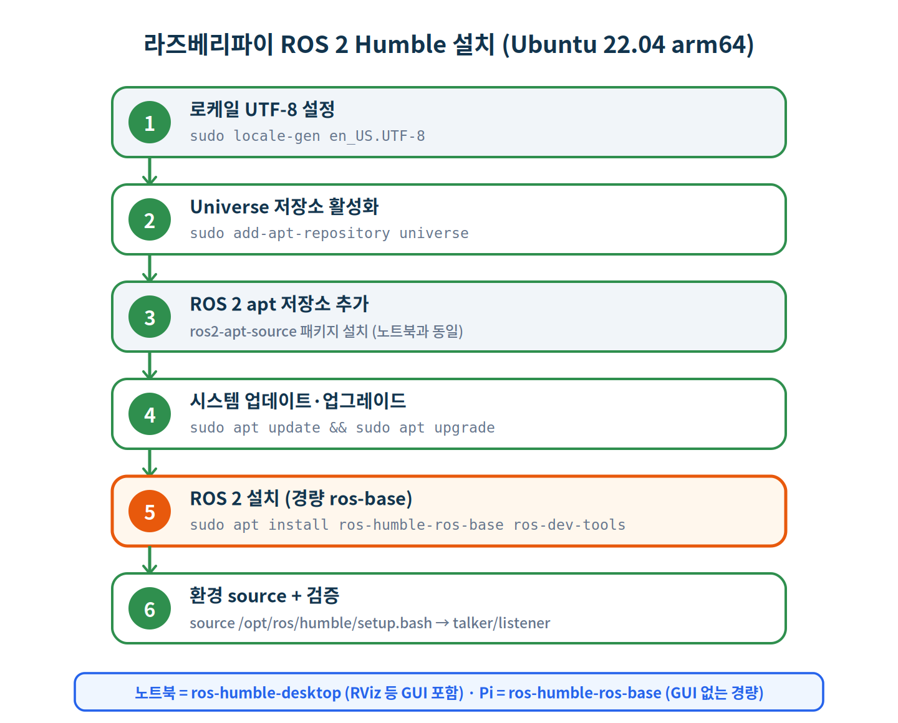
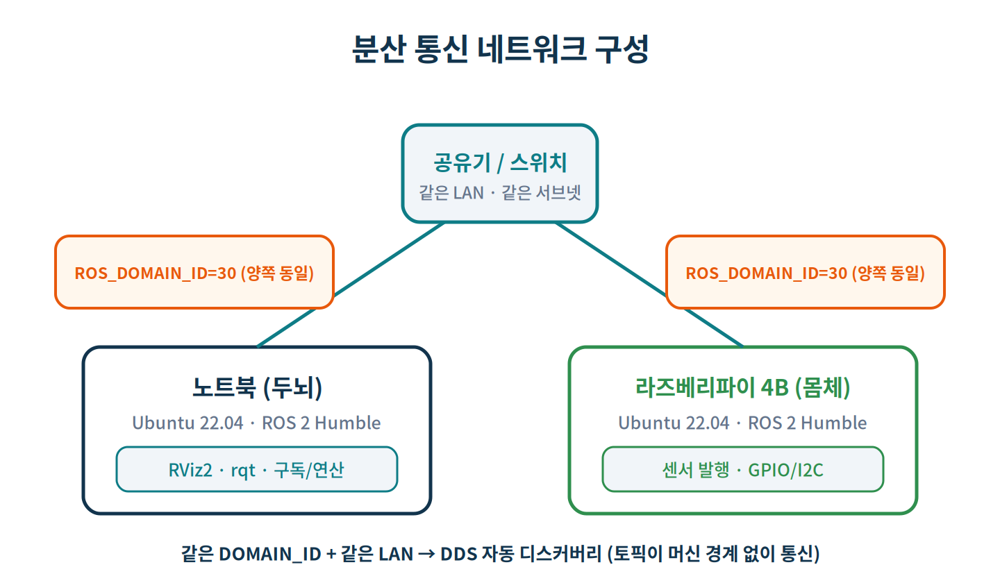
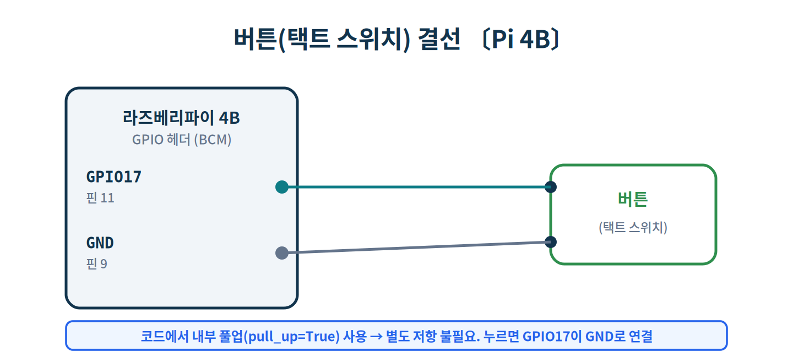
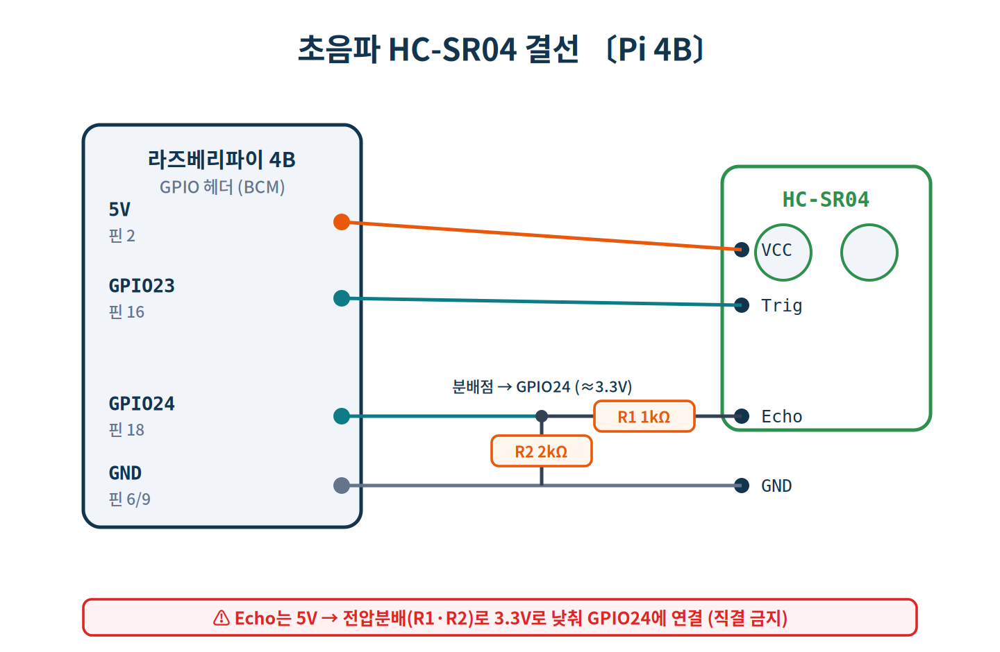
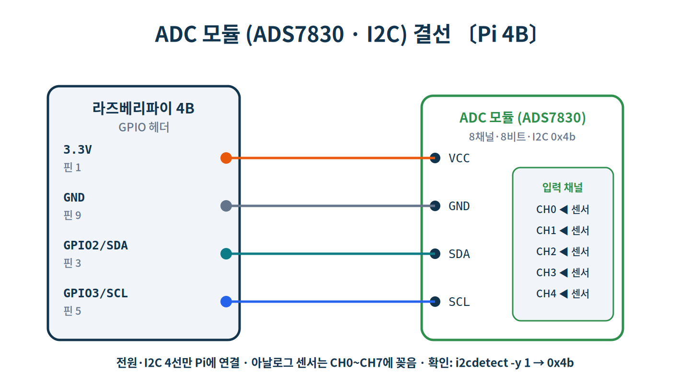
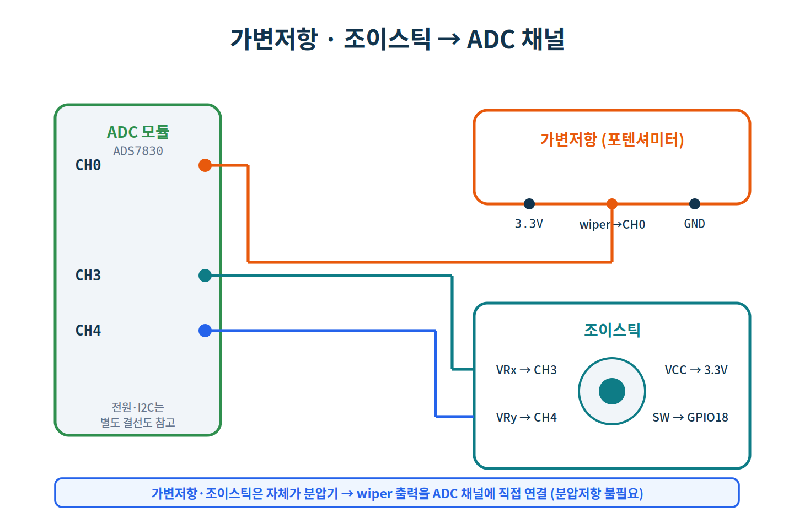
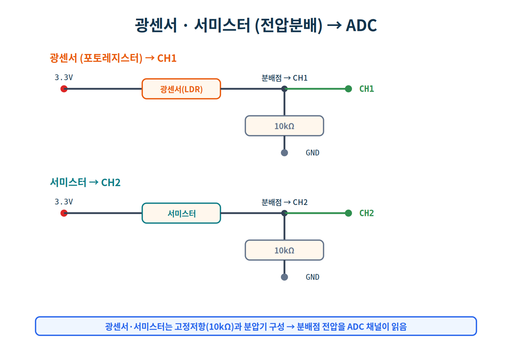

# Day 2 · 분산 통신 + 센서 입력 (노트북 ↔ 라즈베리파이, 키트)

> **과정** ROS2 + AI + 하드웨어 5일 과정 중 **2일차(9시간)**
> **환경** 노트북(Ubuntu 22.04) + 라즈베리파이 4B(Ubuntu 22.04), 양쪽 **ROS 2 Humble** · Freenove 키트
> **방식** 따라하기(hands-on) · **분량** 실습 2-0(Pi 설치) ~ 2-4
> **전제** Day 1 완료(노드·토픽·서비스·패키지 이해), 노트북에 ROS 2 설치 완료 (라즈베리파이는 2-0에서 설치)

Day 1에서는 노트북 한 대 안에서만 통신했습니다. 오늘은 **라즈베리파이를 연결해 두 머신이 ROS 2로 통신**하고, 라즈베리파이에 실제 센서를 붙여 그 데이터를 노트북에서 받아 시각화합니다. 노트북은 **두뇌**(시각화·연산), 라즈베리파이는 **몸체**(센서·GPIO/I2C)입니다.

> 〔노트북〕〔Pi〕 명령 앞의 이 표시는 **어느 머신에서 실행하는지**를 나타냅니다. 두 머신을 헷갈리지 않도록 주의하세요.

## 학습 목표

- 라즈베리파이(Ubuntu 22.04 arm64)에 ROS 2(경량 ros-base)를 설치한다.
- 두 머신에서 `ROS_DOMAIN_ID`와 네트워크를 맞춰 **DDS 자동 디스커버리**로 토픽을 주고받는다.
- 라즈베리파이의 **GPIO 센서**(버튼·초음파)를 표준 메시지(`Bool`/`Range`)로 발행한다.
- **ADC 모듈**로 아날로그 센서(가변저항·광센서·서미스터·조이스틱)를 디지털로 읽어 발행한다.
- 노트북에서 **수신 응용프로그램**과 **RViz·rqt_plot**로 여러 분산 센서를 동시에 모니터링한다.

## 준비물 (키트 부품)

| 구분 | 항목 |
|---|---|
| 공통 | 노트북, 라즈베리파이 4B, 같은 공유기, 점퍼선, 브레드보드 |
| GPIO 센서 | 푸시버튼, HC-SR04 초음파, 저항 1 kΩ·2 kΩ(초음파 분압용) |
| 아날로그 | **ADC 모듈(ADS7830)**, 가변저항, 광센서(LDR), 서미스터, 조이스틱, 저항 10 kΩ ×2 |

## 실습 구성

| # | 제목 | 실행 위치 | 핵심 |
|---|---|---|---|
| 2-0 | 라즈베리파이 ROS 2 설치 | Pi | ros-base 경량 설치 |
| 2-1 | 분산 통신 세팅 | 노트북 + Pi | `ROS_DOMAIN_ID`, talker/listener |
| 2-2 | GPIO 센서 | Pi 발행 → 노트북 | 버튼 `Bool`, 초음파 `Range` |
| 2-3 | ADC 아날로그 센서 허브 | Pi 발행 → 노트북 | 가변저항·광·온도·조이스틱 |
| 2-4 | 분산 센서 동시 모니터링 + 수신 앱 | 노트북 | 수신 노드 · RViz · rqt_plot |

> ⚠️ 이 문서의 `출력 ▶ (예시)` 값(거리·전압·온도·카운터 등)은 **실행 환경에 따라 달라지는 값**입니다. ADC 모듈의 I2C 주소(0x4b)와 센서 변환식은 실제 보드에서 한 번 확인하시길 권합니다.

---

# 실습 2-0 · 라즈베리파이 ROS 2 설치

**목표** 라즈베리파이(Ubuntu 22.04 arm64)에 ROS 2 Humble을 설치한다. 절차는 노트북(Day 1의 1-0)과 **동일**하지만, Pi는 화면 도구가 필요 없으므로 **경량 `ros-humble-ros-base`** 를 설치한다.



> 💡 노트북에는 RViz 등 GUI가 필요해 `ros-humble-desktop`을 깔았지만, **Pi는 센서를 발행하는 "몸체"** 라 GUI가 필요 없습니다. 그래서 용량이 작고 빠른 `ros-humble-ros-base`를 씁니다.

아래 명령은 모두 〔Pi〕에서 실행합니다(SSH 또는 Pi 직접 터미널).

## 2-0-1. 로케일 · Universe 저장소

```bash
# 〔Pi〕 로케일 UTF-8
$ sudo apt update && sudo apt install -y locales
$ sudo locale-gen en_US en_US.UTF-8
$ sudo update-locale LC_ALL=en_US.UTF-8 LANG=en_US.UTF-8
$ export LANG=en_US.UTF-8

# 〔Pi〕 Universe 저장소
$ sudo apt install -y software-properties-common
$ sudo add-apt-repository universe
```

## 2-0-2. ROS 2 apt 저장소 추가 (ros2-apt-source)

노트북과 동일하게 `ros2-apt-source` 패키지를 사용합니다. arm64에서도 같은 방식이며, apt가 자동으로 arm64용 패키지를 받습니다.

```bash
# 〔Pi〕
$ sudo apt update && sudo apt install -y curl
$ export ROS_APT_SOURCE_VERSION=$(curl -s \
    https://api.github.com/repos/ros-infrastructure/ros-apt-source/releases/latest \
    | grep -F "tag_name" | awk -F'"' '{print $4}')
$ curl -L -o /tmp/ros2-apt-source.deb \
    "https://github.com/ros-infrastructure/ros-apt-source/releases/download/${ROS_APT_SOURCE_VERSION}/ros2-apt-source_${ROS_APT_SOURCE_VERSION}.$(. /etc/os-release && echo ${UBUNTU_CODENAME:-${VERSION_CODENAME}})_all.deb"
$ sudo dpkg -i /tmp/ros2-apt-source.deb
```

## 2-0-3. 업데이트·업그레이드 후 설치 (경량 ros-base)

```bash
# 〔Pi〕 설치 전 반드시 최신화
$ sudo apt update
$ sudo apt upgrade -y

# 〔Pi〕 GUI 없는 경량 버전 + 개발 도구
$ sudo apt install -y ros-humble-ros-base ros-dev-tools
```

> ⚠️ 갓 설치한 Ubuntu라면 `apt upgrade`를 **반드시 먼저** 하세요(systemd·udev 충돌 방지). Pi는 microSD 속도 때문에 설치가 노트북보다 오래 걸릴 수 있습니다.

## 2-0-4. 환경 설정과 검증

```bash
# 〔Pi〕
$ echo "source /opt/ros/humble/setup.bash" >> ~/.bashrc
$ source ~/.bashrc
$ printenv ROS_DISTRO          # → humble
```

GUI가 없으므로 Pi **내부에서** 두 터미널로 통신만 확인합니다.

```bash
# 〔Pi〕 터미널 1
$ ros2 run demo_nodes_cpp talker
# 〔Pi〕 터미널 2
$ ros2 run demo_nodes_py listener
```

`listener`가 메시지를 받으면 Pi의 ROS 2 설치 성공입니다. (머신 간 통신은 다음 2-1에서 설정합니다.)

> 💡 GPIO·I2C·센서용 파이썬 패키지(`gpiozero`·`lgpio`·`smbus2`)는 각각 2-2·2-3에서 필요할 때 설치합니다. 여기서는 ROS 2 본체까지만 설치합니다.

> ✅ **체크포인트 2-0**
> - [ ] 로케일 UTF-8 · Universe 활성화
> - [ ] `ros2-apt-source` 저장소 추가
> - [ ] `apt upgrade` 후 `ros-humble-ros-base`·`ros-dev-tools` 설치
> - [ ] `printenv ROS_DISTRO` → `humble`
> - [ ] Pi 내부 talker/listener 통신 확인

---

# 실습 2-1 · 분산 통신 세팅

**목표** 노트북과 라즈베리파이가 서로의 ROS 2 노드를 볼 수 있게 만들고, 토픽이 머신 경계를 넘어 통신하는 것을 확인한다.



분산 통신의 조건은 단 두 가지입니다. **① 같은 네트워크(서브넷)**, **② 같은 `ROS_DOMAIN_ID`**. 이 둘이 맞으면 ROS 2의 DDS가 서로를 자동으로 찾습니다(중앙 서버 불필요).

## 2-1-1. 같은 네트워크 확인

```bash
# 〔노트북〕그리고〔Pi〕 각각 IP 확인
$ hostname -I
```

```bash
# 〔노트북〕에서 Pi로 ping (상대 IP는 위에서 확인)
$ ping -c 3 192.168.0.42
```

```text
출력 ▶ (예시)
64 bytes from 192.168.0.42: icmp_seq=1 ttl=64 time=2.0 ms
3 packets transmitted, 3 received, 0% packet loss
```

## 2-1-2. ROS_DOMAIN_ID 통일

**양쪽 모두** `~/.bashrc`에 동일하게(팀마다 다른 번호, 예: 30).

```bash
# 〔노트북〕그리고〔Pi〕 둘 다
$ echo 'export ROS_DOMAIN_ID=30'     >> ~/.bashrc
$ echo 'export ROS_LOCALHOST_ONLY=0' >> ~/.bashrc   # 네트워크 통신 허용
$ source ~/.bashrc
$ echo $ROS_DOMAIN_ID                # 양쪽 동일한지 확인
```

> ⚠️ `ROS_LOCALHOST_ONLY=1`이면 같은 컴퓨터 안에서만 통신합니다. 분산에서는 반드시 `0`.

## 2-1-3. 방화벽 (실습 환경)

```bash
# 〔노트북〕그리고〔Pi〕 (강의실 폐쇄망 한정)
$ sudo ufw disable     # 운영망이라면 DDS 포트 개방으로 대체
```

## 2-1-4. 머신 간 통신 확인

```bash
# 〔노트북〕 talker
$ ros2 run demo_nodes_cpp talker
```
```bash
# 〔Pi〕 listener
$ ros2 run demo_nodes_py listener
```

```text
출력 ▶ (예시)  — 〔Pi〕 listener
[INFO] [listener]: I heard: [Hello World: 7]
[INFO] [listener]: I heard: [Hello World: 8]
```

라즈베리파이가 노트북의 메시지를 받으면 성공입니다. 반대로도(Pi 발행 → 노트북 구독) 해보세요.

```bash
# 〔Pi〕에서 노트북 토픽이 보이는지
$ ros2 topic list
$ ros2 topic echo /chatter
```

> 💡 **도메인 격리 실험**: 한쪽 `ROS_DOMAIN_ID`를 31로 바꾸면 서로 안 보입니다. 강의실에서 팀마다 도메인을 나누면 간섭이 없습니다. 실험 후 30으로 원복하세요.

```bash
# 〔노트북〕 분산 노드 그래프 시각화
$ rqt_graph
```

> ✅ **체크포인트 2-1**
> - [ ] 노트북 ↔ Pi `ping` 성공
> - [ ] 양쪽 `ROS_DOMAIN_ID` 동일 + `ROS_LOCALHOST_ONLY=0`
> - [ ] talker/listener 머신 간 통신(양방향)
> - [ ] `rqt_graph`로 분산 노드 확인

---

# 실습 2-2 · GPIO 센서 (버튼·초음파)

**목표** 라즈베리파이의 GPIO에 연결한 버튼과 초음파 센서를 표준 메시지로 발행하고, 노트북에서 받는다.

## 2-2-0. Pi GPIO 백엔드 준비 (Ubuntu)

Raspberry Pi OS와 달리 Ubuntu에서는 `gpiozero`가 `lgpio` 백엔드를 쓰도록 지정합니다(한 번만).

```bash
# 〔Pi〕
$ sudo apt update && sudo apt install -y python3-lgpio
$ pip3 install gpiozero lgpio
$ echo 'export GPIOZERO_PIN_FACTORY=lgpio' >> ~/.bashrc
$ source ~/.bashrc
```

## 2-2-1. 버튼 → `std_msgs/Bool`



| 버튼 | 연결 | 라즈베리파이 |
|---|---|---|
| 한쪽 | → | GPIO17 (핀 11) |
| 다른쪽 | → | GND (핀 9) |

`~/ros2_labs/button_pub.py`

```python
#!/usr/bin/env python3
# 〔Pi〕 GPIO 버튼 → std_msgs/Bool 이벤트 발행
import rclpy
from rclpy.node import Node
from std_msgs.msg import Bool
from gpiozero import Button

class ButtonPublisher(Node):
    def __init__(self):
        super().__init__('button_publisher')
        self.pub = self.create_publisher(Bool, 'button/state', 10)
        self.button = Button(17, pull_up=True)  # GPIO17, 내부 풀업
        self.button.when_pressed  = lambda: self.publish(True)
        self.button.when_released = lambda: self.publish(False)
        self.get_logger().info('버튼 노드 준비 완료 (GPIO17)')

    def publish(self, pressed: bool):
        self.pub.publish(Bool(data=pressed))
        self.get_logger().info(f'버튼 {"눌림" if pressed else "떼짐"}')

def main(args=None):
    rclpy.init(args=args)
    node = ButtonPublisher()
    try:
        rclpy.spin(node)
    except KeyboardInterrupt:
        pass
    finally:
        node.destroy_node()
        rclpy.shutdown()

if __name__ == '__main__':
    main()
```

```bash
# 〔Pi〕
$ python3 ~/ros2_labs/button_pub.py
```
```bash
# 〔노트북〕 버튼을 누를 때마다 메시지가 보임
$ ros2 topic echo /button/state
```

```text
출력 ▶ (예시)
data: true
---
data: false
---
```

## 2-2-2. 초음파(HC-SR04) → `sensor_msgs/Range`



| HC-SR04 | 연결 | 라즈베리파이 |
|---|---|---|
| VCC | → | 5V (핀 2) |
| Trig | → | GPIO23 (핀 16) |
| Echo | → R1 1 kΩ → 분배점 → | GPIO24 (핀 18) |
| 분배점 | → R2 2 kΩ → | GND |
| GND | → | GND (핀 6/9) |

> ⚠️ Echo는 5 V 출력이므로 **전압분배(R1·R2)** 로 3.3 V로 낮춰 GPIO24에 연결합니다. 직결 금지.

`~/ros2_labs/ultrasonic_range_pub.py`

```python
#!/usr/bin/env python3
# 〔Pi〕 HC-SR04 초음파 거리 → sensor_msgs/Range 발행
import rclpy
from rclpy.node import Node
from sensor_msgs.msg import Range
from gpiozero import DistanceSensor

class UltrasonicPublisher(Node):
    def __init__(self):
        super().__init__('ultrasonic_publisher')
        self.sensor = DistanceSensor(echo=24, trigger=23, max_distance=4.0)
        self.pub = self.create_publisher(Range, 'ultrasonic/range', 10)
        self.timer = self.create_timer(0.1, self.tick)  # 10 Hz
        self.get_logger().info('HC-SR04 발행 시작 (10 Hz)')

    def tick(self):
        msg = Range()
        msg.header.stamp = self.get_clock().now().to_msg()
        msg.header.frame_id = 'ultrasonic_link'
        msg.radiation_type = Range.ULTRASOUND
        msg.field_of_view = 0.26
        msg.min_range = 0.02
        msg.max_range = 4.0
        msg.range = float(self.sensor.distance)  # m 단위
        self.pub.publish(msg)

def main(args=None):
    rclpy.init(args=args)
    node = UltrasonicPublisher()
    try:
        rclpy.spin(node)
    except KeyboardInterrupt:
        pass
    finally:
        node.destroy_node()
        rclpy.shutdown()

if __name__ == '__main__':
    main()
```

```bash
# 〔Pi〕
$ python3 ~/ros2_labs/ultrasonic_range_pub.py
```
```bash
# 〔노트북〕 손을 센서 앞에서 움직이며 확인
$ ros2 topic echo /ultrasonic/range
```

```text
출력 ▶ (예시)
range: 0.182        # ← 손까지의 거리(m)
---
```

RViz로도 봅니다(Range 디스플레이는 frame의 TF가 필요).

```bash
# 〔노트북〕 터미널 1: 정적 TF
$ ros2 run tf2_ros static_transform_publisher 0 0 0 0 0 0 base_link ultrasonic_link
# 〔노트북〕 터미널 2: RViz
$ rviz2
```

RViz에서 **Add → Range** 추가 → Topic `/ultrasonic/range` → Fixed Frame `base_link`. 거리에 따라 원뿔이 늘었다 줄었다 하면 성공입니다.

> ✅ **체크포인트 2-2**
> - [ ] 버튼 누름이 노트북에 `Bool`로 수신
> - [ ] 초음파 거리가 노트북에 `Range`로 수신
> - [ ] RViz Range 콘이 거리에 따라 변함

---

# 실습 2-3 · ADC 모듈로 아날로그 센서 허브

**목표** 라즈베리파이에는 아날로그 입력이 없다. **ADC 모듈(ADS7830)** 을 I2C로 붙여 가변저항·광센서·서미스터·조이스틱 같은 아날로그 센서를 디지털로 읽어 발행한다.

## 2-3-1. ADC 모듈 연결과 I2C 활성화



ADC 모듈은 전원·I2C 4선만 Pi에 연결합니다.

| ADS7830 | 연결 | 라즈베리파이 |
|---|---|---|
| VCC | → | 3.3V (핀 1) |
| GND | → | GND (핀 9) |
| SDA | → | GPIO2 / SDA1 (핀 3) |
| SCL | → | GPIO3 / SCL1 (핀 5) |

Pi에서 I2C를 켭니다(Day 2 처음 한 번).

```bash
# 〔Pi〕 I2C 활성화
$ sudo nano /boot/firmware/config.txt
#   파일 끝에 추가:  dtparam=i2c_arm=on
$ sudo apt install -y i2c-tools python3-smbus
$ pip3 install smbus2
$ sudo reboot
```

재부팅 후 ADC가 잡히는지 확인합니다.

```bash
# 〔Pi〕 0x4b 가 보이면 정상
$ i2cdetect -y 1
```

```text
출력 ▶ (예시)
40: -- -- -- 4b -- -- -- -- ...
```

> 💡 **ADS7830 읽는 법**: 단일 입력 모드 명령 바이트 `0x84`에 채널 비트를 얹어 `read_byte_data`로 8비트 값(0~255)을 읽습니다. 전압 = 값 / 255 × 3.3 V. 아래 노드의 `read_channel()`이 이 일을 합니다.

## 2-3-2. 가변저항·광센서·서미스터 결선

가변저항은 자체가 분압기라 wiper(가운데)를 ADC 채널에 직접 연결합니다.



광센서·서미스터는 고정저항(10 kΩ)과 분압기를 구성해 분배점을 ADC 채널에 연결합니다.



| 센서 | ADC 채널 | 비고 |
|---|---|---|
| 가변저항 (wiper) | CH0 | 양끝 3.3V/GND |
| 광센서 (LDR) | CH1 | 10 kΩ 분압 |
| 서미스터 | CH2 | 10 kΩ 분압 |
| 조이스틱 VRx / VRy | CH3 / CH4 | SW → GPIO18 |

## 2-3-3. ADC 센서 허브 노드 (가변저항·광·온도)

`~/ros2_labs/adc_sensor_hub.py`

```python
#!/usr/bin/env python3
# 〔Pi〕 ADS7830 ADC → 가변저항/광센서/서미스터 발행 (센서 허브)
import math
import rclpy
from rclpy.node import Node
from std_msgs.msg import Float64
from sensor_msgs.msg import Temperature
from smbus2 import SMBus

ADC_ADDR = 0x4b       # ADS7830 I2C 주소 (i2cdetect 로 확인)
ADC_CMD  = 0x84       # 단일 입력 모드 기본 명령
VREF     = 3.3

def read_channel(bus, chn):
    # ADS7830 단일 입력 채널 읽기 → 0~255
    cmd = ADC_CMD | (((chn << 2 | chn >> 1) & 0x07) << 4)
    return bus.read_byte_data(ADC_ADDR, cmd)

class AdcSensorHub(Node):
    def __init__(self):
        super().__init__('adc_sensor_hub')
        self.bus = SMBus(1)
        self.pot_pub   = self.create_publisher(Float64, 'pot', 10)
        self.light_pub = self.create_publisher(Float64, 'light', 10)
        self.temp_pub  = self.create_publisher(Temperature, 'temperature', 10)
        self.timer = self.create_timer(0.2, self.tick)   # 5 Hz
        self.get_logger().info('ADC 센서 허브 시작 (가변저항·광센서·서미스터)')

    def tick(self):
        # CH0 가변저항 → 전압(V)
        pot_v = read_channel(self.bus, 0) / 255.0 * VREF
        self.pot_pub.publish(Float64(data=pot_v))

        # CH1 광센서 → 상대 밝기(0~255). 배선에 따라 밝을수록 값↑ 또는 ↓
        light_raw = read_channel(self.bus, 1)
        self.light_pub.publish(Float64(data=float(light_raw)))

        # CH2 서미스터 → 섭씨온도 (10kΩ 분압, Beta=3950, R0=10kΩ@25℃)
        v = read_channel(self.bus, 2) / 255.0 * VREF
        temp = Temperature()
        if 0.0 < v < VREF:
            rt = 10.0 * v / (VREF - v)                       # kΩ
            t_k = 1.0 / (1.0 / 298.15 + math.log(rt / 10.0) / 3950.0)
            temp.temperature = t_k - 273.15
        self.temp_pub.publish(temp)

        self.get_logger().info(
            f'pot={pot_v:.2f}V  light={light_raw}  temp={temp.temperature:.1f}C')

def main(args=None):
    rclpy.init(args=args)
    node = AdcSensorHub()
    try:
        rclpy.spin(node)
    except KeyboardInterrupt:
        pass
    finally:
        node.destroy_node()
        rclpy.shutdown()

if __name__ == '__main__':
    main()
```

```bash
# 〔Pi〕
$ python3 ~/ros2_labs/adc_sensor_hub.py
```

```text
출력 ▶ (예시)  — 〔Pi〕 (가변저항을 돌리고, 센서를 가리며)
[INFO] [adc_sensor_hub]: pot=1.65V  light=120  temp=24.3C
[INFO] [adc_sensor_hub]: pot=2.81V  light=45   temp=24.4C
```

```bash
# 〔노트북〕 세 토픽 확인
$ ros2 topic echo /pot
$ ros2 topic echo /temperature
```

## 2-3-4. 조이스틱 노드 (CH3·CH4 + 버튼)

조이스틱은 두 축(VRx, VRy)이 아날로그라 ADC로, 버튼(SW)은 디지털이라 GPIO로 읽습니다. 출력은 teleop에 쓰기 좋게 `Twist`로 발행합니다(3일차 모터 제어의 입력원).

`~/ros2_labs/joystick_node.py`

```python
#!/usr/bin/env python3
# 〔Pi〕 조이스틱(ADS7830 CH3=X, CH4=Y + 버튼 GPIO18) → Twist / Bool 발행
import rclpy
from rclpy.node import Node
from geometry_msgs.msg import Twist
from std_msgs.msg import Bool
from smbus2 import SMBus
from gpiozero import Button

ADC_ADDR = 0x4b
ADC_CMD  = 0x84

def read_channel(bus, chn):
    cmd = ADC_CMD | (((chn << 2 | chn >> 1) & 0x07) << 4)
    return bus.read_byte_data(ADC_ADDR, cmd)

class JoystickNode(Node):
    def __init__(self):
        super().__init__('joystick_node')
        self.bus = SMBus(1)
        self.button = Button(18, pull_up=True)           # 조이스틱 SW → GPIO18
        self.cmd_pub = self.create_publisher(Twist, 'joy_cmd', 10)
        self.btn_pub = self.create_publisher(Bool, 'joy_button', 10)
        self.timer = self.create_timer(0.1, self.tick)   # 10 Hz
        self.get_logger().info('조이스틱 노드 시작 (CH3=X, CH4=Y, SW=GPIO18)')

    def tick(self):
        x = read_channel(self.bus, 3)        # 0~255, 중앙 약 128
        y = read_channel(self.bus, 4)
        nx = (x - 128) / 128.0               # -1.0 ~ +1.0 정규화
        ny = (y - 128) / 128.0
        cmd = Twist()
        cmd.linear.x = ny                    # 앞뒤 → 전진 속도
        cmd.angular.z = -nx                  # 좌우 → 회전
        self.cmd_pub.publish(cmd)
        self.btn_pub.publish(Bool(data=self.button.is_pressed))

def main(args=None):
    rclpy.init(args=args)
    node = JoystickNode()
    try:
        rclpy.spin(node)
    except KeyboardInterrupt:
        pass
    finally:
        node.destroy_node()
        rclpy.shutdown()

if __name__ == '__main__':
    main()
```

```bash
# 〔Pi〕 (ADC 허브와 동시에 실행해도 됩니다 — 같은 ADC를 읽음)
$ python3 ~/ros2_labs/joystick_node.py
```
```bash
# 〔노트북〕 조이스틱을 기울이며 값 변화 확인
$ ros2 topic echo /joy_cmd
```

> ✅ **체크포인트 2-3**
> - [ ] `i2cdetect -y 1`에 `0x4b` 표시
> - [ ] `/pot` 값이 가변저항을 돌리면 변함
> - [ ] `/temperature`가 상온(약 24℃ 근처) 표시
> - [ ] 광센서를 가리면 `/light` 값 변화
> - [ ] 조이스틱을 기울이면 `/joy_cmd`의 linear.x·angular.z 변화

---

# 실습 2-4 · 분산 센서 동시 모니터링

**목표** 라즈베리파이의 여러 센서를 동시에 띄우고, 노트북에서 RViz·rqt_plot·rqt_graph로 **한눈에** 모니터링한다.

## 2-4-1. Pi에서 센서 노드 동시 실행

라즈베리파이에서 터미널을 여러 개 열어 센서 노드들을 함께 띄웁니다(또는 각 명령 끝에 `&`로 백그라운드 실행).

```bash
# 〔Pi〕 — 각각 다른 터미널
$ python3 ~/ros2_labs/button_pub.py
$ python3 ~/ros2_labs/ultrasonic_range_pub.py
$ python3 ~/ros2_labs/adc_sensor_hub.py
$ python3 ~/ros2_labs/joystick_node.py
```

```bash
# 〔노트북〕 모든 센서 토픽이 보이는지
$ ros2 topic list
```

```text
출력 ▶ (예시)
/button/state
/joy_button
/joy_cmd
/light
/pot
/temperature
/ultrasonic/range
```

## 2-4-2. 노트북 수신 응용프로그램 (센서 모니터)

`ros2 topic echo`는 한 토픽만 봅니다. 이번엔 **모든 센서 토픽을 한 노드에서 구독**해 1초마다 통합 대시보드로 출력하는 응용 노드를 노트북에서 작성합니다. 여러 구독을 한 노드에 두고, 최신값을 저장했다가 타이머로 요약하는 패턴입니다.

`~/ros2_labs/sensor_monitor.py` (노트북)

```python
#!/usr/bin/env python3
# 〔노트북〕 Pi의 모든 센서 토픽을 구독해 통합 대시보드로 출력하는 응용 노드
import rclpy
from rclpy.node import Node
from std_msgs.msg import Float64, Bool
from sensor_msgs.msg import Range, Temperature
from geometry_msgs.msg import Twist

class SensorMonitor(Node):
    def __init__(self):
        super().__init__('sensor_monitor')
        self.data = {'pot': None, 'light': None, 'temp': None, 'range': None,
                     'button': False, 'joy_btn': False, 'joy_x': 0.0, 'joy_z': 0.0}
        # 여러 토픽을 한 노드에서 구독
        self.create_subscription(Float64,     'pot',              self.on_pot,     10)
        self.create_subscription(Float64,     'light',            self.on_light,   10)
        self.create_subscription(Temperature, 'temperature',      self.on_temp,    10)
        self.create_subscription(Range,       'ultrasonic/range', self.on_range,   10)
        self.create_subscription(Bool,        'button/state',     self.on_button,  10)
        self.create_subscription(Bool,        'joy_button',       self.on_joy_btn, 10)
        self.create_subscription(Twist,       'joy_cmd',          self.on_joy,     10)
        self.timer = self.create_timer(1.0, self.report)   # 1초마다 요약 출력
        self.get_logger().info('센서 모니터 시작 — Pi 센서 구독 중')

    def on_pot(self, m):     self.data['pot'] = m.data
    def on_light(self, m):   self.data['light'] = m.data
    def on_temp(self, m):    self.data['temp'] = m.temperature
    def on_range(self, m):   self.data['range'] = m.range
    def on_button(self, m):  self.data['button'] = m.data
    def on_joy_btn(self, m): self.data['joy_btn'] = m.data
    def on_joy(self, m):
        self.data['joy_x'] = m.linear.x
        self.data['joy_z'] = m.angular.z

    def report(self):
        d = self.data
        def fmt(v, unit=''):
            return f'{v:.2f}{unit}' if isinstance(v, float) else '---'
        self.get_logger().info(
            f"[대시보드] 가변저항={fmt(d['pot'],'V')}  밝기={fmt(d['light'])}  "
            f"온도={fmt(d['temp'],'C')}  거리={fmt(d['range'],'m')}  "
            f"버튼={'ON' if d['button'] else 'off'}  "
            f"조이스틱=({d['joy_x']:+.2f},{d['joy_z']:+.2f})")

def main(args=None):
    rclpy.init(args=args)
    node = SensorMonitor()
    try:
        rclpy.spin(node)
    except KeyboardInterrupt:
        pass
    finally:
        node.destroy_node()
        rclpy.shutdown()

if __name__ == '__main__':
    main()
```

```bash
# 〔노트북〕 (Pi 센서 노드들이 돌고 있는 상태에서)
$ python3 ~/ros2_labs/sensor_monitor.py
```

```text
출력 ▶ (예시)
[INFO] [sensor_monitor]: [대시보드] 가변저항=1.65V  밝기=120.00  온도=24.30C  거리=0.18m  버튼=off  조이스틱=(+0.02,-0.01)
[INFO] [sensor_monitor]: [대시보드] 가변저항=2.81V  밝기=45.00  온도=24.40C  거리=0.35m  버튼=ON  조이스틱=(+0.55,-0.30)
```

핵심은 세 가지입니다. ① **한 노드에서 여러 토픽을 구독**(`create_subscription` 7개), ② 각 콜백은 최신값만 `self.data`에 저장, ③ **타이머가 1초마다** 저장된 값을 모아 한 줄로 출력. 콜백은 값을 쌓아두고, 출력 주기는 타이머가 따로 관리하는 구조라 빠른 센서와 느린 센서를 한 화면에 깔끔히 모을 수 있습니다.

> 💡 아직 도착하지 않은 토픽은 `---`로 표시됩니다. 이 노드가 오늘 배운 분산 통신의 결과물입니다 — Pi가 발행한 데이터를 노트북 응용프로그램이 받아 처리합니다. 과제(예: 거리 임계값 경고)도 이 노드를 확장해 만들 수 있습니다.

## 2-4-3. rqt_plot으로 수치 센서 동시 그래프

```bash
# 〔노트북〕 여러 토픽을 한 그래프에
$ ros2 run rqt_plot rqt_plot /pot/data /light/data /ultrasonic/range/range
```

`+`/`-` 버튼으로 토픽을 추가·제거할 수 있습니다. 가변저항을 돌리고, 센서를 가리고, 손을 초음파 앞에서 움직이면 세 곡선이 각각 출렁입니다. 온도는 별도 창에서:

```bash
$ ros2 run rqt_plot rqt_plot /temperature/temperature
```

## 2-4-4. RViz로 초음파 시각화

```bash
# 〔노트북〕 터미널 1: 정적 TF
$ ros2 run tf2_ros static_transform_publisher 0 0 0 0 0 0 base_link ultrasonic_link
# 〔노트북〕 터미널 2: RViz
$ rviz2
```

Range 디스플레이로 거리를 콘으로 표시합니다(2-2-2와 동일).

## 2-4-5. rqt로 통합 대시보드

`rqt` 하나에서 여러 플러그인을 한 화면에 배치할 수 있습니다.

```bash
# 〔노트북〕
$ rqt
```

상단 메뉴 **Plugins**에서 *Topic Monitor*(모든 토픽 값 표), *Plot*(그래프), *Node Graph*(노드 연결)를 띄워 한 화면에 배치하면, 분산된 모든 센서를 동시에 관찰하는 대시보드가 됩니다.

## 2-4-6. 전체 분산 그래프 확인

```bash
# 〔노트북〕
$ rqt_graph
```

Pi에서 발행하는 7개 토픽과 노트북의 구독/도구 노드가 **머신 경계 없이** 하나의 그래프로 보입니다. 이것이 오늘의 핵심 — 두 머신이 한 ROS 2 시스템으로 동작합니다.

> ✅ **체크포인트 2-4**
> - [ ] Pi의 4개 센서 노드를 동시에 실행
> - [ ] 노트북 `ros2 topic list`에 7개 토픽 모두 표시
> - [ ] **노트북 수신 앱(`sensor_monitor.py`)으로 통합 대시보드 출력**
> - [ ] `rqt_plot`으로 여러 센서 동시 그래프
> - [ ] RViz Range + `rqt_graph` 전체 분산 그래프 확인

---

# 과제

### 기본
1. `/temperature`를 `rqt_plot`으로 띄우고, 서미스터를 손으로 잡아 온도가 오르는 곡선을 캡처하라.
2. 가변저항(`/pot`) 값이 **1.65 V(중앙) 이상이면** `Bool`(`/pot_high`)을 `true`로 발행하는 노드를 Pi에 추가하라.

### 심화
3. 광센서(`/light`) 임계값을 정해, 어두워지면 "어두움"을 노트북에서 출력하는 구독 노드를 작성하라.
4. 초음파 거리가 **0.3 m 이하**면 `/obstacle/near`(`Bool`)를 `true`로 발행하는 노드를 만들어라. (다음 시간 폐루프의 토대)

### 도전
5. 네 센서 노드(버튼·초음파·ADC 허브·조이스틱)를 **하나의 런치 파일**로 Pi에서 한 번에 실행하라. (Day 1의 패키지·런치 기법 활용 — 노드들을 `pi_sensors` 패키지로 묶고 bringup 런치 작성)
6. 조이스틱(`/joy_cmd`)으로 Day 1의 turtlesim 거북이를 원격조종하라(`/joy_cmd` → `/turtle1/cmd_vel` 리매핑 또는 중계 노드).

---

# 트러블슈팅

| 증상 | 원인 | 해결 |
|---|---|---|
| 노드는 뜨는데 머신 간 안 보임 | `ROS_DOMAIN_ID` 불일치 | 양쪽 동일하게 |
| 같은 PC만 통신 | `ROS_LOCALHOST_ONLY=1` | `0`으로 변경 후 `source` |
| `ping` 되는데 토픽 안 됨 | 방화벽이 DDS 차단 | `ufw disable` 또는 포트 개방 |
| `gpiozero` 핀 팩토리 오류 | 백엔드 미설정 | `export GPIOZERO_PIN_FACTORY=lgpio` |
| 초음파가 항상 0 또는 4.0 | Echo 분압·결선 오류 | 결선도 재확인(R1·R2, GPIO24) |
| `i2cdetect`에 0x4b 없음 | I2C 비활성/결선 오류 | `config.txt`에 `dtparam=i2c_arm=on` 후 재부팅 |
| ADC 값이 안 변함 | 채널 번호·배선 불일치 | 센서가 꽂힌 CH와 코드의 채널 번호 일치 |
| 서미스터 온도가 이상함 | 분압 방향/계수 차이 | 10kΩ 분압 배선과 Beta(3950)·R0 확인 |
| 조이스틱 중앙이 0 아님 | ADC 중앙값이 128 아님 | 정지 시 값을 읽어 중앙 보정값으로 사용 |
| `rqt_plot` 토픽 경로 오류 | 필드 경로 누락 | `/pot/data`처럼 메시지 필드까지 지정 |

---

# 최종 체크리스트

- [ ] **라즈베리파이에 ROS 2(ros-base) 설치 + 검증 (실습 2-0)**
- [ ] 분산 통신 세팅(`ROS_DOMAIN_ID`) + talker/listener 양방향
- [ ] 버튼 → `Bool`, 초음파 → `Range` 발행·수신
- [ ] ADC 모듈 I2C 연결 + `i2cdetect` 0x4b
- [ ] 가변저항·광센서·서미스터 허브 발행
- [ ] 조이스틱 → `Twist`/`Bool` 발행
- [ ] **노트북 수신 앱(`sensor_monitor.py`)으로 모든 센서 통합 출력**
- [ ] 노트북에서 RViz·rqt_plot·rqt_graph 동시 모니터링
- [ ] 과제 기본 2문항 완료

---

# 다음 시간 예고 — Day 3

오늘은 센서(입력)를 다뤘습니다. 내일은 **방향을 뒤집어** 노트북의 명령으로 라즈베리파이의 **액추에이터를 구동**합니다.

- 표시장치(LED·RGB·7세그·LED매트릭스·LCD·부저) 멀티 액추에이터
- 모터 3종(서보·DC 모터 L293D·스테핑 ULN2003)
- `teleop`·조이스틱(오늘의 `/joy_cmd`)으로 모터 원격조종
- **폐루프**: 초음파 거리 → 노트북 판단 → 모터 정지(장애물 회피)

오늘 만든 `/obstacle/near`(과제 4)와 `/joy_cmd`가 내일 폐루프·원격조종의 출발점이 됩니다.

---

## 📌 한 장 요약 (복붙용)

```bash
# ── 2-0 라즈베리파이 ROS 2 설치 (Pi) ──
sudo apt update && sudo apt install -y locales
sudo locale-gen en_US en_US.UTF-8
sudo update-locale LC_ALL=en_US.UTF-8 LANG=en_US.UTF-8 && export LANG=en_US.UTF-8
sudo apt install -y software-properties-common && sudo add-apt-repository universe
sudo apt update && sudo apt install -y curl
export ROS_APT_SOURCE_VERSION=$(curl -s https://api.github.com/repos/ros-infrastructure/ros-apt-source/releases/latest | grep -F "tag_name" | awk -F'"' '{print $4}')
curl -L -o /tmp/ros2-apt-source.deb "https://github.com/ros-infrastructure/ros-apt-source/releases/download/${ROS_APT_SOURCE_VERSION}/ros2-apt-source_${ROS_APT_SOURCE_VERSION}.$(. /etc/os-release && echo ${UBUNTU_CODENAME:-${VERSION_CODENAME}})_all.deb"
sudo dpkg -i /tmp/ros2-apt-source.deb
sudo apt update && sudo apt upgrade -y
sudo apt install -y ros-humble-ros-base ros-dev-tools     # Pi는 경량 ros-base
echo "source /opt/ros/humble/setup.bash" >> ~/.bashrc && source ~/.bashrc

# ── 2-1 분산 통신 (노트북 + Pi 양쪽) ──
echo 'export ROS_DOMAIN_ID=30'     >> ~/.bashrc
echo 'export ROS_LOCALHOST_ONLY=0' >> ~/.bashrc
source ~/.bashrc
ros2 run demo_nodes_cpp talker      # 노트북
ros2 run demo_nodes_py  listener    # Pi
rqt_graph

# ── 2-2 GPIO 백엔드 (Pi, 한 번만) ──
sudo apt install -y python3-lgpio
pip3 install gpiozero lgpio
echo 'export GPIOZERO_PIN_FACTORY=lgpio' >> ~/.bashrc && source ~/.bashrc

# 버튼 / 초음파
python3 ~/ros2_labs/button_pub.py                 # Pi
python3 ~/ros2_labs/ultrasonic_range_pub.py       # Pi
ros2 topic echo /button/state                     # 노트북
ros2 run tf2_ros static_transform_publisher 0 0 0 0 0 0 base_link ultrasonic_link  # 노트북
rviz2                                             # 노트북 (Range)

# ── 2-3 ADC (Pi, I2C 활성화: config.txt에 dtparam=i2c_arm=on 후 재부팅) ──
sudo apt install -y i2c-tools python3-smbus ; pip3 install smbus2
i2cdetect -y 1                                    # Pi → 0x4b
python3 ~/ros2_labs/adc_sensor_hub.py             # Pi
python3 ~/ros2_labs/joystick_node.py              # Pi
ros2 topic echo /pot ; ros2 topic echo /temperature   # 노트북

# ── 2-4 동시 모니터링 (노트북) ──
python3 ~/ros2_labs/sensor_monitor.py             # 노트북 수신 응용프로그램(통합 대시보드)
ros2 run rqt_plot rqt_plot /pot/data /light/data /ultrasonic/range/range
ros2 run rqt_plot rqt_plot /temperature/temperature
rqt ; rqt_graph
```
