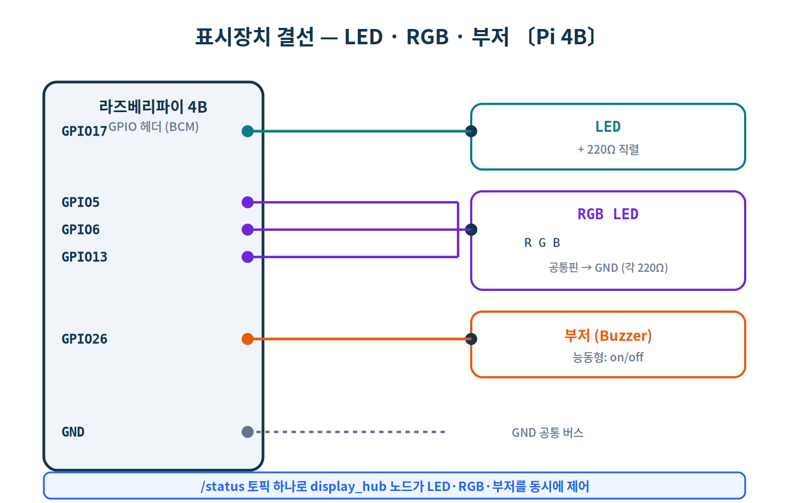
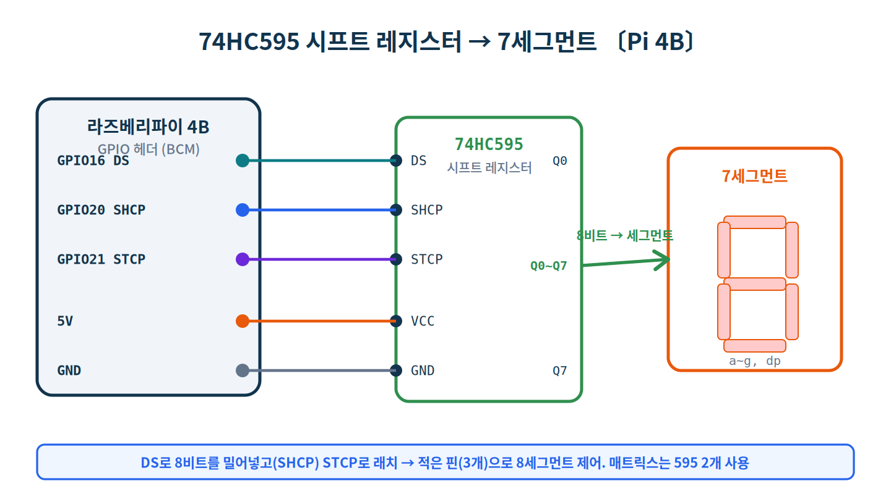
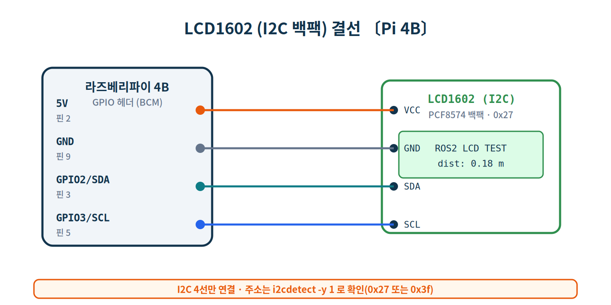
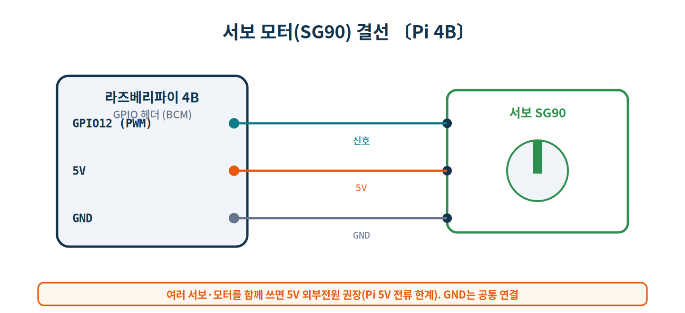
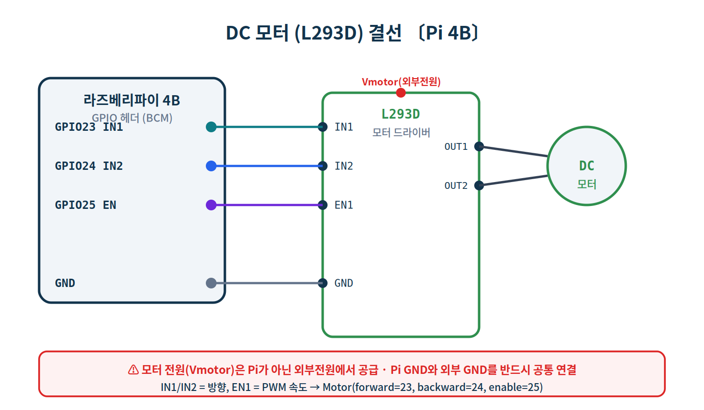
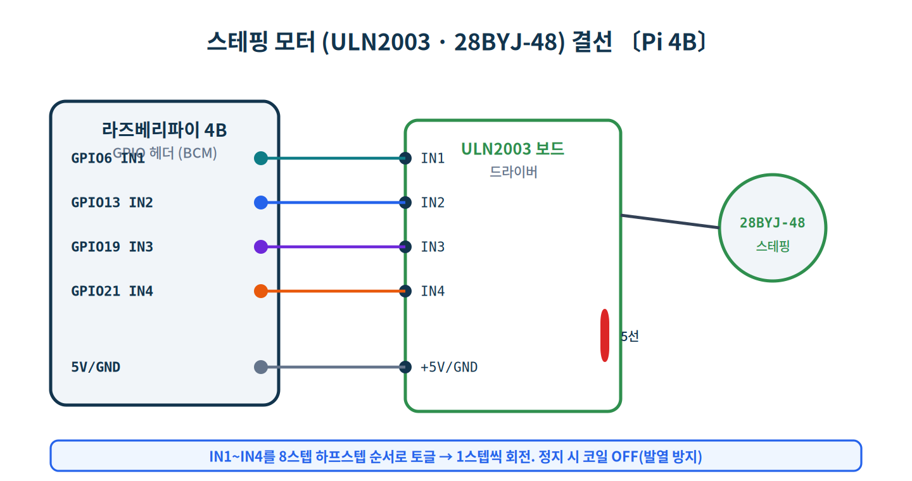
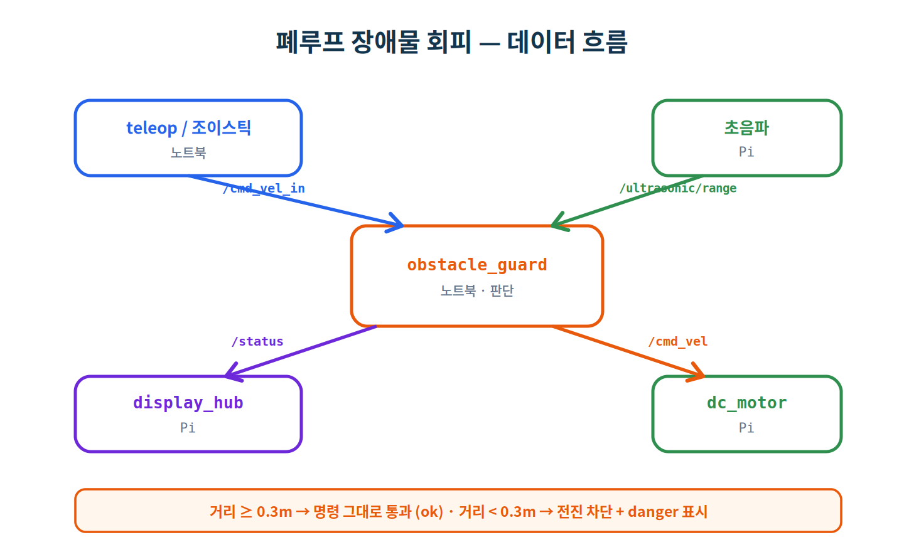
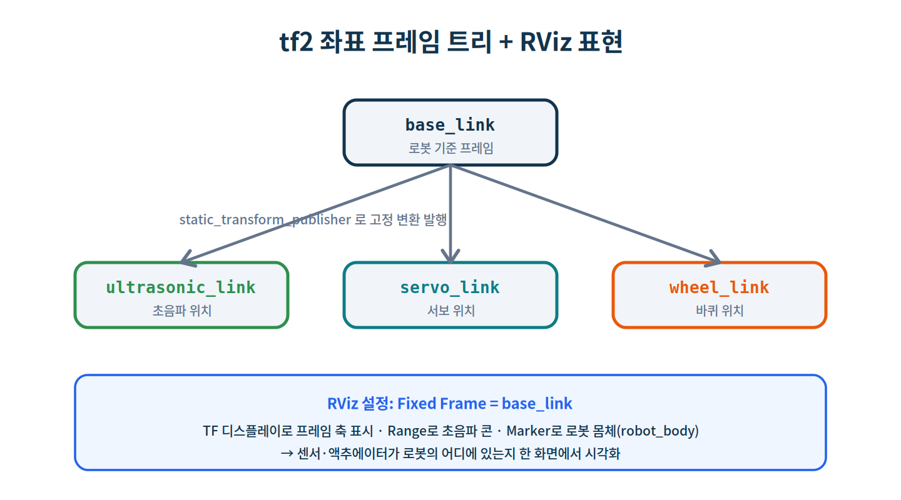

# Day 3 · 액추에이터 제어 + 시각화 (노트북 명령 → Pi)

> **과정** ROS2 + AI + 하드웨어 5일 과정 중 **3일차(9시간)**
> **환경** 노트북(Ubuntu 22.04) + 라즈베리파이 4B(Ubuntu 22.04), 양쪽 **ROS 2 Humble** · Freenove 키트
> **방식** 따라하기(hands-on) · **분량** 실습 3-1 ~ 3-5
> **전제** Day 1·2 완료 (분산 통신, 토픽/서비스/액션, 센서 발행·수신)

Day 2에서는 센서(입력)를 노트북으로 받았습니다. 오늘은 **방향을 뒤집어**, 노트북의 명령으로 라즈베리파이의 **액추에이터(출력)** 를 구동합니다. 표시장치 → 모터 → 원격조종 → **폐루프 제어**(센서로 보고 모터를 멈춤) → RViz 시각화로 이어지며, 진짜 "로봇"의 형태를 갖춰갑니다.

## 학습 목표

- 표시장치(LED·RGB·7세그·LCD·부저)를 **토픽 하나(`/status`)** 로 동시에 구동한다.
- 모터 3종(서보 각도, DC 모터 `Twist`, 스테핑 위치)을 ROS 2 토픽으로 제어한다.
- `teleop_twist_keyboard`와 조이스틱으로 모터를 **원격조종**한다.
- **폐루프**: 초음파 거리를 노트북이 판단해 모터를 멈추고 위험을 표시한다(장애물 회피).
- **tf2** 좌표 프레임과 RViz로 센서·액추에이터가 달린 로봇을 시각화한다.

## 준비물 (키트 부품)

| 구분 | 항목 |
|---|---|
| 표시 | LED, RGB LED, 7세그먼트, **74HC595**, LED 매트릭스, **LCD1602(I2C)**, 부저, 저항 220Ω 다수 |
| 모터 | 서보(SG90), DC 모터 + **L293D**, 스테핑(28BYJ-48) + **ULN2003** |
| 전원 | 모터용 **외부 전원**(건전지팩/어댑터), 점퍼선, 브레드보드 |
| 센서 | (Day 2의) HC-SR04 초음파 |

## 핀 맵 (예시 — 키트 가이드에 맞춰 조정)

| 장치 | 핀(BCM) | 토픽 |
|---|---|---|
| LED | GPIO17 | `/status` |
| RGB LED | GPIO5·6·13 | `/status` |
| 부저 | GPIO26 | `/status` |
| 74HC595 (7세그) | DS17→ DS=16, SHCP=20, STCP=21 | `/number` |
| LCD1602 | I2C (SDA=2, SCL=3) 0x27 | `/lcd_text` |
| 서보 | GPIO12 (PWM) | `/servo_angle` |
| DC 모터(L293D) | IN1=23, IN2=24, EN=25 | `/cmd_vel` |
| 스테핑(ULN2003) | IN1~4 = 6·13·19·21 | `/stepper_steps` |

> ⚠️ 위 핀은 **예시**입니다. 여러 장치를 동시에 쓰면 핀이 겹칠 수 있으니, 실제로 함께 구동할 장치끼리는 핀이 충돌하지 않도록 키트 핀 가이드를 따라 조정하세요. 본 문서의 모든 코드는 문법 검증만 거쳤으므로, 핀 번호·공통 음/양극·I2C 주소·세그먼트 코드는 **실제 보드에서 확인**해야 합니다.

> ⚠️ **모터 전원 안전**: 서보·DC·스테핑 모터는 전류가 커서 Pi의 5V로 직접 구동하면 전압 강하·재부팅이 발생할 수 있습니다. **모터 전원은 외부 전원**에서 공급하고, **Pi GND와 외부 GND를 반드시 공통**으로 연결하세요.

---

# 실습 3-1 · 표시장치 멀티 액추에이터

**목표** 여러 표시장치를 ROS 2로 구동한다. 먼저 LED·RGB·부저를 **상태 토픽 하나**로 동시에 제어하고, 이어서 74HC595로 7세그먼트, I2C로 LCD를 다룬다.

## 3-1-0. GPIO 백엔드 (Day 2와 동일, 한 번만)

```bash
# 〔Pi〕
$ sudo apt install -y python3-lgpio
$ pip3 install gpiozero lgpio smbus2
$ echo 'export GPIOZERO_PIN_FACTORY=lgpio' >> ~/.bashrc && source ~/.bashrc
```

## 3-1-1. LED · RGB · 부저 — 토픽 하나로 (표시 허브)



`/status`(String) 하나에 `ok`·`warn`·`danger`를 보내면 세 표시장치가 함께 반응합니다. `~/ros2_labs/display_hub.py` (Pi)

```python
#!/usr/bin/env python3
# 〔Pi〕 /status(String) 하나로 LED·RGB·부저를 동시에 구동하는 표시 허브
import rclpy
from rclpy.node import Node
from std_msgs.msg import String
from gpiozero import LED, RGBLED, Buzzer

class DisplayHub(Node):
    def __init__(self):
        super().__init__('display_hub')
        self.led = LED(17)
        self.rgb = RGBLED(red=5, green=6, blue=13)   # 색 반전 시 active_high=False
        self.buzzer = Buzzer(26)
        self.sub = self.create_subscription(String, 'status', self.on_status, 10)
        self.get_logger().info('표시 허브 시작 — /status 구독 (ok/warn/danger)')

    def on_status(self, msg):
        s = msg.data.lower()
        if s == 'ok':
            self.led.on();  self.rgb.color = (0, 1, 0); self.buzzer.off()
        elif s == 'warn':
            self.led.blink(0.3, 0.3); self.rgb.color = (1, 1, 0); self.buzzer.off()
        elif s == 'danger':
            self.led.on();  self.rgb.color = (1, 0, 0); self.buzzer.on()
        else:
            self.led.off(); self.rgb.color = (0, 0, 0); self.buzzer.off()
        self.get_logger().info(f'상태 표시: {s}')

def main(args=None):
    rclpy.init(args=args)
    node = DisplayHub()
    try:
        rclpy.spin(node)
    except KeyboardInterrupt:
        pass
    finally:
        node.destroy_node()
        rclpy.shutdown()

if __name__ == '__main__':
    main()
```

```bash
# 〔Pi〕
$ python3 ~/ros2_labs/display_hub.py
```
```bash
# 〔노트북〕 상태를 바꿔가며 표시장치 반응 확인
$ ros2 topic pub --once /status std_msgs/msg/String "{data: 'ok'}"
$ ros2 topic pub --once /status std_msgs/msg/String "{data: 'warn'}"
$ ros2 topic pub --once /status std_msgs/msg/String "{data: 'danger'}"
```

`ok`이면 초록·LED 켜짐, `warn`이면 노랑·LED 깜빡, `danger`면 빨강·LED·부저. 이 `/status` 토픽은 3-4 폐루프에서 자동으로 구동됩니다.

> 💡 RGB 색이 반대로 나오면(켜야 할 때 꺼짐) 공통 양극(common-anode) LED입니다. `RGBLED(..., active_high=False)`로 바꾸세요.

## 3-1-2. 7세그먼트 — 74HC595 시프트 레지스터



GPIO 3개(DS·SHCP·STCP)로 8비트를 밀어넣어 7세그먼트를 제어합니다. `~/ros2_labs/seg_display.py` (Pi)

```python
#!/usr/bin/env python3
# 〔Pi〕 /number(Int32) → 74HC595 시프트 레지스터 → 7세그먼트 숫자 표시
import rclpy
from rclpy.node import Node
from std_msgs.msg import Int32
from gpiozero import OutputDevice

# 공통 캐소드 7세그먼트 코드(0~9). 비트=세그먼트 점등(abcdefg.dp)
SEG = {0:0x3f, 1:0x06, 2:0x5b, 3:0x4f, 4:0x66,
       5:0x6d, 6:0x7d, 7:0x07, 8:0x7f, 9:0x6f}

class SegDisplay(Node):
    def __init__(self):
        super().__init__('seg_display')
        self.ds   = OutputDevice(16)   # 74HC595 DS(데이터)
        self.shcp = OutputDevice(20)   # SHCP(시프트 클럭)
        self.stcp = OutputDevice(21)   # STCP(래치)
        self.sub = self.create_subscription(Int32, 'number', self.on_number, 10)
        self.get_logger().info('7세그먼트 노드 시작 — /number 구독 (0~9)')

    def shift_out(self, byte):
        for i in range(8):                       # MSB first
            self.ds.value = (byte >> (7 - i)) & 0x01
            self.shcp.on(); self.shcp.off()      # 시프트
        self.stcp.on(); self.stcp.off()          # 래치(출력 반영)

    def on_number(self, msg):
        d = abs(msg.data) % 10
        self.shift_out(SEG[d])
        self.get_logger().info(f'표시 숫자: {d}')

def main(args=None):
    rclpy.init(args=args)
    node = SegDisplay()
    try:
        rclpy.spin(node)
    except KeyboardInterrupt:
        pass
    finally:
        node.destroy_node()
        rclpy.shutdown()

if __name__ == '__main__':
    main()
```

```bash
# 〔Pi〕
$ python3 ~/ros2_labs/seg_display.py
# 〔노트북〕
$ ros2 topic pub --once /number std_msgs/msg/Int32 "{data: 7}"
```

> 💡 세그먼트가 이상하게 켜지면 공통 음/양극과 `SEG` 코드가 안 맞는 것입니다. 공통 양극이면 각 코드를 비트 반전(`~code & 0xFF`)하세요.
>
> 💡 **LED 매트릭스(8×8)** 는 같은 74HC595 기법을 **2개**(행·열) 써서 열을 빠르게 스캔(멀티플렉싱)합니다. `shift_out`을 두 칩에 연속 호출하는 식으로 확장합니다(도전 과제).

## 3-1-3. LCD1602 — I2C 문자 출력



I2C 4선으로 16×2 문자 LCD에 텍스트를 출력합니다. `~/ros2_labs/lcd_display.py` (Pi)

```python
#!/usr/bin/env python3
# 〔Pi〕 /lcd_text(String) → I2C LCD1602(PCF8574 백팩, 주소 0x27) 출력
import time
import rclpy
from rclpy.node import Node
from std_msgs.msg import String
from smbus2 import SMBus

ADDR = 0x27        # i2cdetect 로 확인 (0x27 또는 0x3f)
BL = 0x08          # 백라이트
EN = 0x04          # Enable
RS = 0x01          # 데이터/명령 선택

class Lcd1602(Node):
    def __init__(self):
        super().__init__('lcd_display')
        self.bus = SMBus(1)
        self.init_lcd()
        self.sub = self.create_subscription(String, 'lcd_text', self.on_text, 10)
        self.get_logger().info('LCD 노드 시작 — /lcd_text 구독')

    def _strobe(self, data):
        self.bus.write_byte(ADDR, data | EN | BL); time.sleep(0.0005)
        self.bus.write_byte(ADDR, (data & ~EN) | BL); time.sleep(0.0001)

    def _write4(self, data):
        self.bus.write_byte(ADDR, data | BL)
        self._strobe(data)

    def _cmd(self, cmd):
        self._write4(cmd & 0xF0)
        self._write4((cmd << 4) & 0xF0)

    def _char(self, ch):
        self._write4((ch & 0xF0) | RS)
        self._write4(((ch << 4) & 0xF0) | RS)

    def init_lcd(self):
        for c in (0x33, 0x32, 0x28, 0x0C, 0x06, 0x01):
            self._cmd(c); time.sleep(0.002)

    def on_text(self, msg):
        self._cmd(0x01); time.sleep(0.002)       # 화면 지움
        for ch in msg.data[:16]:
            self._char(ord(ch))
        self.get_logger().info(f'LCD 출력: {msg.data[:16]}')

def main(args=None):
    rclpy.init(args=args)
    node = Lcd1602()
    try:
        rclpy.spin(node)
    except KeyboardInterrupt:
        pass
    finally:
        node.destroy_node()
        rclpy.shutdown()

if __name__ == '__main__':
    main()
```

```bash
# 〔Pi〕 I2C 주소 확인 후 실행
$ i2cdetect -y 1                 # 0x27(또는 0x3f) 확인
$ python3 ~/ros2_labs/lcd_display.py
# 〔노트북〕
$ ros2 topic pub --once /lcd_text std_msgs/msg/String "{data: 'ROS2 LCD TEST'}"
```

> ✅ **체크포인트 3-1**
> - [ ] `/status`로 LED·RGB·부저가 동시에 반응(ok/warn/danger)
> - [ ] `/number`로 7세그먼트에 숫자 표시
> - [ ] `/lcd_text`로 LCD에 문자 출력

---

# 실습 3-2 · 모터 3종 제어

**목표** 성격이 다른 세 모터를 ROS 2 토픽으로 제어한다. 서보(각도), DC 모터(속도·방향), 스테핑(정밀 위치).

## 3-2-1. 서보 — 각도 제어



`~/ros2_labs/servo_node.py` (Pi)

```python
#!/usr/bin/env python3
# 〔Pi〕 /servo_angle(Float64, 0~180도) → 서보(SG90) 구동
import rclpy
from rclpy.node import Node
from std_msgs.msg import Float64
from gpiozero import AngularServo

class ServoNode(Node):
    def __init__(self):
        super().__init__('servo_node')
        self.servo = AngularServo(12, min_angle=0, max_angle=180,
                                  min_pulse_width=0.0005, max_pulse_width=0.0025)
        self.sub = self.create_subscription(Float64, 'servo_angle', self.on_angle, 10)
        self.get_logger().info('서보 노드 시작 — /servo_angle 구독 (0~180)')

    def on_angle(self, msg):
        angle = max(0.0, min(180.0, msg.data))
        self.servo.angle = angle
        self.get_logger().info(f'서보 각도: {angle:.0f}도')

def main(args=None):
    rclpy.init(args=args)
    node = ServoNode()
    try:
        rclpy.spin(node)
    except KeyboardInterrupt:
        pass
    finally:
        node.destroy_node()
        rclpy.shutdown()

if __name__ == '__main__':
    main()
```

```bash
# 〔Pi〕
$ python3 ~/ros2_labs/servo_node.py
# 〔노트북〕 0도 → 90도 → 180도
$ ros2 topic pub --once /servo_angle std_msgs/msg/Float64 "{data: 0}"
$ ros2 topic pub --once /servo_angle std_msgs/msg/Float64 "{data: 90}"
$ ros2 topic pub --once /servo_angle std_msgs/msg/Float64 "{data: 180}"
```

> 💡 서보가 떨리면 `min_pulse_width`/`max_pulse_width`를 서보 사양에 맞게 미세조정하세요(SG90은 보통 0.5~2.5 ms).

## 3-2-2. DC 모터(L293D) — `Twist` 속도·방향



`Twist`의 `linear.x`로 전진(+)/후진(−)/정지(0)를 제어합니다. `~/ros2_labs/dc_motor_node.py` (Pi)

```python
#!/usr/bin/env python3
# 〔Pi〕 /cmd_vel(Twist) → L293D → DC 모터 구동 (전진/후진/정지 + 워치독)
import rclpy
from rclpy.node import Node
from geometry_msgs.msg import Twist
from gpiozero import Motor

class DcMotorNode(Node):
    def __init__(self):
        super().__init__('dc_motor_node')
        # L293D 한 채널: IN1=forward, IN2=backward, EN=enable(PWM)
        self.motor = Motor(forward=23, backward=24, enable=25)
        self.sub = self.create_subscription(Twist, 'cmd_vel', self.on_cmd, 10)
        self.last = self.get_clock().now()
        self.timer = self.create_timer(0.2, self.watchdog)
        self.get_logger().info('DC 모터 노드 시작 — /cmd_vel 구독')

    def on_cmd(self, msg):
        self.last = self.get_clock().now()
        v = max(-1.0, min(1.0, msg.linear.x))
        if v > 0.05:
            self.motor.forward(v)
        elif v < -0.05:
            self.motor.backward(-v)
        else:
            self.motor.stop()

    def watchdog(self):
        # 0.5초 이상 명령이 없으면 안전 정지
        dt = (self.get_clock().now() - self.last).nanoseconds / 1e9
        if dt > 0.5:
            self.motor.stop()

def main(args=None):
    rclpy.init(args=args)
    node = DcMotorNode()
    try:
        rclpy.spin(node)
    except KeyboardInterrupt:
        pass
    finally:
        node.destroy_node()
        rclpy.shutdown()

if __name__ == '__main__':
    main()
```

```bash
# 〔Pi〕
$ python3 ~/ros2_labs/dc_motor_node.py
# 〔노트북〕 전진(0.6) → 정지(0)
$ ros2 topic pub --once /cmd_vel geometry_msgs/msg/Twist "{linear: {x: 0.6}}"
$ ros2 topic pub --once /cmd_vel geometry_msgs/msg/Twist "{linear: {x: 0.0}}"
```

> 💡 **워치독**: 명령이 0.5초 이상 끊기면 모터를 자동 정지합니다. 통신 두절 시 폭주를 막는 안전장치로, 원격조종·폐루프에서 중요합니다.

## 3-2-3. 스테핑 모터(ULN2003) — 위치 제어



`~/ros2_labs/stepper_node.py` (Pi)

```python
#!/usr/bin/env python3
# 〔Pi〕 /stepper_steps(Int32) → ULN2003 → 28BYJ-48 스테핑 모터 (양수=정방향)
import time
import rclpy
from rclpy.node import Node
from std_msgs.msg import Int32
from gpiozero import OutputDevice

# 8스텝 하프스텝 시퀀스
SEQ = [[1,0,0,0],[1,1,0,0],[0,1,0,0],[0,1,1,0],
       [0,0,1,0],[0,0,1,1],[0,0,0,1],[1,0,0,1]]

class StepperNode(Node):
    def __init__(self):
        super().__init__('stepper_node')
        self.pins = [OutputDevice(6), OutputDevice(13),
                     OutputDevice(19), OutputDevice(21)]   # IN1~IN4
        self.sub = self.create_subscription(Int32, 'stepper_steps', self.on_steps, 10)
        self.get_logger().info('스테핑 모터 노드 시작 — /stepper_steps 구독')

    def on_steps(self, msg):
        steps = msg.data
        order = SEQ if steps >= 0 else SEQ[::-1]
        for _ in range(abs(steps)):
            for phase in order:
                for pin, val in zip(self.pins, phase):
                    pin.value = val
                time.sleep(0.002)
        for pin in self.pins:
            pin.off()                       # 코일 발열 방지
        self.get_logger().info(f'스텝 이동: {steps}')

def main(args=None):
    rclpy.init(args=args)
    node = StepperNode()
    try:
        rclpy.spin(node)
    except KeyboardInterrupt:
        pass
    finally:
        node.destroy_node()
        rclpy.shutdown()

if __name__ == '__main__':
    main()
```

```bash
# 〔Pi〕
$ python3 ~/ros2_labs/stepper_node.py
# 〔노트북〕 정방향 512스텝 ≈ 한 바퀴, 음수면 역방향
$ ros2 topic pub --once /stepper_steps std_msgs/msg/Int32 "{data: 512}"
```

> 💡 28BYJ-48은 하프스텝 기준 약 4096스텝이 1회전입니다(기어비 포함). 스텝 수로 정밀한 각도를 만들 수 있습니다.

> ✅ **체크포인트 3-2**
> - [ ] 서보가 0·90·180도로 이동
> - [ ] DC 모터가 `Twist`로 전진·후진·정지, 워치독 정지 확인
> - [ ] 스테핑 모터가 지정 스텝만큼 정·역방향 회전

---

# 실습 3-3 · 원격조종 (teleop + 조이스틱)

**목표** 사람이 키보드와 조이스틱으로 DC 모터를 실시간 조종한다. 입력 장치가 `Twist`를 발행하고, Pi의 모터 노드가 그대로 구독한다.

## 3-3-1. 키보드 원격조종

표준 패키지를 설치하고 노트북에서 실행합니다.

```bash
# 〔노트북〕
$ sudo apt install -y ros-humble-teleop-twist-keyboard
$ ros2 run teleop_twist_keyboard teleop_twist_keyboard
```

이 노드는 `/cmd_vel`로 `Twist`를 발행합니다. Pi의 `dc_motor_node`(3-2-2)가 켜져 있으면, 터미널에 표시된 키(`i` 전진, `,` 후진, `k` 정지 등)로 모터가 움직입니다.

```bash
# 〔Pi〕 (모터 노드가 떠 있어야 함)
$ python3 ~/ros2_labs/dc_motor_node.py
```

## 3-3-2. 조이스틱 원격조종

Day 2의 `joystick_node.py`는 `/joy_cmd`(Twist)를 발행합니다. 이를 `/cmd_vel`로 중계하면 조이스틱으로 모터를 조종할 수 있습니다.

```bash
# 〔Pi〕 조이스틱 노드 (Day 2)
$ python3 ~/ros2_labs/joystick_node.py
# 〔Pi〕 또는 〔노트북〕 토픽 중계 (topic_tools)
$ sudo apt install -y ros-humble-topic-tools
$ ros2 run topic_tools relay /joy_cmd /cmd_vel
```

이제 조이스틱을 기울이면 그 `Twist`가 `/cmd_vel`로 전달되어 모터가 움직입니다.

> 💡 키보드/조이스틱이 잠깐씩 끊겨도 3-2-2의 **워치독**이 모터를 안전 정지시킵니다.

> ✅ **체크포인트 3-3**
> - [ ] 키보드(`teleop_twist_keyboard`)로 모터 전진·후진·정지
> - [ ] 조이스틱(`/joy_cmd` → `/cmd_vel` 중계)으로 모터 조종

---

# 실습 3-4 · 폐루프 — 장애물 회피

**목표** 사람의 조종 명령을 그대로 따르지 않고, **노트북이 초음파 거리를 보고 판단**해 위험하면 전진을 막고 표시한다. 이것이 센서→판단→구동으로 닫히는 **폐루프**다.



구조는 이렇습니다. 조종 명령은 이제 `/cmd_vel`이 아니라 **`/cmd_vel_in`** 으로 들어가고, 노트북의 `obstacle_guard`가 초음파 거리를 보고 **안전한 `/cmd_vel`만 통과**시킵니다. 동시에 `/status`로 표시장치를 갱신합니다.

`~/ros2_labs/obstacle_guard.py` (노트북)

```python
#!/usr/bin/env python3
# 〔노트북〕 폐루프 안전: 초음파 거리로 cmd_vel 통과/차단 + 상태 표시
import rclpy
from rclpy.node import Node
from sensor_msgs.msg import Range
from geometry_msgs.msg import Twist
from std_msgs.msg import String

STOP_DIST = 0.30   # m, 이 거리 이하면 전진 차단

class ObstacleGuard(Node):
    def __init__(self):
        super().__init__('obstacle_guard')
        self.distance = None
        self.create_subscription(Range, 'ultrasonic/range', self.on_range, 10)
        self.create_subscription(Twist, 'cmd_vel_in', self.on_cmd_in, 10)
        self.cmd_pub = self.create_publisher(Twist, 'cmd_vel', 10)
        self.status_pub = self.create_publisher(String, 'status', 10)
        self.get_logger().info(f'장애물 가드 시작 — {STOP_DIST}m 이하면 전진 차단')

    def on_range(self, msg):
        self.distance = msg.range
        st = String()
        if self.distance is None:
            st.data = 'unknown'
        elif self.distance < STOP_DIST:
            st.data = 'danger'
        elif self.distance < STOP_DIST * 2:
            st.data = 'warn'
        else:
            st.data = 'ok'
        self.status_pub.publish(st)

    def on_cmd_in(self, msg):
        out = Twist()
        if self.distance is not None and self.distance < STOP_DIST and msg.linear.x > 0.0:
            out.linear.x = 0.0               # 전진 성분만 차단
            out.angular.z = msg.angular.z    # 회전·후진은 허용
            self.get_logger().warn(f'장애물 {self.distance:.2f}m — 전진 차단')
        else:
            out = msg
        self.cmd_pub.publish(out)

def main(args=None):
    rclpy.init(args=args)
    node = ObstacleGuard()
    try:
        rclpy.spin(node)
    except KeyboardInterrupt:
        pass
    finally:
        node.destroy_node()
        rclpy.shutdown()

if __name__ == '__main__':
    main()
```

전체를 연결해 실행합니다(여러 터미널).

```bash
# 〔Pi〕 초음파(Day 2) · 모터 · 표시 허브
$ python3 ~/ros2_labs/ultrasonic_range_pub.py
$ python3 ~/ros2_labs/dc_motor_node.py
$ python3 ~/ros2_labs/display_hub.py

# 〔노트북〕 폐루프 가드
$ python3 ~/ros2_labs/obstacle_guard.py

# 〔노트북〕 조종은 이제 /cmd_vel_in 으로 (teleop 리매핑)
$ ros2 run teleop_twist_keyboard teleop_twist_keyboard \
    --ros-args -r /cmd_vel:=/cmd_vel_in
```

이제 전진하다가 장애물이 0.3 m 안으로 들어오면, 사람이 계속 전진을 눌러도 **모터가 멈추고** RGB가 빨강·부저가 울립니다(`danger`). 장애물이 멀어지면 다시 전진할 수 있습니다.

```text
출력 ▶ (예시)  — 〔노트북〕 obstacle_guard
[WARN] [obstacle_guard]: 장애물 0.18m — 전진 차단
```

> 💡 이 구조가 로봇 안전의 핵심 패턴입니다. 사람·AI의 명령과 **센서 기반 안전 계층**을 분리해, 명령이 위험하면 마지막에 가드가 막습니다. Day 4에서 AI 탐지 결과가 이 자리에 들어갑니다.

> ✅ **체크포인트 3-4**
> - [ ] 거리 ≥ 0.3 m면 조종 명령대로 전진
> - [ ] 거리 < 0.3 m면 전진 차단 + `danger` 표시
> - [ ] 후진·회전은 차단 중에도 가능

---

# 실습 3-5 · tf2 좌표 프레임 + RViz 로봇 표현

**목표** 센서·액추에이터가 로봇의 **어디에** 달려 있는지 좌표 프레임(tf2)으로 정의하고, RViz에서 로봇 몸체와 초음파 콘을 함께 본다.



## 3-5-1. 정적 좌표 변환 발행

`base_link`(로봇 기준)에서 각 부품 프레임으로의 고정 변환을 발행합니다.

```bash
# 〔노트북〕 base_link → ultrasonic_link (앞쪽 10cm, 높이 5cm)
$ ros2 run tf2_ros static_transform_publisher 0.10 0 0.05 0 0 0 base_link ultrasonic_link
# 〔노트북〕 base_link → servo_link (다른 터미널)
$ ros2 run tf2_ros static_transform_publisher 0 0.05 0.03 0 0 0 base_link servo_link
```

인자는 `x y z yaw pitch roll 부모 자식` 순서입니다. `ros2 run tf2_tools view_frames`로 프레임 트리를 PDF로 저장해 확인할 수 있습니다.

## 3-5-2. RViz에 로봇 몸체 표시 (Marker)

`~/ros2_labs/robot_marker.py` (노트북)

```python
#!/usr/bin/env python3
# 〔노트북〕 RViz에 로봇 몸체를 표시하는 Marker 발행 (base_link 기준)
import rclpy
from rclpy.node import Node
from visualization_msgs.msg import Marker

class RobotMarker(Node):
    def __init__(self):
        super().__init__('robot_marker')
        self.pub = self.create_publisher(Marker, 'robot_body', 10)
        self.timer = self.create_timer(0.5, self.tick)
        self.get_logger().info('로봇 마커 발행 — RViz에서 Marker(robot_body) 추가')

    def tick(self):
        m = Marker()
        m.header.frame_id = 'base_link'
        m.header.stamp = self.get_clock().now().to_msg()
        m.ns = 'robot'
        m.id = 0
        m.type = Marker.CUBE
        m.action = Marker.ADD
        m.pose.position.z = 0.03
        m.pose.orientation.w = 1.0
        m.scale.x, m.scale.y, m.scale.z = 0.20, 0.15, 0.06
        m.color.r, m.color.g, m.color.b, m.color.a = 0.2, 0.5, 0.9, 1.0
        self.pub.publish(m)

def main(args=None):
    rclpy.init(args=args)
    node = RobotMarker()
    try:
        rclpy.spin(node)
    except KeyboardInterrupt:
        pass
    finally:
        node.destroy_node()
        rclpy.shutdown()

if __name__ == '__main__':
    main()
```

```bash
# 〔노트북〕
$ python3 ~/ros2_labs/robot_marker.py
$ rviz2
```

RViz 설정: **Fixed Frame = `base_link`** → **Add → TF**(프레임 축) → **Add → Marker**(Topic `/robot_body`, 로봇 몸체) → **Add → Range**(Topic `/ultrasonic/range`, 초음파 콘). 이제 로봇 몸체 위에 초음파 콘이 앞쪽 프레임에 붙어 함께 보입니다. 손을 센서 앞에서 움직이면 콘 길이가 변합니다.

> 💡 더 사실적인 로봇 모델은 **URDF**로 기술하고 `robot_state_publisher`로 발행합니다(4·5일차 확장). 오늘은 Marker + 정적 TF로 개념을 잡습니다.

> ✅ **체크포인트 3-5**
> - [ ] 정적 TF로 `base_link`→센서/액추에이터 프레임 발행
> - [ ] RViz에서 TF 축 표시
> - [ ] Marker로 로봇 몸체, Range로 초음파 콘 동시 표시

---

# 과제

### 기본
1. `/status`에 `ok`/`warn`/`danger`를 1초 간격으로 순환 발행하는 노드를 만들어 표시장치 동작을 확인하라.
2. 서보를 0→180→0으로 천천히 왕복(스윕)시키는 발행 노드를 작성하라.

### 심화
3. 가변저항(Day 2 `/pot`)으로 서보 각도를 제어하라(`/pot` 구독 → 0~3.3V를 0~180도로 매핑 → `/servo_angle`).
4. 초음파 거리를 7세그먼트에 정수(cm)로 표시하라(`/ultrasonic/range` → `/number` 변환 노드).

### 도전
5. 폐루프(3-4)에서 거리에 따라 **속도를 비례 감속**(가까울수록 느리게)하도록 `obstacle_guard`를 개선하라.
6. LED 매트릭스(8×8)를 74HC595 2개로 구동해 화살표(↑/↓)를 표시하라(전진/정지 상태에 연동).

---

# 트러블슈팅

| 증상 | 원인 | 해결 |
|---|---|---|
| Pi가 모터 구동 시 재부팅/꺼짐 | 모터 전류로 전압 강하 | 모터 전원을 외부 전원으로 분리, GND 공통 |
| RGB 색이 반대 | 공통 양극 LED | `RGBLED(..., active_high=False)` |
| 7세그가 이상하게 켜짐 | 공통 음/양극·코드 불일치 | `SEG` 코드 비트 반전 또는 핀 순서 확인 |
| LCD에 글자 안 나옴 | I2C 주소·대비(콘트라스트) | `i2cdetect`로 주소 확인(0x27/0x3f), 백팩 가변저항 조절 |
| 서보가 계속 떨림 | 펄스 폭·전원 불안정 | `min/max_pulse_width` 조정, 외부 5V |
| `gpiozero` 핀 팩토리 오류 | 백엔드 미설정 | `export GPIOZERO_PIN_FACTORY=lgpio` |
| 모터가 안 멈춤 | 명령 끊김/토픽 불일치 | 워치독 동작 확인, `/cmd_vel` 이름 일치 |
| teleop 키 입력 무시 | 터미널 포커스 | teleop 터미널을 클릭해 포커스 |
| 폐루프가 안 막음 | `/cmd_vel_in` 리매핑 누락 | teleop를 `-r /cmd_vel:=/cmd_vel_in`로 실행 |
| RViz에 아무것도 안 보임 | Fixed Frame·TF 없음 | Fixed Frame=`base_link`, 정적 TF 발행 확인 |

---

# 최종 체크리스트

- [ ] `/status` 하나로 LED·RGB·부저 동시 구동
- [ ] 7세그먼트(74HC595)·LCD(I2C) 출력
- [ ] 서보·DC(L293D)·스테핑(ULN2003) 모터 제어
- [ ] 키보드·조이스틱 원격조종
- [ ] 폐루프 장애물 회피(거리→정지+표시)
- [ ] tf2 프레임 + RViz에 로봇 몸체·초음파 콘 표시
- [ ] 과제 기본 2문항 완료

---

# 다음 시간 예고 — Day 4

오늘까지 "센서 → 판단 → 액추에이터"의 폐루프를 사람이 정한 규칙(거리 임계값)으로 닫았습니다. 내일은 그 **판단 자리에 AI**가 들어갑니다.

- 카메라 영상 → 노트북에서 **AI 추론**(객체 탐지/분류)
- 탐지 결과 → ROS 2 토픽 → Pi 액추에이터(오늘의 `/cmd_vel`·`/status`)
- LiteRT/YOLO 등 경량 추론, 엣지(Pi) vs 두뇌(노트북) 역할 분담
- (카메라는 별도 준비물)

오늘 만든 `/cmd_vel`·`/status`·폐루프 가드 구조가 그대로 **AI 명령의 출력 통로**가 됩니다.

---

## 📌 한 장 요약 (복붙용)

```bash
# ── 3-0 GPIO 백엔드 (Pi, 한 번만) ──
sudo apt install -y python3-lgpio ; pip3 install gpiozero lgpio smbus2
echo 'export GPIOZERO_PIN_FACTORY=lgpio' >> ~/.bashrc && source ~/.bashrc

# ── 3-1 표시장치 (Pi 실행 / 노트북 발행) ──
python3 ~/ros2_labs/display_hub.py
ros2 topic pub --once /status   std_msgs/msg/String "{data: 'danger'}"
python3 ~/ros2_labs/seg_display.py
ros2 topic pub --once /number   std_msgs/msg/Int32  "{data: 7}"
python3 ~/ros2_labs/lcd_display.py    # i2cdetect -y 1 로 0x27 확인
ros2 topic pub --once /lcd_text std_msgs/msg/String "{data: 'ROS2 LCD TEST'}"

# ── 3-2 모터 (Pi 실행 / 노트북 발행) ──
python3 ~/ros2_labs/servo_node.py
ros2 topic pub --once /servo_angle  std_msgs/msg/Float64 "{data: 90}"
python3 ~/ros2_labs/dc_motor_node.py
ros2 topic pub --once /cmd_vel      geometry_msgs/msg/Twist "{linear: {x: 0.6}}"
python3 ~/ros2_labs/stepper_node.py
ros2 topic pub --once /stepper_steps std_msgs/msg/Int32 "{data: 512}"

# ── 3-3 원격조종 (노트북) ──
sudo apt install -y ros-humble-teleop-twist-keyboard ros-humble-topic-tools
ros2 run teleop_twist_keyboard teleop_twist_keyboard          # 키보드 → /cmd_vel
ros2 run topic_tools relay /joy_cmd /cmd_vel                  # 조이스틱 → /cmd_vel

# ── 3-4 폐루프 (Pi: 초음파·모터·표시 / 노트북: 가드·조종) ──
python3 ~/ros2_labs/ultrasonic_range_pub.py                  # Pi
python3 ~/ros2_labs/dc_motor_node.py                         # Pi
python3 ~/ros2_labs/display_hub.py                           # Pi
python3 ~/ros2_labs/obstacle_guard.py                        # 노트북
ros2 run teleop_twist_keyboard teleop_twist_keyboard --ros-args -r /cmd_vel:=/cmd_vel_in

# ── 3-5 tf2 + RViz (노트북) ──
ros2 run tf2_ros static_transform_publisher 0.10 0 0.05 0 0 0 base_link ultrasonic_link
python3 ~/ros2_labs/robot_marker.py
rviz2     # Fixed Frame=base_link, Add: TF / Marker(/robot_body) / Range(/ultrasonic/range)
```
