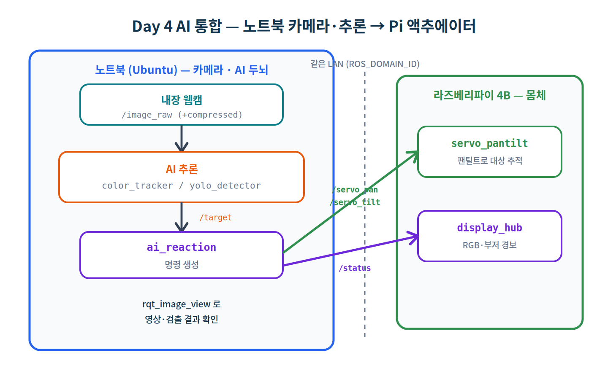
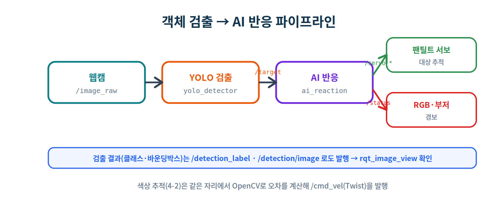
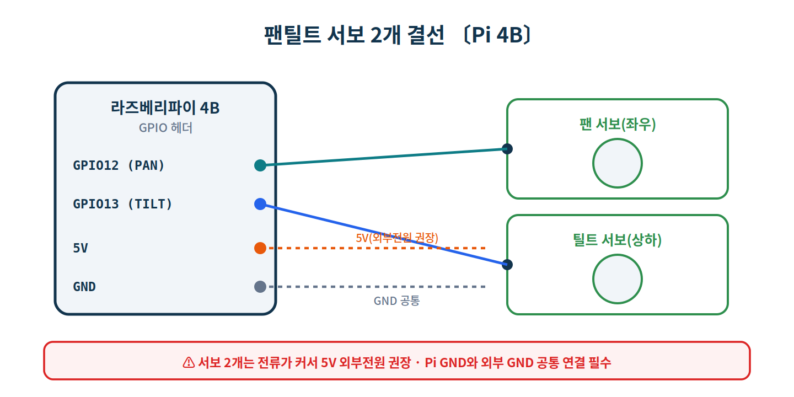
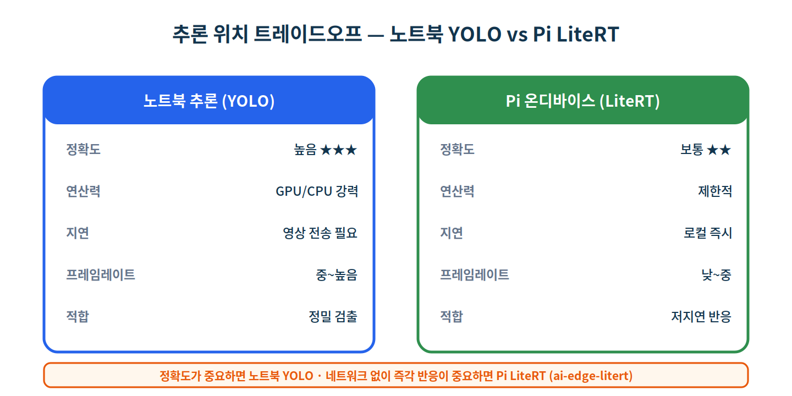

# Day 4 · AI 통합 (비전 인식 → ROS 2 명령)

> **과정** ROS2 + AI + 하드웨어 5일 과정 중 **4일차(9시간)**
> **환경** 노트북(Ubuntu 22.04, **내장 카메라 사용**) + 라즈베리파이 4B · 양쪽 ROS 2 Humble · Freenove 키트
> **방식** 따라하기(hands-on) · **분량** 실습 4-1 ~ 4-5
> **전제** Day 1~3 완료 (분산 통신, 센서, 액추에이터·폐루프·tf2)

Day 3까지는 사람이 정한 규칙(거리 임계값)으로 폐루프를 닫았습니다. 오늘은 그 **판단 자리에 AI(비전 인식)** 가 들어갑니다. **카메라는 노트북 내장 카메라**를 쓰고, 노트북에서 영상 처리·AI 추론을 한 뒤, 그 결과 명령만 라즈베리파이의 액추에이터로 보냅니다. 노트북 = 눈·두뇌, 라즈베리파이 = 몸체입니다.



## 학습 목표

- 노트북 내장 카메라를 ROS 2 토픽으로 발행하고 **압축 스트리밍**을 이해한다.
- **고전 CV**(OpenCV 색상 추적)로 추적 오차를 `Twist`로 변환한다.
- **딥러닝 객체 검출**(YOLO)로 검출 결과(클래스·바운딩박스)를 토픽으로 발행한다.
- 검출 결과로 **Pi 액추에이터**를 구동한다(팬틸트 서보 추적, RGB·부저 경보).
- (선택) **Pi 온디바이스 추론(LiteRT)** 과 노트북 추론의 트레이드오프를 비교한다.

## 준비물

| 구분 | 항목 |
|---|---|
| 카메라 | **노트북 내장 카메라**(또는 USB 웹캠) — Pi 카메라 불필요 |
| 액추에이터 | 팬틸트 서보 2개(또는 서보 2개), Day 3의 RGB LED·부저 |
| 소프트웨어 | (노트북) OpenCV, cv_bridge, ultralytics(YOLO) · (Pi, 선택) ai-edge-litert |

## 4-0. 사전 설치

```bash
# 〔노트북〕 영상·AI 패키지
$ sudo apt install -y ros-humble-cv-bridge ros-humble-vision-opencv python3-opencv
$ pip3 install ultralytics            # YOLO (PyTorch 포함, 용량 큼)
# (선택) 표준 카메라 드라이버·압축 플러그인
$ sudo apt install -y ros-humble-v4l2-camera ros-humble-image-transport-plugins
```

> ⚠️ **VirtualBox에서 노트북 카메라 쓰기**: 기본 상태에서는 VM이 호스트 웹캠을 못 봅니다. VM을 끄고, 확장팩(Extension Pack) 설치 후 호스트에서 웹캠을 연결하세요.
> ```
> VBoxManage list webcams
> VBoxManage controlvm "<VM이름>" webcam attach .1
> ```
> 네이티브 Ubuntu(듀얼부팅)라면 내장 카메라가 `/dev/video0`으로 바로 잡힙니다. 확인: `ls /dev/video*`.

---

# 실습 4-1 · 카메라 분산 스트리밍

**목표** 노트북 내장 카메라 영상을 ROS 2 토픽으로 발행하고, 원본과 **JPEG 압축본**을 함께 내보내 `rqt_image_view`로 확인한다.

`~/ros2_labs/webcam_pub.py` (노트북)

```python
#!/usr/bin/env python3
# 〔노트북〕 내장 카메라 → /image_raw(원본) + /image_raw/compressed(JPEG) 발행
import cv2
import rclpy
from rclpy.node import Node
from sensor_msgs.msg import Image, CompressedImage
from cv_bridge import CvBridge

class WebcamPublisher(Node):
    def __init__(self):
        super().__init__('webcam_publisher')
        self.cap = cv2.VideoCapture(0)                  # /dev/video0
        self.cap.set(cv2.CAP_PROP_FRAME_WIDTH, 640)
        self.cap.set(cv2.CAP_PROP_FRAME_HEIGHT, 480)
        self.bridge = CvBridge()
        self.raw_pub  = self.create_publisher(Image, 'image_raw', 10)
        self.comp_pub = self.create_publisher(CompressedImage, 'image_raw/compressed', 10)
        self.timer = self.create_timer(1 / 30.0, self.tick)   # 30 FPS 목표
        self.get_logger().info('웹캠 발행 시작 — /image_raw, /image_raw/compressed')

    def tick(self):
        ok, frame = self.cap.read()
        if not ok:
            self.get_logger().warn('카메라 프레임 읽기 실패')
            return
        self.raw_pub.publish(self.bridge.cv2_to_imgmsg(frame, 'bgr8'))    # 원본
        ok2, enc = cv2.imencode('.jpg', frame, [cv2.IMWRITE_JPEG_QUALITY, 80])
        if ok2:                                                           # JPEG 압축
            msg = CompressedImage()
            msg.format = 'jpeg'
            msg.data = enc.tobytes()
            self.comp_pub.publish(msg)

    def destroy_node(self):
        self.cap.release()
        super().destroy_node()

def main(args=None):
    rclpy.init(args=args)
    node = WebcamPublisher()
    try:
        rclpy.spin(node)
    except KeyboardInterrupt:
        pass
    finally:
        node.destroy_node()
        rclpy.shutdown()

if __name__ == '__main__':
    main()
```

```bash
# 〔노트북〕
$ python3 ~/ros2_labs/webcam_pub.py
# 〔노트북〕 다른 터미널 — 영상 확인 (드롭다운에서 /image_raw 또는 /image_raw/compressed 선택)
$ ros2 run rqt_image_view rqt_image_view
```

```bash
# 대역폭 비교 — 압축본이 훨씬 작음
$ ros2 topic bw /image_raw
$ ros2 topic bw /image_raw/compressed
```

원본(`/image_raw`)은 초당 수십 MB지만 JPEG 압축본은 수백 KB 수준입니다. 이 차이가 **분산 환경에서 압축이 중요한 이유**입니다(4-5에서 Pi로 영상을 보낼 때 압축본을 씁니다).

> 💡 표준 드라이버를 쓰려면 `ros2 run v4l2_camera v4l2_camera_node`도 같은 `/image_raw`(+ `image_transport` 압축)를 제공합니다. 본 문서는 동작 원리가 보이도록 직접 발행 노드를 사용합니다.

> ✅ **체크포인트 4-1**
> - [ ] `/image_raw`·`/image_raw/compressed` 발행
> - [ ] `rqt_image_view`로 영상 표시
> - [ ] `topic bw`로 원본 vs 압축 대역폭 차이 확인

---

# 실습 4-2 · 고전 CV — 색상 추적 → `Twist`

**목표** 딥러닝 없이 OpenCV만으로 특정 색 물체를 추적하고, 화면 중심으로부터의 **추적 오차를 `Twist`로 변환**한다(가볍고 빠른 고전 기법).

`~/ros2_labs/color_tracker.py` (노트북)

```python
#!/usr/bin/env python3
# 〔노트북〕 /image_raw → OpenCV 색상 추적 → 추적 오차를 /cmd_vel(Twist)로 변환
import cv2
import numpy as np
import rclpy
from rclpy.node import Node
from sensor_msgs.msg import Image
from geometry_msgs.msg import Twist
from cv_bridge import CvBridge

LOWER = np.array([0, 120, 70])     # 추적 색(HSV) 하한 — 대상에 맞게 조정(예: 빨강)
UPPER = np.array([10, 255, 255])   # 상한

class ColorTracker(Node):
    def __init__(self):
        super().__init__('color_tracker')
        self.bridge = CvBridge()
        self.sub = self.create_subscription(Image, 'image_raw', self.on_image, 10)
        self.cmd_pub = self.create_publisher(Twist, 'cmd_vel', 10)
        self.img_pub = self.create_publisher(Image, 'tracked/image', 10)
        self.get_logger().info('색상 추적 시작 — /image_raw 구독')

    def on_image(self, msg):
        frame = self.bridge.imgmsg_to_cv2(msg, 'bgr8')
        h, w = frame.shape[:2]
        hsv = cv2.cvtColor(frame, cv2.COLOR_BGR2HSV)
        mask = cv2.inRange(hsv, LOWER, UPPER)
        contours, _ = cv2.findContours(mask, cv2.RETR_EXTERNAL, cv2.CHAIN_APPROX_SIMPLE)
        cmd = Twist()
        if contours:
            c = max(contours, key=cv2.contourArea)
            if cv2.contourArea(c) > 500:
                x, y, bw, bh = cv2.boundingRect(c)
                cx = x + bw / 2.0
                err = (cx - w / 2.0) / (w / 2.0)       # -1(왼쪽)~+1(오른쪽)
                cmd.angular.z = -1.5 * err             # 대상 쪽으로 회전
                cmd.linear.x = 0.2                     # 천천히 전진
                cv2.rectangle(frame, (x, y), (x + bw, y + bh), (0, 255, 0), 2)
        self.cmd_pub.publish(cmd)
        self.img_pub.publish(self.bridge.cv2_to_imgmsg(frame, 'bgr8'))

def main(args=None):
    rclpy.init(args=args)
    node = ColorTracker()
    try:
        rclpy.spin(node)
    except KeyboardInterrupt:
        pass
    finally:
        node.destroy_node()
        rclpy.shutdown()

if __name__ == '__main__':
    main()
```

```bash
# 〔노트북〕 (webcam_pub 실행 중인 상태에서)
$ python3 ~/ros2_labs/color_tracker.py
$ ros2 run rqt_image_view rqt_image_view      # /tracked/image 선택
$ ros2 topic echo /cmd_vel                     # 추적 오차가 Twist로
```

색 물체를 화면 좌우로 움직이면 `angular.z` 부호가 바뀝니다. 이 `/cmd_vel`을 Day 3의 DC 모터(`dc_motor_node`)에 연결하면 **색을 따라가는 로봇**이 됩니다.

> 💡 추적 색은 HSV 범위(`LOWER`/`UPPER`)로 정합니다. 빨강은 Hue가 0과 180 양끝에 걸쳐 있어, 정밀하게 하려면 두 범위를 OR로 합칩니다(과제).

> ✅ **체크포인트 4-2**
> - [ ] 색 물체의 바운딩박스가 `/tracked/image`에 표시
> - [ ] 좌우 이동에 따라 `/cmd_vel`의 `angular.z` 변화

---

# 실습 4-3 · 딥러닝 객체 검출 (YOLO)

**목표** 사전학습 YOLO 모델로 사람·사물을 검출하고, **대상의 위치(클래스·바운딩박스)** 를 토픽으로 발행한다.



검출기는 대상(`person`)의 화면 내 정규화 위치를 `/target`(Point: x,y∈[-1,1], z=신뢰도)으로, 라벨을 `/detection_label`로, 표시 영상을 `/detection/image`로 발행합니다.

`~/ros2_labs/yolo_detector.py` (노트북)

```python
#!/usr/bin/env python3
# 〔노트북〕 /image_raw → YOLO 객체 검출 → /target(Point)+/detection_label(String)+/detection/image
import cv2
import rclpy
from rclpy.node import Node
from sensor_msgs.msg import Image
from geometry_msgs.msg import Point
from std_msgs.msg import String
from cv_bridge import CvBridge
from ultralytics import YOLO

TARGET_CLASS = 'person'      # 추적 대상 클래스

class YoloDetector(Node):
    def __init__(self):
        super().__init__('yolo_detector')
        self.bridge = CvBridge()
        self.model = YOLO('yolov8n.pt')        # 경량 모델(최초 실행 시 자동 다운로드)
        self.sub = self.create_subscription(Image, 'image_raw', self.on_image, 10)
        self.target_pub = self.create_publisher(Point, 'target', 10)
        self.label_pub = self.create_publisher(String, 'detection_label', 10)
        self.img_pub = self.create_publisher(Image, 'detection/image', 10)
        self.get_logger().info('YOLO 검출 시작 — /image_raw 구독')

    def on_image(self, msg):
        frame = self.bridge.imgmsg_to_cv2(msg, 'bgr8')
        h, w = frame.shape[:2]
        results = self.model(frame, verbose=False)
        best = None
        for box in results[0].boxes:
            cls_id = int(box.cls[0]); conf = float(box.conf[0])
            name = self.model.names[cls_id]
            x1, y1, x2, y2 = (float(v) for v in box.xyxy[0])
            cv2.rectangle(frame, (int(x1), int(y1)), (int(x2), int(y2)), (0, 255, 0), 2)
            cv2.putText(frame, f'{name} {conf:.2f}', (int(x1), int(y1) - 6),
                        cv2.FONT_HERSHEY_SIMPLEX, 0.5, (0, 255, 0), 2)
            if name == TARGET_CLASS and (best is None or conf > best[0]):
                best = (conf, (x1 + x2) / 2.0, (y1 + y2) / 2.0, x1, y1, x2, y2)
        if best is not None:
            conf, cx, cy, x1, y1, x2, y2 = best
            p = Point()
            p.x = (cx - w / 2.0) / (w / 2.0)     # -1~+1 (좌우)
            p.y = (cy - h / 2.0) / (h / 2.0)     # -1~+1 (상하)
            p.z = conf
            self.target_pub.publish(p)
            lbl = String()
            lbl.data = f'{TARGET_CLASS} {conf:.2f} bbox=[{int(x1)},{int(y1)},{int(x2-x1)},{int(y2-y1)}]'
            self.label_pub.publish(lbl)
            self.get_logger().info(lbl.data)
        self.img_pub.publish(self.bridge.cv2_to_imgmsg(frame, 'bgr8'))

def main(args=None):
    rclpy.init(args=args)
    node = YoloDetector()
    try:
        rclpy.spin(node)
    except KeyboardInterrupt:
        pass
    finally:
        node.destroy_node()
        rclpy.shutdown()

if __name__ == '__main__':
    main()
```

```bash
# 〔노트북〕 (webcam_pub 실행 중)
$ python3 ~/ros2_labs/yolo_detector.py
$ ros2 run rqt_image_view rqt_image_view      # /detection/image
$ ros2 topic echo /detection_label
$ ros2 topic echo /target
```

```text
출력 ▶ (예시)
[INFO] [yolo_detector]: person 0.91 bbox=[210,80,180,360]
```

> 💡 최초 실행 시 `yolov8n.pt`(약 6 MB)가 자동 다운로드됩니다. CPU만으로도 동작하지만, GPU가 없으면 프레임레이트가 낮을 수 있습니다. `TARGET_CLASS`를 `bottle`, `cup` 등으로 바꿔 다른 대상을 추적할 수 있습니다.

> ✅ **체크포인트 4-3**
> - [ ] `/detection/image`에 바운딩박스·라벨 표시
> - [ ] `/detection_label`에 클래스·신뢰도·박스
> - [ ] `/target`에 대상의 정규화 좌표·신뢰도

---

# 실습 4-4 · AI 반응 — 팬틸트 추적 + 경보

**목표** 검출 결과로 Pi의 액추에이터를 구동한다. 대상을 **화면 중앙에 두도록 팬틸트 서보**를 움직이고, 대상이 가까이/확실하면 **RGB·부저로 경보**한다.

## 4-4-1. 노트북 — 반응 노드 (`/target` → 명령)

`~/ros2_labs/ai_reaction.py` (노트북)

```python
#!/usr/bin/env python3
# 〔노트북〕 /target(Point) → 팬틸트 서보 각도(/servo_pan,/servo_tilt) + 경보(/status)
import rclpy
from rclpy.node import Node
from geometry_msgs.msg import Point
from std_msgs.msg import Float64, String

class AiReaction(Node):
    def __init__(self):
        super().__init__('ai_reaction')
        self.pan = 90.0
        self.tilt = 90.0
        self.sub = self.create_subscription(Point, 'target', self.on_target, 10)
        self.pan_pub = self.create_publisher(Float64, 'servo_pan', 10)
        self.tilt_pub = self.create_publisher(Float64, 'servo_tilt', 10)
        self.status_pub = self.create_publisher(String, 'status', 10)
        self.last = self.get_clock().now()
        self.timer = self.create_timer(0.5, self.idle_check)
        self.get_logger().info('AI 반응 노드 시작 — /target 구독')

    def on_target(self, msg):
        self.last = self.get_clock().now()
        # 대상을 화면 중앙에 두도록 오차 비례로 팬/틸트 보정
        self.pan  = max(0.0, min(180.0, self.pan  - 8.0 * msg.x))   # 오른쪽이면 팬↓
        self.tilt = max(0.0, min(180.0, self.tilt + 8.0 * msg.y))   # 아래면 틸트↑
        self.pan_pub.publish(Float64(data=self.pan))
        self.tilt_pub.publish(Float64(data=self.tilt))
        self.status_pub.publish(String(data='danger' if msg.z > 0.6 else 'warn'))

    def idle_check(self):
        dt = (self.get_clock().now() - self.last).nanoseconds / 1e9
        if dt > 1.0:                                   # 대상이 사라지면 평상 복귀
            self.status_pub.publish(String(data='ok'))

def main(args=None):
    rclpy.init(args=args)
    node = AiReaction()
    try:
        rclpy.spin(node)
    except KeyboardInterrupt:
        pass
    finally:
        node.destroy_node()
        rclpy.shutdown()

if __name__ == '__main__':
    main()
```

## 4-4-2. Pi — 팬틸트 서보



`~/ros2_labs/servo_pantilt.py` (Pi)

```python
#!/usr/bin/env python3
# 〔Pi〕 /servo_pan,/servo_tilt(Float64) → 팬틸트 서보 2개 구동
import rclpy
from rclpy.node import Node
from std_msgs.msg import Float64
from gpiozero import AngularServo

class ServoPanTilt(Node):
    def __init__(self):
        super().__init__('servo_pantilt')
        self.pan  = AngularServo(12, min_angle=0, max_angle=180,
                                 min_pulse_width=0.0005, max_pulse_width=0.0025)
        self.tilt = AngularServo(13, min_angle=0, max_angle=180,
                                 min_pulse_width=0.0005, max_pulse_width=0.0025)
        self.create_subscription(Float64, 'servo_pan',  self.on_pan,  10)
        self.create_subscription(Float64, 'servo_tilt', self.on_tilt, 10)
        self.get_logger().info('팬틸트 서보 시작 — /servo_pan, /servo_tilt 구독')

    def on_pan(self, msg):
        self.pan.angle = max(0.0, min(180.0, msg.data))

    def on_tilt(self, msg):
        self.tilt.angle = max(0.0, min(180.0, msg.data))

def main(args=None):
    rclpy.init(args=args)
    node = ServoPanTilt()
    try:
        rclpy.spin(node)
    except KeyboardInterrupt:
        pass
    finally:
        node.destroy_node()
        rclpy.shutdown()

if __name__ == '__main__':
    main()
```

## 4-4-3. 전체 실행

```bash
# 〔노트북〕 카메라 → 검출 → 반응
$ python3 ~/ros2_labs/webcam_pub.py
$ python3 ~/ros2_labs/yolo_detector.py
$ python3 ~/ros2_labs/ai_reaction.py

# 〔Pi〕 팬틸트 서보 + 경보 표시(Day 3)
$ python3 ~/ros2_labs/servo_pantilt.py
$ python3 ~/ros2_labs/display_hub.py
```

카메라 앞에서 움직이면 팬틸트 서보가 대상을 따라 움직이고, 대상이 확실하면 RGB가 빨강·부저가 울립니다. **AI가 폐루프의 판단을 맡은 것**입니다.

> 💡 서보가 대상을 지나쳐 진동하면 보정 게인(`8.0`)을 낮추세요. 반대로 너무 느리면 키웁니다(Day 3 P 제어와 같은 원리).

> ✅ **체크포인트 4-4**
> - [ ] 대상 이동에 따라 팬틸트 서보가 추적
> - [ ] 대상 검출 시 RGB·부저 경보(`/status`)
> - [ ] 대상이 사라지면 평상(`ok`) 복귀

---

# 실습 4-5 · (선택) Pi 온디바이스 추론 (LiteRT) 비교

**목표** 같은 영상을 **Pi에서 직접 추론**(LiteRT)했을 때와 노트북 추론(YOLO)의 정확도·지연·프레임레이트 차이를 체감한다.



노트북은 영상을 받아 정밀하게 검출하지만 영상 전송이 필요하고, Pi 온디바이스는 정확도는 낮아도 네트워크 없이 즉시 반응합니다. 여기서는 노트북이 보낸 **압축 영상**(`/image_raw/compressed`)을 Pi가 받아 LiteRT로 분류해 봅니다.

```bash
# 〔Pi〕 LiteRT 설치 (TFLite의 새 이름)
$ pip3 install ai-edge-litert opencv-python numpy
# MobileNet .tflite 모델과 labels.txt를 ~/models/ 에 준비
```

`~/ros2_labs/litert_classify.py` (Pi)

```python
#!/usr/bin/env python3
# 〔Pi〕(선택) /image_raw/compressed → LiteRT MobileNet 분류 → /pi_class (온디바이스 추론)
import time
import numpy as np
import cv2
import rclpy
from rclpy.node import Node
from sensor_msgs.msg import CompressedImage
from std_msgs.msg import String
from ai_edge_litert.interpreter import Interpreter

MODEL  = '/home/robot/models/mobilenet_v2.tflite'
LABELS = '/home/robot/models/labels.txt'

class LiteRTClassify(Node):
    def __init__(self):
        super().__init__('litert_classify')
        self.interp = Interpreter(model_path=MODEL)
        self.interp.allocate_tensors()
        self.inp = self.interp.get_input_details()
        self.out = self.interp.get_output_details()
        _, self.ih, self.iw, _ = self.inp[0]['shape']
        with open(LABELS) as f:
            self.labels = [ln.strip() for ln in f]
        self.sub = self.create_subscription(CompressedImage, 'image_raw/compressed', self.on_image, 10)
        self.pub = self.create_publisher(String, 'pi_class', 10)
        self.t0 = time.time(); self.n = 0
        self.get_logger().info('LiteRT 분류 시작 — /image_raw/compressed 구독')

    def on_image(self, msg):
        arr = np.frombuffer(msg.data, np.uint8)
        frame = cv2.imdecode(arr, cv2.IMREAD_COLOR)
        img = cv2.resize(frame, (self.iw, self.ih))
        data = np.expand_dims(img, axis=0).astype(self.inp[0]['dtype'])
        self.interp.set_tensor(self.inp[0]['index'], data)
        self.interp.invoke()
        scores = self.interp.get_tensor(self.out[0]['index'])[0]
        idx = int(np.argmax(scores))
        label = self.labels[idx] if idx < len(self.labels) else str(idx)
        self.pub.publish(String(data=label))
        self.n += 1
        if self.n % 30 == 0:
            fps = self.n / (time.time() - self.t0)
            self.get_logger().info(f'분류: {label} | 평균 {fps:.1f} FPS')
```

```bash
# 〔노트북〕 압축 영상 발행
$ python3 ~/ros2_labs/webcam_pub.py
# 〔Pi〕 온디바이스 분류 + FPS 측정
$ python3 ~/ros2_labs/litert_classify.py
```

노트북 YOLO의 검출 지연·FPS(`yolo_detector` 로그)와 Pi LiteRT의 FPS를 비교해 표로 정리해 보세요.

> ⚠️ 이 노드는 모델 파일(`.tflite`)·라벨·입력 정규화(uint8/float32)가 모델마다 달라 **그대로 동작하지 않을 수 있습니다.** 사용하는 MobileNet 모델의 입력 사양에 맞춰 `dtype`·정규화·전처리를 조정하세요. 본 문서의 모든 AI 코드는 문법 검증만 거쳤습니다.

> ✅ **체크포인트 4-5**
> - [ ] Pi가 압축 영상을 받아 LiteRT로 분류
> - [ ] 노트북 YOLO vs Pi LiteRT의 FPS·지연·정확도 비교 정리

---

# 과제

### 기본
1. `color_tracker`의 추적 색을 자신이 가진 물체 색(HSV)으로 바꿔 추적되게 하라.
2. `yolo_detector`의 `TARGET_CLASS`를 바꿔 다른 물체(예: `cup`)를 추적하라.

### 심화
3. 검출된 대상이 화면의 일정 면적 이상(가까움)일 때만 `danger` 경보가 울리도록 `ai_reaction`을 개선하라.
4. 색상 추적(`/cmd_vel`)을 Day 3 DC 모터에 연결하고 Day 3의 `obstacle_guard`(폐루프)를 끼워, **색을 따라가되 장애물 앞에서 멈추게** 하라.

### 도전
5. YOLO 검출과 색상 추적을 런치 파일 하나로 묶고, 파라미터로 둘 중 하나를 선택하게 하라.
6. (4-5) Pi LiteRT FPS와 노트북 YOLO FPS를 같은 장면에서 측정해 표·그래프로 비교 보고서를 작성하라.

---

# 트러블슈팅

| 증상 | 원인 | 해결 |
|---|---|---|
| `VideoCapture(0)` 실패 | 카메라 미인식 | `ls /dev/video*` 확인. VirtualBox면 웹캠 attach |
| VM에서 카메라 안 잡힘 | VirtualBox 패스스루 미설정 | 확장팩 + `VBoxManage controlvm <VM> webcam attach .1` |
| `cv_bridge` import 오류 | 패키지 미설치 | `sudo apt install ros-humble-cv-bridge ros-humble-vision-opencv` |
| `rqt_image_view` 검은 화면 | 토픽·인코딩 불일치 | 드롭다운에서 올바른 토픽 선택, `bgr8` 확인 |
| YOLO 매우 느림 | CPU 추론 | 해상도 축소, `yolov8n`(나노) 사용, GPU 환경 권장 |
| `ultralytics` 설치 오류 | PyTorch 의존성 | `pip3 install ultralytics` 재시도, 파이썬 버전 확인 |
| 팬틸트가 진동 | 보정 게인 과다 | `ai_reaction`의 `8.0`을 낮춤 |
| 서보 떨림/리셋 | 전원 부족 | 외부 5V, GND 공통 |
| LiteRT 결과 이상 | 입력 정규화·dtype 불일치 | 모델 사양에 맞게 전처리 조정 |
| 머신 간 토픽 안 옴 | 도메인·네트워크 | Day 2-1 분산 설정 확인(`ROS_DOMAIN_ID`) |

---

# 최종 체크리스트

- [ ] 노트북 카메라 → `/image_raw`(+압축) 발행, rqt_image_view 확인
- [ ] OpenCV 색상 추적 → `/cmd_vel`(Twist)
- [ ] YOLO 검출 → `/target`·`/detection_label`·`/detection/image`
- [ ] AI 반응 → 팬틸트 서보 추적 + RGB·부저 경보
- [ ] (선택) Pi LiteRT 온디바이스 추론 비교
- [ ] 과제 기본 2문항 완료

---

# 다음 시간 예고 — Day 5 (캡스톤)

오늘 완성한 **카메라 → AI 추론 → 액추에이터** 파이프라인을 하나의 자율 동작으로 통합합니다.

- 비전 인식 + 폐루프 안전(Day 3) + 분산 통신(Day 2)을 결합한 **AI 자율 로봇**
- 시나리오: 대상 추적 + 장애물 회피 + 상태 표시를 동시에
- 런치 파일로 전체 시스템을 한 번에 기동, RViz로 상태 시각화
- 팀별 캡스톤 발표

오늘의 `webcam_pub` · `yolo_detector` · `ai_reaction` · 팬틸트 · 경보가 캡스톤의 핵심 부품이 됩니다.

---

## 📌 한 장 요약 (복붙용)

```bash
# ── 4-0 설치 (노트북) ──
sudo apt install -y ros-humble-cv-bridge ros-humble-vision-opencv python3-opencv
pip3 install ultralytics
ls /dev/video*                       # 카메라 확인 (VirtualBox는 웹캠 attach)

# ── 4-1 카메라 스트리밍 (노트북) ──
python3 ~/ros2_labs/webcam_pub.py
ros2 run rqt_image_view rqt_image_view
ros2 topic bw /image_raw ; ros2 topic bw /image_raw/compressed

# ── 4-2 색상 추적 (노트북) ──
python3 ~/ros2_labs/color_tracker.py
ros2 topic echo /cmd_vel

# ── 4-3 YOLO 검출 (노트북) ──
python3 ~/ros2_labs/yolo_detector.py
ros2 topic echo /detection_label ; ros2 topic echo /target

# ── 4-4 AI 반응 (노트북: 검출·반응 / Pi: 서보·경보) ──
python3 ~/ros2_labs/ai_reaction.py            # 노트북
python3 ~/ros2_labs/servo_pantilt.py          # Pi
python3 ~/ros2_labs/display_hub.py            # Pi

# ── 4-5 (선택) Pi 온디바이스 LiteRT ──
pip3 install ai-edge-litert opencv-python numpy   # Pi
python3 ~/ros2_labs/litert_classify.py            # Pi
```
