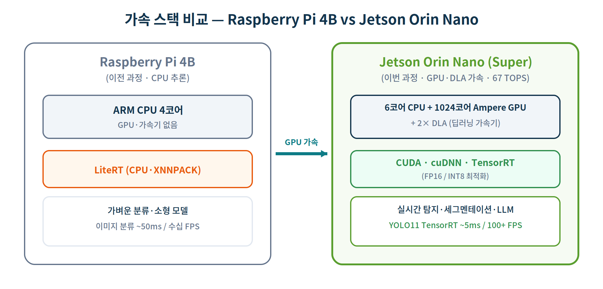
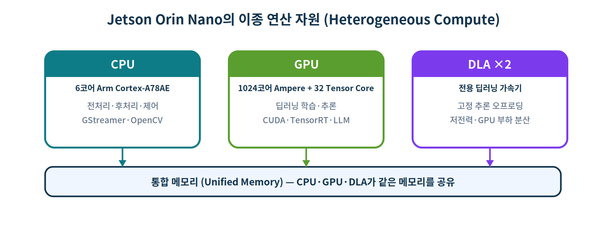
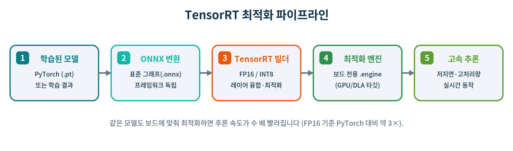

# Jetson Orin Nano GPU·AI 심화 실습

> **SBC 기반 임베디드 리눅스 & 로보틱스 과정** · 인공지능 심화(GPU 가속) 실습 자료
> **대상 보드:** NVIDIA Jetson Orin Nano Developer Kit (Super, 최대 67 TOPS) · **OS:** Ubuntu 22.04 / **JetPack 6.2** (L4T 36.4.3)
> **가속 스택:** CUDA 12.6 · cuDNN 9.3 · TensorRT 10.3 · OpenCV 4.11(CUDA) · DLA 3.1
> **소요 시간:** 약 12시간 · **언어/도구:** Python 3.10, PyTorch(CUDA), TensorRT, Ultralytics YOLO11, OpenCV(GStreamer), Ollama, jetson-stats

---

## 0. 실습 개요

이 과정은 **라즈베리 파이 4B AI 기초 실습**의 후속편입니다. 라즈베리 파이에서는 GPU 없이 **CPU(LiteRT)** 로 추론했다면, 이번에는 **GPU·CUDA·TensorRT·DLA** 를 활용해 **같은 작업을 수 배~수십 배 빠르게**, 그리고 **CPU만으로는 불가능했던 작업**(실시간 영상 탐지, 로컬 LLM)까지 직접 실행합니다.



> 〔Jetson〕 라즈베리 파이에서 익힌 **"전처리 → 추론 → 후처리"** 파이프라인은 그대로 유지됩니다. 달라지는 것은 **추론을 어디서, 어떤 정밀도로 하느냐**입니다. 핵심 학습 포인트는 "**같은 모델을 보드에 맞게 최적화(TensorRT/FP16)** 하면 얼마나 빨라지는가"를 정량적으로 체감하는 것입니다.

### Jetson Orin Nano의 연산 자원



Orin Nano는 **CPU·GPU·DLA**라는 세 종류의 연산기를 **통합 메모리** 위에서 함께 사용합니다. 작업의 성격에 따라 어디서 연산할지 선택하는 것(이종 컴퓨팅)이 임베디드 AI의 핵심 역량입니다.

### 학습 목표

이 실습을 마치면 다음을 할 수 있습니다.

1. JetPack 6.2의 GPU 가속 스택(CUDA·cuDNN·TensorRT)을 점검하고, `jtop`·`nvpmodel`로 자원과 전력 모드를 관리한다.
2. **Jetson 전용 PyTorch(CUDA)** 를 설치하고 `torch.cuda` 로 GPU 연산을 수행한다.
3. 동일 연산의 **CPU vs GPU 속도 차이**를 측정해 가속 효과를 정량화한다.
4. 사전 학습 모델을 **GPU로 추론**하고, CPU 대비 지연시간을 비교한다.
5. **TensorRT** 로 모델을 최적화(ONNX → 엔진, FP16)하고 추론 속도를 비교한다.
6. **YOLO11 + TensorRT** 로 실시간 객체 탐지를 수행하고 FPS를 측정한다.
7. **USB·CSI 카메라** 영상에서 실시간 추론 파이프라인을 구성한다.
8. **DLA(딥러닝 가속기)** 로 추론을 오프로딩해 GPU 부하·전력을 분산한다.
9. **로컬 LLM(Ollama)** 을 GPU로 구동해 엣지 생성형 AI를 체험한다.
10. **정밀도(FP32/FP16)·전력 모드(15W/25W/MAXN SUPER)** 에 따른 성능을 종합 벤치마크한다.
11. AI 추론 결과로 **Jetson.GPIO** 를 제어해 인식과 동작을 연결한다.

### 사전 지식 및 준비

- **라즈베리 파이 4B AI 기초 실습** 수료(또는 동등한 파이썬·NumPy·추론 파이프라인 이해)
- Jetson Orin Nano에 **JetPack 6.2 설치 완료**(이전 세션의 Jetson 설치 실습 참고), 모니터·키보드 또는 SSH 접속
- 인터넷 연결, 충분한 저장공간(모델·LLM 다운로드로 수 GB 사용), 가능하면 NVMe SSD
- (선택) USB 웹캠 또는 CSI 카메라(IMX219 등), LED·점퍼선(실습 11)

> ⚠️ 8GB 모델 기준으로 작성되었습니다. 4GB 모델은 LLM·대형 모델 실습에서 더 작은 모델을 쓰거나 swap을 확보해야 합니다(트러블슈팅 참고).

---

## 실습 0. 환경 점검 — GPU·CUDA·JetPack 스택 확인 (20분)

> **학습 목표:** 보드의 JetPack 버전과 GPU 가속 스택(CUDA·cuDNN·TensorRT)을 확인하고, 최대 성능 모드로 전환한다.

**0‑1.** 아키텍처와 L4T(Jetson Linux) 버전을 확인합니다.

```bash
$ uname -m
```
```
출력 ▶ aarch64
```

```bash
$ cat /etc/nv_tegra_release
```
```
출력 ▶ (예시) # R36 (release), REVISION: 4.3, GCID: ..., BOARD: generic, EABI: aarch64, DATE: ...
```

> `R36 / REVISION 4.3` 은 **L4T 36.4.3 = JetPack 6.2** 를 의미합니다.

**0‑2.** CUDA 버전을 확인합니다. `nvcc` 가 경로에 없으면 CUDA bin을 PATH에 추가합니다.

```bash
$ export PATH=/usr/local/cuda/bin:$PATH       # 필요 시 ~/.bashrc 에 추가
$ nvcc --version
```
```
출력 ▶ (예시) Cuda compilation tools, release 12.6, V12.6.68
```

**0‑3.** **jetson-stats** 를 설치해 전체 스택을 한눈에 봅니다.

```bash
$ sudo pip3 install -U jetson-stats
$ sudo reboot                                  # 서비스 적용을 위해 1회 재부팅
```

재부팅 후, 스택 요약을 출력합니다.

```bash
$ jetson_release
```
```
출력 ▶ (예시)
 Model: NVIDIA Jetson Orin Nano Developer Kit - Jetpack 6.2 [L4T 36.4.3]
 Libraries:
   - CUDA: 12.6.68
   - cuDNN: 9.3.0.75
   - TensorRT: 10.3.0.30
   - VPI: 3.2.4
   - OpenCV: 4.11.0  - with CUDA: YES
```

실시간 자원 모니터는 `jtop` 으로 봅니다(종료는 `q`).

```bash
$ jtop          # CPU/GPU 사용률·온도·전력·메모리, 7:INFO 탭에서 스택 버전 확인
```

**0‑4.** **최대 성능(MAXN SUPER) 모드**로 전환합니다. 이 한 줄이 추론 속도를 크게 좌우합니다.

```bash
$ sudo nvpmodel -q                  # 현재 전원 모드 확인
$ sudo nvpmodel -m 0                # 0번 = MAXN SUPER (최대 성능)
$ sudo jetson_clocks                # 클럭을 최대로 고정
```

> 〔Jetson〕 `nvpmodel -m 0` 는 전력 상한을 풀어 최대 성능을 냅니다(발열·전류에 따라 스로틀링 가능). 벤치마크 전에는 항상 MAXN SUPER + `jetson_clocks` 를 적용하세요. 데스크톱 상단바의 **Power Mode** 메뉴에서도 바꿀 수 있습니다.

✅ **체크포인트 0:** `jetson_release` 에 **CUDA 12.6 · TensorRT 10.3 · OpenCV with CUDA: YES** 가 보이고, 전원 모드가 **MAXN SUPER** 이면 준비 완료입니다.

---

## 실습 1. 파이썬 환경과 GPU 라이브러리 설치 (50분)

> **학습 목표:** 시스템 가속 라이브러리(TensorRT·OpenCV)를 그대로 쓰면서, 프로젝트 전용 가상환경에 **Jetson용 PyTorch(CUDA)** 를 설치한다.

**1‑1.** 작업 폴더와 가상환경을 만듭니다. Jetson에서는 **`--system-site-packages`** 옵션이 중요합니다.

```bash
$ sudo apt update && sudo apt install -y python3-venv python3-pip python3-dev
$ mkdir -p ~/jetson_ai && cd ~/jetson_ai
$ python3 -m venv --system-site-packages ai_env
$ source ai_env/bin/activate
```

> 〔Jetson〕 **`--system-site-packages`** 를 쓰는 이유: `tensorrt`, `cv2`(CUDA 빌드) 등은 JetPack이 **시스템에 설치**한 패키지라 pip로 다시 설치하기 어렵습니다. 이 옵션을 줘야 가상환경에서도 시스템의 TensorRT·OpenCV를 그대로 불러올 수 있습니다.

**1‑2.** **Jetson 전용 PyTorch(CUDA)** 를 설치합니다. 일반 PyPI의 torch는 Jetson에서 GPU를 못 쓰므로, **Jetson AI Lab 인덱스**를 사용합니다.

```bash
(ai_env) $ pip install --upgrade pip
# JetPack 6 / CUDA 12.6 전용 인덱스에서 torch·torchvision 설치
(ai_env) $ pip install torch torchvision --index-url https://pypi.jetson-ai-lab.io/jp6/cu126
```

```bash
# GPU 인식 검증 — 반드시 True 가 나와야 함
(ai_env) $ python -c "import torch; print(torch.__version__, '| CUDA:', torch.cuda.is_available(), '|', torch.cuda.get_device_name(0))"
```
```
출력 ▶ (예시) 2.x.x | CUDA: True | Orin
```

> ⚠️ `CUDA: False` 가 나오면 일반 PyPI torch가 깔린 것입니다. `pip uninstall torch torchvision` 후 위 인덱스로 다시 설치하세요(트러블슈팅 참고).

**1‑3.** 객체 탐지·영상용 라이브러리를 설치하고, 시스템 TensorRT·OpenCV가 보이는지 확인합니다.

```bash
(ai_env) $ pip install ultralytics
(ai_env) $ python -c "import tensorrt, cv2; print('TensorRT', tensorrt.__version__, '| OpenCV', cv2.__version__)"
```
```
출력 ▶ (예시) TensorRT 10.3.0 | OpenCV 4.11.0
```

✅ **체크포인트 1:** `torch.cuda.is_available()` 가 **True**, `import tensorrt` 가 성공하면 GPU 개발 환경이 준비된 것입니다.

---

## 실습 2. CPU vs GPU — CUDA 가속 체감하기 (40분)

> **학습 목표:** 동일한 행렬 연산을 CPU와 GPU에서 각각 실행해, GPU 가속의 효과를 **숫자로** 확인한다.

라즈베리 파이 실습 2에서 NumPy 행렬 연산이 신경망의 기초임을 배웠습니다. 그 **대규모 행렬곱**이 GPU에서 얼마나 빨라지는지 측정합니다.

```bash
(ai_env) $ nano gpu_vs_cpu.py
```

```python
import torch, time

N = 4096
A = torch.randn(N, N)
B = torch.randn(N, N)

# (1) CPU 측정
t = time.time()
C = A @ B
cpu_ms = (time.time() - t) * 1000

# (2) GPU 측정 — 워밍업 후, synchronize 로 정확히 계측
Ag, Bg = A.cuda(), B.cuda()
torch.cuda.synchronize()
_ = Ag @ Bg                      # 워밍업(커널 로딩 제외)
torch.cuda.synchronize()
t = time.time()
Cg = Ag @ Bg
torch.cuda.synchronize()
gpu_ms = (time.time() - t) * 1000

print(f"행렬곱 {N}x{N}")
print(f"  CPU: {cpu_ms:8.1f} ms")
print(f"  GPU: {gpu_ms:8.1f} ms")
print(f"  가속: {cpu_ms/gpu_ms:.0f}x")
```

```bash
(ai_env) $ python gpu_vs_cpu.py
```
```
출력 ▶ (예시 — 값은 전원 모드·발열에 따라 달라짐)
       행렬곱 4096x4096
         CPU:    790.4 ms
         GPU:     11.8 ms
         가속:    67x
```

### 무엇을 배웠나

- `.cuda()` 로 텐서를 GPU 메모리로 옮기면 연산이 GPU에서 수행됩니다.
- GPU는 비동기로 동작하므로 `torch.cuda.synchronize()` 로 **완료를 기다린 뒤** 시간을 재야 정확합니다.
- 행렬곱처럼 **병렬성이 큰 연산**일수록 GPU 가속 효과가 큽니다. 이것이 딥러닝이 GPU를 쓰는 이유입니다.

✅ **체크포인트 2:** GPU 시간이 CPU보다 수십 배 짧게 나오면 성공입니다.

---

## 실습 3. PyTorch GPU 추론 — 사전 학습 모델 (50분)

> **학습 목표:** torchvision의 사전 학습 모델을 **GPU로 추론**하고, CPU 대비 지연시간을 비교한다.

**3‑1.** 분류할 샘플 이미지를 받습니다(라즈베리 파이 실습과 동일한 고양이 샘플).

```bash
(ai_env) $ cd ~/jetson_ai
(ai_env) $ wget -q https://raw.githubusercontent.com/google-coral/test_data/master/cat.bmp
(ai_env) $ python -c "from PIL import Image; Image.open('cat.bmp').convert('RGB').save('test.jpg')"
```

**3‑2.** ResNet18 추론 스크립트를 작성합니다. 라벨은 모델 가중치에 포함된 것을 그대로 사용합니다(별도 다운로드 불필요).

```bash
(ai_env) $ nano classify_gpu.py
```

```python
import torch, time
from torchvision.models import resnet18, ResNet18_Weights
from PIL import Image

weights = ResNet18_Weights.DEFAULT
model = resnet18(weights=weights).eval()
preprocess = weights.transforms()
categories = weights.meta["categories"]          # ImageNet 1000종 라벨

x = preprocess(Image.open("test.jpg").convert("RGB")).unsqueeze(0)

def run(device):
    m = model.to(device); xx = x.to(device)
    with torch.no_grad():
        if device == "cuda":
            torch.cuda.synchronize(); _ = m(xx); torch.cuda.synchronize()  # 워밍업
        t = time.time()
        out = m(xx)
        if device == "cuda": torch.cuda.synchronize()
        ms = (time.time() - t) * 1000
    return out.softmax(1)[0], ms

probs_cpu, cpu_ms = run("cpu")
probs_gpu, gpu_ms = run("cuda")

print(f"CPU 추론: {cpu_ms:.1f} ms | GPU 추론: {gpu_ms:.1f} ms | 가속 {cpu_ms/gpu_ms:.1f}x\n")
top5 = probs_gpu.topk(5)
print("Top-5 (GPU):")
for score, idx in zip(top5.values, top5.indices):
    print(f"  {categories[idx]:25s} {score.item():.3f}")
```

```bash
(ai_env) $ python classify_gpu.py
```
```
출력 ▶ (예시)
       CPU 추론: 38.2 ms | GPU 추론: 4.6 ms | 가속 8.3x

       Top-5 (GPU):
         Egyptian cat              0.512
         tabby                     0.281
         tiger cat                 0.123
         lynx                      0.034
         Persian cat              0.011
```

### 무엇을 배웠나

- `model.to("cuda")` 로 모델 전체를 GPU에 올려 추론합니다.
- 첫 추론은 커널 로딩 때문에 느리므로 **워밍업 1회 후** 측정합니다.
- 같은 ResNet18도 GPU에서 CPU보다 수 배 빠릅니다 — 그런데 이게 끝이 아닙니다. 다음 실습의 **TensorRT** 로 한 단계 더 빨라집니다.

✅ **체크포인트 3:** 고양이 라벨이 Top‑1으로 나오고, GPU 추론 시간이 CPU보다 짧으면 성공입니다.

---

## 실습 4. TensorRT 최적화 — ONNX → 엔진 변환과 FP16 가속 (70분)

> **학습 목표:** 모델을 **TensorRT 엔진**으로 변환(ONNX 경유)하고, **FP32 vs FP16** 추론 속도를 비교한다. 이 과정이 Jetson 성능의 핵심입니다.



TensorRT는 NVIDIA GPU 전용 추론 최적화 엔진입니다. 레이어 융합, 정밀도 하향(FP16/INT8), 커널 자동 튜닝으로 **같은 모델을 훨씬 빠르게** 실행합니다.

**4‑1.** PyTorch 모델을 표준 포맷인 **ONNX** 로 내보냅니다.

```bash
(ai_env) $ nano export_onnx.py
```

```python
import torch
from torchvision.models import resnet18, ResNet18_Weights

model = resnet18(weights=ResNet18_Weights.DEFAULT).eval()
dummy = torch.randn(1, 3, 224, 224)              # 입력 형태 예시
torch.onnx.export(
    model, dummy, "resnet18.onnx",
    input_names=["input"], output_names=["output"],
    opset_version=17,
)
print("resnet18.onnx 생성 완료")
```

```bash
(ai_env) $ python export_onnx.py
```
```
출력 ▶ resnet18.onnx 생성 완료
```

**4‑2.** TensorRT에 포함된 **`trtexec`** 로 엔진을 빌드하고 벤치마크합니다. 먼저 FP32(기본)입니다.

```bash
(ai_env) $ export PATH=/usr/src/tensorrt/bin:$PATH      # trtexec 경로
(ai_env) $ trtexec --onnx=resnet18.onnx --saveEngine=resnet18_fp32.engine
```
```
출력 ▶ (예시 — 끝부분의 GPU Compute Time 'mean' 값을 봄)
       [I] GPU Compute Time: ... mean = 3.42 ms ...
       &&&& PASSED
```

**4‑3.** 이번엔 **FP16** 으로 빌드합니다. `--fp16` 한 줄을 추가할 뿐입니다.

```bash
(ai_env) $ trtexec --onnx=resnet18.onnx --fp16 --saveEngine=resnet18_fp16.engine
```
```
출력 ▶ (예시)
       [I] GPU Compute Time: ... mean = 1.58 ms ...
       &&&& PASSED
```

**4‑4.** 두 결과의 `mean` 추론 시간을 비교합니다.

| 정밀도 | 엔진 | 평균 추론 시간(예시) | 상대 속도 |
|---|---|---|---|
| FP32 | `resnet18_fp32.engine` | 3.42 ms | 1.0× |
| FP16 | `resnet18_fp16.engine` | 1.58 ms | **2.2×** |

### 무엇을 배웠나

- **워크플로:** 학습 모델 → ONNX(표준 그래프) → TensorRT 엔진(보드 전용 최적화).
- **FP16** 은 정밀도를 절반으로 낮춰(정확도 손실은 대부분 미미) 속도·메모리를 크게 개선합니다.
- 엔진(`.engine`)은 **그 보드·그 TensorRT 버전 전용**입니다. 다른 보드로 옮기면 다시 빌드해야 합니다.

> 💡 더 빠른 **INT8** 은 정확도 보정을 위한 **캘리브레이션** 데이터가 필요합니다. 실무에서는 FP16으로 충분한 경우가 많습니다.

✅ **체크포인트 4:** FP16 엔진의 평균 추론 시간이 FP32보다 짧게 나오면 성공입니다.

---

## 실습 5. 실시간 객체 탐지 — YOLO11 + TensorRT (70분)

> **학습 목표:** 최신 YOLO11을 **TensorRT 엔진(FP16)** 으로 변환해, PyTorch 대비 추론 속도와 FPS를 비교한다.

라즈베리 파이에서는 SSD MobileNet으로 정지 이미지를 탐지했습니다. 이번엔 **YOLO11**을 GPU·TensorRT로 돌려 **실시간급 속도**를 확인합니다.

**5‑1.** 탐지할 이미지를 받습니다(여러 사람·연이 있는 장면).

```bash
(ai_env) $ wget -q https://raw.githubusercontent.com/tensorflow/models/master/research/object_detection/test_images/image2.jpg -O street.jpg
```

**5‑2.** 먼저 PyTorch(.pt)로 탐지합니다. 첫 실행 시 가중치를 자동으로 받습니다.

```bash
(ai_env) $ yolo predict model=yolo11n.pt source=street.jpg
```
```
출력 ▶ (예시) ... person 5, kite 4, ... 13.2ms
       Results saved to runs/detect/predict
```

**5‑3.** 같은 모델을 **TensorRT FP16 엔진**으로 변환합니다.

```bash
(ai_env) $ yolo export model=yolo11n.pt format=engine half=True
```
```
출력 ▶ (예시) ... TensorRT: export success ... yolo11n.engine
```

**5‑4.** 엔진으로 다시 탐지하고, 속도를 비교합니다.

```bash
(ai_env) $ yolo predict model=yolo11n.engine source=street.jpg
```
```
출력 ▶ (예시) ... 4.8ms  → PyTorch(13.2ms) 대비 약 3배 빠름
```

**5‑5.** 공식 벤치마크로 포맷별 속도를 한눈에 비교합니다.

```bash
(ai_env) $ yolo benchmark model=yolo11n.pt data=coco8.yaml imgsz=640
```
```
출력 ▶ (예시 — TensorRT FP16 행이 가장 빠름)
       Format        Inference(ms)   FPS
       PyTorch          13.x          ~75
       TensorRT(FP16)    4.x         ~150~200
```

### 무엇을 배웠나

- Ultralytics는 `.pt → .engine` 변환과 추론을 한 줄로 처리합니다.
- **TensorRT FP16** 은 PyTorch 대비 약 3배 빠른 추론을 제공합니다(Orin Nano Super 기준 100+ FPS).
- 라즈베리 파이의 정지 이미지 탐지가, Jetson에서는 **실시간 영상 탐지**로 확장됩니다(다음 실습).

✅ **체크포인트 5:** `.engine` 추론 시간이 `.pt` 보다 뚜렷이 짧게 나오면 성공입니다.

---

## 실습 6. 카메라 실시간 추론 — USB·CSI 카메라 (60분)

> **학습 목표:** 카메라 영상에 YOLO11 TensorRT 엔진을 적용해 **실시간 탐지 파이프라인**을 구성한다.

**6‑1. (USB 웹캠)** 가장 간단한 방법입니다. `source=0` 은 첫 번째 카메라를 뜻합니다.

```bash
(ai_env) $ yolo predict model=yolo11n.engine source=0 show=True
```

> 화면에 실시간 탐지 결과가 상자로 표시됩니다. 좌상단 또는 콘솔에서 추론 시간/FPS를 확인하세요. 종료는 창에서 `q`.

**6‑2. (CSI 카메라)** IMX219 등 CSI 카메라는 **GStreamer(`nvarguscamerasrc`)** 파이프라인으로 받습니다. OpenCV로 프레임을 읽어 YOLO에 넣는 예제입니다.

```bash
(ai_env) $ nano camera_detect.py
```

```python
import cv2, time
from ultralytics import YOLO

# CSI 카메라용 GStreamer 파이프라인 (해상도/프레임레이트는 조정 가능)
def gst(width=1280, height=720, fps=30):
    return (f"nvarguscamerasrc ! video/x-raw(memory:NVMM), width={width}, height={height}, "
            f"framerate={fps}/1 ! nvvidconv ! video/x-raw, format=BGRx ! "
            f"videoconvert ! video/x-raw, format=BGR ! appsink drop=true")

model = YOLO("yolo11n.engine")
cap = cv2.VideoCapture(gst(), cv2.CAP_GSTREAMER)   # USB 웹캠이면: cv2.VideoCapture(0)

while cap.isOpened():
    ok, frame = cap.read()
    if not ok:
        break
    t = time.time()
    results = model(frame, verbose=False)          # 추론
    fps = 1.0 / (time.time() - t)
    annotated = results[0].plot()                  # 상자·라벨 그리기
    cv2.putText(annotated, f"{fps:.1f} FPS", (10, 30),
                cv2.FONT_HERSHEY_SIMPLEX, 1, (0, 255, 0), 2)
    cv2.imshow("Jetson YOLO", annotated)
    if cv2.waitKey(1) & 0xFF == ord('q'):
        break

cap.release(); cv2.destroyAllWindows()
```

```bash
(ai_env) $ python camera_detect.py
```

> 〔Jetson〕 CSI 카메라가 잡히지 않으면 연결과 모델 호환성을 확인하세요. JetPack 6.2는 카메라 자동 인식 설정(예: `nvidia-jetson-io` 또는 devicetree overlay)이 필요한 경우가 있습니다. USB 웹캠으로 먼저 6‑1을 성공시킨 뒤 CSI로 넘어가는 것을 권합니다.

### 무엇을 배웠나

- 실시간 추론 루프 = **프레임 읽기 → 추론 → 시각화** 의 반복입니다.
- CSI 카메라는 GStreamer를 거쳐 OpenCV로 받습니다(`nvarguscamerasrc`).
- TensorRT 엔진 덕분에 영상에서도 충분한 FPS가 나옵니다.

✅ **체크포인트 6:** 카메라 영상 위에 실시간으로 상자와 FPS가 표시되면 성공입니다.

---

## 실습 7. DLA 활용 — 딥러닝 가속기로 오프로딩 (50분)

> **학습 목표:** Orin Nano의 전용 가속기 **DLA**로 추론을 오프로딩하고, GPU 단독 실행과 전력·부하를 비교한다.

Orin Nano에는 GPU 외에 **2개의 DLA(Deep Learning Accelerator)** 가 있습니다. 고정된 추론 연산을 DLA로 넘기면 **GPU를 다른 작업에 쓰거나, 더 낮은 전력**으로 운영할 수 있습니다.

**7‑1.** YOLO11을 **DLA 타깃** 엔진으로 변환합니다. DLA는 FP16/INT8만 지원하므로 `half=True` 가 필요합니다.

```bash
(ai_env) $ yolo export model=yolo11n.pt format=engine half=True device="dla:0"
```
```
출력 ▶ (예시) ... 일부 레이어는 GPU로 폴백(fallback)됨 ... export success
```

> 〔Jetson〕 DLA가 지원하지 않는 레이어는 자동으로 GPU에서 실행됩니다(**GPU fallback**). 따라서 순수 DLA만으로 도는 모델은 드물고, 보통 **DLA + GPU 혼합**으로 동작합니다.

**7‑2.** GPU 단독 엔진과 DLA 엔진을 각각 돌리며, 다른 터미널에서 `tegrastats` 로 전력·사용률을 비교합니다.

```bash
# 터미널 A: 전력·자원 모니터 (GPU/DLA/전력 열을 관찰)
$ tegrastats
```
```
출력 ▶ (예시) RAM ... GR3D_FREQ(가속기 사용률) ... POM_5V_GPU ... mW ...
```

```bash
# 터미널 B: 각 엔진으로 추론
(ai_env) $ yolo predict model=yolo11n.engine source=street.jpg          # GPU
(ai_env) $ yolo predict model=yolo11n.engine source=street.jpg device="dla:0"
```

### 무엇을 배웠나

- DLA는 **저전력·고정 추론** 에 특화된 별도 가속기로, GPU 부하를 분산합니다.
- DLA는 FP16/INT8만 지원하고, 미지원 레이어는 GPU로 폴백합니다.
- 로봇처럼 **여러 모델을 동시에** 돌려야 할 때(예: 탐지는 DLA, 별도 작업은 GPU) 유용한 전략입니다.

✅ **체크포인트 7:** DLA 엔진 변환이 완료되고, `tegrastats` 로 가속기/전력 변화를 관찰했다면 성공입니다.

---

## 실습 8. 생성형 AI at the Edge — 로컬 LLM 실행 (60분)

> **학습 목표:** 클라우드 없이 보드에서 **대규모 언어 모델(LLM)** 을 GPU로 구동해, 엣지 생성형 AI를 체험한다.

라즈베리 파이로는 불가능했던 작업입니다. Orin Nano Super는 작은 LLM(1B~8B)을 **로컬·오프라인**으로 돌릴 수 있습니다.

**8‑1.** **Ollama** 를 설치합니다. 설치 스크립트가 Jetson(CUDA)을 자동 인식합니다.

```bash
$ curl -fsSL https://ollama.com/install.sh | sh
```
```
출력 ▶ (예시) ... NVIDIA GPU detected ... Ollama service started.
```

**8‑2.** 모델을 받아 대화를 시작합니다. **8GB 보드는 `llama3.2:3b`**, 4GB 보드는 `llama3.2:1b` 를 권장합니다.

```bash
$ ollama run llama3.2:3b
```
```
출력 ▶ (예시)
       >>> 엣지 AI가 클라우드 AI보다 유리한 점을 한 문장으로 알려줘
       엣지 AI는 데이터를 기기에서 직접 처리하므로 지연이 짧고, 오프라인에서도
       동작하며 개인정보가 외부로 나가지 않는다는 장점이 있습니다.
       >>> /bye
```

**8‑3.** 생성 중에 **다른 터미널**에서 `tegrastats` 또는 `jtop` 으로 GPU 사용을 확인합니다. 토큰 생성 동안 GPU 사용률이 올라가는 것이 보입니다.

```bash
$ tegrastats        # GR3D_FREQ(GPU) 사용률 상승 확인
```

**8‑4.** 파이썬에서 LLM을 호출해, **AI 추론 결과를 자연어로 설명**시키는 등 응용할 수 있습니다.

```bash
(ai_env) $ nano ask_llm.py
```

```python
import requests

def ask(prompt):
    r = requests.post("http://localhost:11434/api/generate",
                      json={"model": "llama3.2:3b", "prompt": prompt, "stream": False})
    return r.json()["response"]

print(ask("라즈베리 파이와 Jetson Orin Nano의 차이를 초보자에게 두 문장으로 설명해줘."))
```

```bash
(ai_env) $ python ask_llm.py
```

### 무엇을 배웠나

- Ollama는 모델 다운로드·구동·서빙을 한 번에 처리하며, Jetson에서 **GPU 가속**으로 동작합니다.
- 같은 보드라도 **메모리 한계**가 모델 크기를 결정합니다(8GB → 최대 ~8B급, 4GB → 1B급).
- 로컬 LLM은 **오프라인·저지연·프라이버시** 가 중요한 로봇/엣지 응용에 적합합니다.

> 💡 `localhost:11434` REST API로 객체 탐지 결과를 LLM에 넘겨 "장면 설명"을 생성하는 식으로 **비전 + 언어** 를 결합할 수 있습니다.

✅ **체크포인트 8:** 터미널에서 LLM과 대화가 되고, 생성 중 GPU 사용률이 오르는 것을 확인하면 성공입니다.

---

## 실습 9. 정밀도·전력·성능 종합 벤치마크 (50분)

> **학습 목표:** 정밀도(FP32/FP16)와 전력 모드(15W/25W/MAXN SUPER)에 따른 성능을 측정해, 임베디드 AI의 **성능·전력 트레이드오프**를 이해한다.

**9‑1.** 전력 모드를 바꿔가며 YOLO11 엔진의 추론 속도를 측정합니다.

```bash
# 15W 모드
$ sudo nvpmodel -m 1        # (8GB: 1=15W) — nvpmodel -q 로 번호 확인
(ai_env) $ yolo benchmark model=yolo11n.engine data=coco8.yaml imgsz=640

# MAXN SUPER 모드
$ sudo nvpmodel -m 0
$ sudo jetson_clocks
(ai_env) $ yolo benchmark model=yolo11n.engine data=coco8.yaml imgsz=640
```

> 〔Jetson〕 전원 모드 번호는 모델/메모리에 따라 다릅니다. `sudo nvpmodel -q` 로 사용 가능한 모드(예: 15W, 25W, MAXN SUPER)를 먼저 확인하세요.

**9‑2.** 측정 결과를 표로 정리합니다(예시 양식).

| 구성 | 정밀도 | 전력 모드 | 추론(ms) | FPS | 비고 |
|---|---|---|---|---|---|
| ResNet18 | FP32 | MAXN SUPER | 3.4 | — | 실습 4 |
| ResNet18 | FP16 | MAXN SUPER | 1.6 | — | 실습 4 |
| YOLO11n | FP16 | 15W | (측정) | (측정) | 저전력 |
| YOLO11n | FP16 | MAXN SUPER | (측정) | (측정) | 최대 성능 |

**9‑3.** 라즈베리 파이(이전 과정)와 비교합니다.

| 항목 | Raspberry Pi 4B (CPU) | Jetson Orin Nano (GPU·TensorRT) |
|---|---|---|
| 이미지 분류 | LiteRT, 수십 ms | TensorRT FP16, 수 ms |
| 객체 탐지 | 정지 이미지 위주 | 실시간 영상 100+ FPS |
| 생성형 AI(LLM) | 사실상 불가 | 1B~8B 로컬 구동 |
| 전력 | 고정(수 W) | 모드 선택(10~25W+) |

### 무엇을 배웠나

- **FP16** 은 정확도 손실을 거의 없이 속도·전력을 개선합니다.
- 전력 모드는 **성능과 전력의 트레이드오프**입니다. 배터리 로봇은 저전력 모드, 고정형은 MAXN SUPER가 유리합니다.
- 같은 작업도 보드·정밀도·전력에 따라 결과가 크게 달라지므로, **목표에 맞는 구성**을 선택하는 것이 엔지니어링입니다.

✅ **체크포인트 9:** 최소 두 가지 전력 모드에서 FPS를 측정해 표로 정리했다면 성공입니다.

---

## 실습 10. 인식 → 동작 — Jetson.GPIO로 제어 연계 (40분)

> **학습 목표:** AI 추론 결과로 **40핀 헤더의 GPIO**를 제어해, 인식(perception)과 동작(actuation)을 연결한다.

라즈베리 파이 실습 8에서 분류 결과로 LED를 켰습니다. Jetson에서도 **Jetson.GPIO** 로 같은 패턴을 구현합니다 — 이 구조가 다음 과정의 **ROS2·TurtleBot3 로봇 제어**로 확장됩니다.

**10‑1.** Jetson.GPIO를 설치하고 권한을 설정합니다.

```bash
(ai_env) $ pip install Jetson.GPIO
$ sudo groupadd -f gpio
$ sudo usermod -aG gpio $USER        # 적용하려면 재로그인 필요
```

**10‑2.** LED 기본 제어로 배선을 확인합니다(40핀 물리 핀 번호 `BOARD` 모드 사용).

```bash
(ai_env) $ nano led_test.py
```

```python
import Jetson.GPIO as GPIO
from time import sleep

LED = 12                         # 40핀 헤더의 물리 12번 핀 (BOARD 번호)
GPIO.setmode(GPIO.BOARD)
GPIO.setup(LED, GPIO.OUT)

for _ in range(5):
    GPIO.output(LED, GPIO.HIGH); print("ON");  sleep(0.5)
    GPIO.output(LED, GPIO.LOW);  print("OFF"); sleep(0.5)

GPIO.cleanup()
```

```bash
(ai_env) $ sudo $(which python) led_test.py    # GPIO 권한이 없으면 sudo 사용
```

**10‑3.** YOLO 탐지 결과와 연결합니다. **사람이 탐지되면 LED 점등**하는 예시입니다.

```python
# detect_to_gpio.py 의 핵심 부분
import Jetson.GPIO as GPIO
from ultralytics import YOLO

LED = 12
GPIO.setmode(GPIO.BOARD); GPIO.setup(LED, GPIO.OUT)
model = YOLO("yolo11n.engine")

results = model("street.jpg", verbose=False)[0]
names = results.names
found_person = any(names[int(c)] == "person" for c in results.boxes.cls)

GPIO.output(LED, GPIO.HIGH if found_person else GPIO.LOW)
print("사람 탐지 →", "LED ON" if found_person else "LED OFF")
GPIO.cleanup()
```

### 무엇을 배웠나

- Jetson.GPIO API는 라즈베리 파이의 GPIO 제어와 거의 동일한 패턴입니다(인식 → 판단 → 동작).
- **AI 추론 → GPIO 출력** 으로 "보고 반응하는" 기본 제어 루프를 완성했습니다.

> 〔Jetson〕 오늘 LED였던 출력을, 다음 과정에서는 **모터·서보**로 바꿔 TurtleBot3를 움직입니다. 인식 결과를 동작 입력으로 잇는 사고방식이 핵심입니다.

✅ **체크포인트 10:** 사람이 있는 사진에서 LED가 켜지고, 없는 사진에서 꺼지면 성공입니다.

---

## 트러블슈팅

| 증상 | 원인 | 해결 |
|---|---|---|
| `torch.cuda.is_available()` → False | 일반 PyPI torch 설치됨 | `pip uninstall torch torchvision` 후 Jetson AI Lab 인덱스(`jp6/cu126`)로 재설치(실습 1‑2) |
| `import tensorrt` / `import cv2` 실패 | venv가 시스템 패키지를 못 봄 | venv를 `--system-site-packages` 로 다시 생성(실습 1‑1) |
| `nvcc: command not found` | CUDA bin 경로 누락 | `export PATH=/usr/local/cuda/bin:$PATH` (실습 0‑2) |
| `trtexec: command not found` | TensorRT bin 경로 누락 | `export PATH=/usr/src/tensorrt/bin:$PATH` (실습 4‑2) |
| 추론이 벤치마크보다 느림 | 저전력 모드/클럭 미고정 | `sudo nvpmodel -m 0 && sudo jetson_clocks`(실습 0‑4) |
| LLM/대형 모델 실행 중 멈춤·OOM | 메모리 부족 | 더 작은 모델(1b) 사용, 다른 앱 종료, swap 확보, MAXN SUPER 적용 |
| `system throttled due to overcurrent` | 순간 전력 초과 | 정품 전원 사용, 발열 관리, 한 단계 낮은 전력 모드 사용 |
| YOLO `format=engine` 변환 실패 | TensorRT/드라이버 불일치 | JetPack 6.2 스택 확인(`jetson_release`), ultralytics 최신화 |
| CSI 카메라 인식 안 됨 | devicetree/카메라 설정 | USB 웹캠으로 먼저 검증, `nvidia-jetson-io` 또는 카메라 오버레이 설정 |
| `RuntimeError`/권한 오류(GPIO) | gpio 그룹/권한 | `sudo usermod -aG gpio $USER` 후 재로그인, 또는 `sudo $(which python) ...`(실습 10) |
| `.engine` 추론 시 오류 | 다른 보드/버전에서 빌드한 엔진 | 엔진은 보드·TensorRT 버전 전용 — 현재 보드에서 다시 빌드 |

---

## 최종 체크리스트

- [ ] `jetson_release` 로 CUDA·TensorRT·OpenCV(CUDA) 스택을 확인했다
- [ ] MAXN SUPER 모드와 `jetson_clocks` 를 적용했다
- [ ] Jetson용 PyTorch를 설치하고 `torch.cuda.is_available()` = True 를 확인했다
- [ ] 행렬곱 CPU vs GPU 속도 차이를 측정했다
- [ ] 사전 학습 모델을 GPU로 추론했다
- [ ] ONNX → TensorRT 엔진으로 변환하고 FP32 vs FP16을 비교했다
- [ ] YOLO11을 TensorRT 엔진으로 변환해 PyTorch와 속도를 비교했다
- [ ] 카메라 영상에서 실시간 탐지를 수행했다
- [ ] DLA 엔진을 빌드하고 자원/전력을 관찰했다
- [ ] 로컬 LLM(Ollama)과 대화하고 GPU 사용을 확인했다
- [ ] 전력 모드별 성능을 측정해 표로 정리했다
- [ ] AI 추론 결과로 GPIO(LED)를 제어했다

---

## 과제

1. **(필수)** 실습 4를 ResNet18 대신 **다른 torchvision 모델**(예: mobilenet_v3_small, efficientnet_b0)로 반복하고, 모델별 FP16 엔진 추론 시간을 표로 비교하세요.

2. **(필수)** 실습 5의 YOLO11을 **`yolo11s`(더 큰 모델)** 로 바꿔 정확도와 속도(FPS)가 어떻게 달라지는지 측정하고, `yolo11n` 과 비교해 한 문단으로 설명하세요.

3. **(필수)** 실습 9의 표를 완성하세요. 최소 **두 가지 전력 모드 × 두 가지 정밀도** 조합의 추론 시간을 측정하고, 라즈베리 파이 결과와 비교한 소감을 적으세요.

4. **(선택)** 실습 6의 실시간 카메라 탐지에서, **특정 클래스(예: person)만 화면에 표시**하도록 후처리를 수정하세요.

5. **(선택)** 실습 8의 LLM과 실습 5의 탐지를 결합해, 탐지된 객체 목록을 LLM에 보내 **"장면을 한국어로 설명"** 하게 만드세요(비전 + 언어).

6. **(선택/심화)** 실습 4의 모델을 **INT8** 로 양자화(캘리브레이션 포함)해 FP16과 속도·정확도를 비교하세요. TensorRT의 캘리브레이션 개념을 한 문단으로 정리하세요.

---

## 다음 세션 예고

다음 시간에는 오늘 익힌 GPU 추론을 **로봇 제어**와 결합합니다.

- **ROS2 + TurtleBot3:** 오늘의 "인식 → 동작" 루프를 ROS2 노드로 구성해, 카메라 탐지 결과로 **모터·서보**를 제어
- **실시간 비전 파이프라인:** YOLO11 TensorRT 엔진을 ROS2 토픽과 연결해, 사람을 따라가거나 장애물을 회피하는 동작 구현
- **엣지 추론 + 의사결정:** 오늘 다룬 TensorRT·DLA·LLM을 로봇의 인지·판단 모듈로 통합

라즈베리 파이(CPU)에서 Jetson(GPU)으로, 다시 **로봇(ROS2)** 으로 — "보고 → 판단하고 → 움직이는" 시스템이 점점 완성되어 갑니다.

---

*이 자료는 SBC 기반 임베디드 리눅스 & 로보틱스 교육 과정의 일부입니다. NVIDIA Jetson Orin Nano Developer Kit / JetPack 6.2 (Ubuntu 22.04) 기준으로 작성되었습니다. 버전·성능 수치는 보드 상태에 따라 달라질 수 있으니, 실제 보드에서 측정한 값으로 갱신해 사용하세요.*
