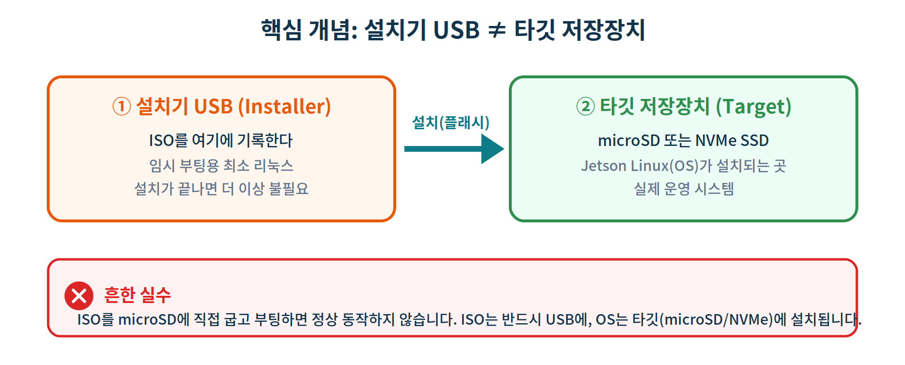
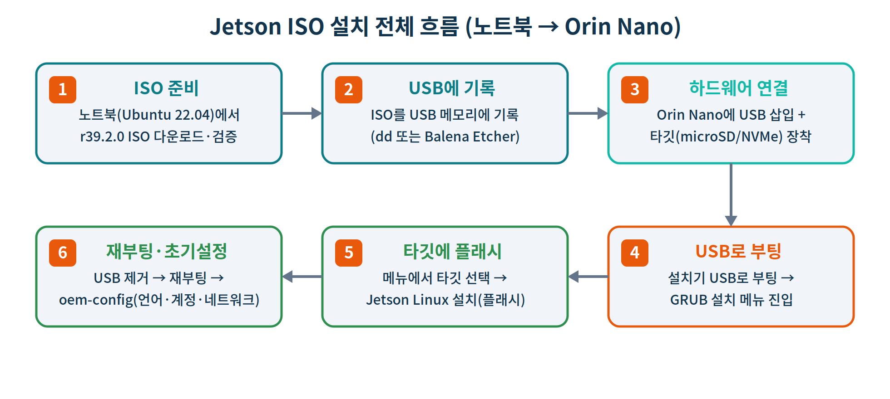

# [실습] Jetson Orin Nano 이미지 생성과 부팅 — Jetson ISO 방식

> **과정** · SBC 기반 임베디드 리눅스 & 로보틱스 (5일 / 40시간)
> **대상 플랫폼** · NVIDIA Jetson Orin Nano Developer Kit
> **호스트** · 노트북 (Ubuntu 22.04 LTS, x86_64)
> **설치 방식** · Jetson ISO 통합 설치 (JetPack 7.x · `jetsoninstaller-r39.2.0-2026-06-01-23-53-13-arm64.iso`)
> **예상 소요** · 60~90분 (다운로드·플래시 시간 별도)
> **선행 학습** · `Ubuntu 22.04 설치 및 환경 설정` 랩, `리눅스 명령어` 랩

---

## 학습 목표

이 실습을 마치면 다음을 할 수 있습니다.

1. **Jetson ISO 설치 방식**의 개념과 기존 SD카드 이미지 방식의 차이를 설명할 수 있다.
2. **NVIDIA 공식 페이지**에서 보드·버전에 맞는 ISO를 내려받고, 노트북(Ubuntu 22.04)에서 **USB 메모리에 부팅 가능한 형태로 기록**할 수 있다.
3. Orin Nano를 **설치기 USB로 부팅**하여 **타깃 저장장치(microSD/NVMe)에 Jetson Linux를 설치**할 수 있다.
4. 첫 부팅 후 **초기 설정(oem-config)** 을 완료하고 설치 결과를 **검증**할 수 있다.
5. 설치 중 발생하는 대표적인 문제를 **진단·해결**할 수 있다.

---

## 0. 핵심 개념 먼저 잡기

### 0-1. Jetson ISO 방식이란?

JetPack 7.x부터 NVIDIA는 **하나의 통합 ISO 파일**로 Jetson에 OS를 설치하는 방식을 도입했습니다.
노트북에 우분투를 설치하듯이, **호스트 PC(SDK Manager) 없이** Jetson 자체에서 설치를 진행할 수 있습니다.

- 우리가 받은 파일: `jetsoninstaller-r39.2.0-2026-06-01-23-53-13-arm64.iso`
  - `r39.2.0` → Jetson Linux(L4T) 릴리스 버전
  - `arm64` → **Jetson(ARM64)** 에서 부팅되는 이미지 (노트북은 x86_64이지만, 이 ISO는 노트북에서 *실행*하는 게 아니라 *USB에 기록*만 합니다)

### 0-2. 가장 중요한 개념 — 설치기 USB ≠ 타깃 저장장치

> 이 한 장만 제대로 이해하면 실습의 90%는 끝난 것입니다.



- **설치기 USB(Installer)** : ISO를 기록하는 곳. 부팅해서 설치만 담당하는 임시 최소 리눅스입니다.
- **타깃(Target)** : 실제 OS가 설치되어 운영될 곳. Orin Nano에 장착한 **microSD 카드** 또는 **NVMe SSD** 입니다.

> ⚠️ **흔한 실수** — ISO를 microSD에 직접 굽고 부팅하면 정상 동작하지 않습니다.
> 설치기 USB로 부팅한 뒤, 그 안에서 타깃(microSD/NVMe)에 설치하는 2단계 구조입니다.

### 0-3. 전체 흐름 한눈에 보기



✅ **체크포인트 0** — "ISO는 USB에, OS는 타깃에"를 한 문장으로 설명할 수 있다.

---

## 준비물 및 사전 점검

| 구분 | 항목 | 비고 |
|---|---|---|
| 호스트 | 노트북 (Ubuntu 22.04 LTS) | ISO를 USB에 기록하는 용도 (Windows/Mac도 가능) |
| 설치 매체 | USB 메모리 **16GB 이상** | 설치기 전용. 내용은 모두 지워집니다 |
| 타깃 저장장치 | microSD **64GB 이상 UHS-1** *또는* NVMe SSD | 둘 중 하나는 반드시 준비 (기본 구성품에 미포함) |
| 주변기기 | DisplayPort 모니터, USB 키보드/마우스 | 초기 설정용 |
| 전원 | Orin Nano 전용 19V 어댑터 | |
| 파일 | `jetsoninstaller-r39.2.0-...-arm64.iso` | NVIDIA 공식 페이지에서 다운로드 (→ 1단계) |

> **펌웨어 선행 조건** : Jetson ISO(JetPack 7.x) 설치는 Orin Nano에 **JetPack 6.x 세대 UEFI/QSPI 펌웨어(36.x 이상)** 가 있어야 합니다.
> 출고 펌웨어가 36.0보다 낮으면 **JetPack 6.x 업데이트 경로**를 먼저 수행해야 합니다. (→ 5단계에서 확인·분기)

---

## 1. ISO 다운로드 (NVIDIA Developer)

ISO는 **NVIDIA 공식 배포처**에서만 받습니다. 다운로드에는 **NVIDIA Developer Program 계정(무료)** 으로 로그인이 필요합니다.

### 1-1. 다운로드 페이지 접속

1. 브라우저에서 **JetPack SDK 다운로드 페이지**를 엽니다.
   `https://developer.nvidia.com/embedded/jetpack/downloads`
2. NVIDIA Developer 계정으로 **로그인**합니다. (계정이 없으면 무료로 **Join** 후 진행)

### 1-2. 보드·버전에 맞는 ISO 선택 (권장)

- 우리 보드는 **Jetson Orin Nano** 이고, 사용할 릴리스는 **JetPack 7.x (L4T r39.2)** 입니다.
- 페이지에서 **Jetson Orin Family / JetPack 7.x** 항목의 **통합 ISO(unified ISO)** 를 선택합니다.
- 라이선스(EULA)에 동의하면 다운로드가 시작됩니다.
- 받은 파일명이 **`jetsoninstaller-r39.2.0-2026-06-01-23-53-13-arm64.iso`** 인지 확인합니다.

> 📌 NVIDIA 공식 안내: Orin Nano Developer Kit는 더 이상 SD카드 이미지를 제공하지 않으며, **USB 스틱으로 플래시하는 통합 ISO**를 사용합니다. 보드/버전이 맞지 않는 ISO를 받으면 설치 단계에서 "Unsupported board!" 같은 오류가 날 수 있으니, **Orin 계열 + 해당 JetPack 버전**인지 꼭 확인하세요.

### 1-3. (대안) 터미널에서 직접 받기

페이지에서 ISO **다운로드 링크를 복사**했다면 `wget`으로 받을 수 있습니다. (대용량이라 이어받기 `-c` 권장)

```bash
$ cd ~/Downloads
$ wget -c "<NVIDIA 페이지에서 복사한 ISO 링크>" \
    -O jetsoninstaller-r39.2.0-2026-06-01-23-53-13-arm64.iso
# -c : 중단 시 이어받기,  -O : 저장 파일명 지정
```

```text
출력 ▶ (예시 — 진행 중)
jetsoninstaller-r39.2.0-...-arm64.iso
  46%[=========>            ]  3.10G  18.4MB/s    eta 3m 2s
```

> 💡 로그인 세션이 필요한 링크는 시간이 지나면 만료됩니다. `wget`이 실제 ISO 대신 **HTML 로그인 페이지**를 받아오면(파일이 수십 KB로 작게 받아짐) 1-2의 브라우저 방식으로 받으세요.

✅ **체크포인트 1** — NVIDIA 공식 페이지에서 Orin Nano용 r39.2.0 통합 ISO를 받았고, 파일명을 확인했다.

---

## 2. ISO 파일 확인 및 무결성 검증

먼저 노트북에서 ISO 파일이 제대로 받아졌는지 확인합니다.

```bash
$ cd ~/Downloads                       # ISO를 받은 폴더로 이동
$ ls -lh jetsoninstaller-*.iso         # 파일 존재 및 크기 확인
```

```text
출력 ▶ (예시)
-rw-rw-r-- 1 user user 6.8G  6월  1 23:53 jetsoninstaller-r39.2.0-2026-06-01-23-53-13-arm64.iso
```

다운로드 페이지에 SHA256 체크섬이 함께 제공되면, 파일이 손상되지 않았는지 검증합니다.

```bash
$ sha256sum jetsoninstaller-r39.2.0-2026-06-01-23-53-13-arm64.iso
```

```text
출력 ▶ (예시 — 실제 값은 배포 페이지의 공식 체크섬과 한 글자도 빠짐없이 일치해야 함)
3f9a1c...(64자리 16진수)...e7b2  jetsoninstaller-r39.2.0-2026-06-01-23-53-13-arm64.iso
```

> 💡 체크섬이 다르면 다운로드가 손상된 것입니다. 다시 받으세요. 손상된 ISO는 설치 중간에 실패합니다.

✅ **체크포인트 2** — ISO 파일이 존재하고, (제공된다면) SHA256 체크섬이 일치한다.

---

## 3. USB 메모리 식별 — 가장 위험한 단계

`dd`는 지정한 장치를 **묻지도 따지지도 않고 덮어씁니다.** 노트북의 내장 디스크를 잘못 지정하면 **노트북 OS가 통째로 날아갑니다.** 반드시 USB 장치명을 정확히 확인하세요.

USB를 **꽂기 전** 한 번, **꽂은 후** 한 번 `lsblk`를 실행해 **새로 생긴 장치**를 찾습니다.

```bash
$ lsblk -o NAME,SIZE,TYPE,MODEL        # USB 꽂기 전
```

이제 USB를 꽂고 다시 실행합니다.

```bash
$ lsblk -o NAME,SIZE,TYPE,MODEL        # USB 꽂은 후
```

```text
출력 ▶ (예시)
NAME        SIZE TYPE MODEL
nvme0n1   476.9G disk SAMSUNG MZVL...     # ← 노트북 내장 SSD (절대 건드리지 말 것!)
├─nvme0n1p1   512M part
└─nvme0n1p2 476.4G part
sda        28.9G disk SanDisk Ultra      # ← 새로 나타난 USB = 우리가 쓸 장치
└─sda1     28.9G part
```

위 예시에서 새로 생긴 **`sda`** 가 USB입니다. 이후 명령에서 이 이름(`/dev/sda`)을 사용합니다.
**자신의 환경에서는 `sdb`, `sdc` 등으로 다를 수 있으니 반드시 직접 확인한 이름을 쓰세요.**

USB에 기존 파티션이 자동 마운트되어 있으면 먼저 해제합니다.

```bash
$ sudo umount /dev/sda*                 # sda의 모든 파티션 마운트 해제 (없으면 그냥 넘어감)
```

> ⚠️ **장치명은 파티션이 아니라 디스크 전체** 를 씁니다. `sda1`(파티션)이 아니라 **`sda`**(디스크)에 기록해야 부팅됩니다.

✅ **체크포인트 3** — 새로 나타난 장치(USB)의 정확한 이름을 `lsblk`로 확인했고, 내장 디스크와 구분했다.

---

## 4. USB에 ISO 기록하기

두 가지 방법 중 하나를 선택합니다. 수업에서는 **방법 A(dd)** 를 기본으로 익히고, GUI가 편하면 **방법 B(Etcher)** 를 사용합니다.

### 방법 A — `dd` (명령줄)

```bash
$ sudo dd if=jetsoninstaller-r39.2.0-2026-06-01-23-53-13-arm64.iso \
    of=/dev/sda \
    bs=4M \
    status=progress \
    oflag=sync
# if = 입력 파일(ISO),  of = 출력 장치(USB, 디스크 전체!)
# bs=4M 블록 크기,  status=progress 진행률 표시,  oflag=sync 안전 기록
```

```text
출력 ▶ (예시 — 진행 중)
6800000000 bytes (6.8 GB, 6.3 GiB) copied, 412 s, 16.5 MB/s
```

기록이 끝나면 캐시를 디스크에 완전히 비웁니다.

```bash
$ sync                                  # 버퍼에 남은 데이터까지 USB에 모두 기록
```

### 방법 B — Balena Etcher (GUI)

1. <https://etcher.balena.io> 에서 Etcher를 내려받아 실행합니다.
2. **Flash from file** → ISO 선택
3. **Select target** → USB 장치 선택 (용량으로 USB가 맞는지 재확인)
4. **Flash!** 클릭 → 완료까지 대기

### 기록 검증

```bash
$ lsblk -o NAME,SIZE,TYPE,LABEL /dev/sda    # 부팅 파티션 구조가 생겼는지 확인
```

> 💡 Etcher든 dd든, 기록 후 USB를 뽑기 전에 `sync`가 끝났는지 또는 Etcher의 "Flash Complete"를 반드시 확인하세요.

✅ **체크포인트 4** — USB에 ISO가 기록되었고 새 파티션 구조가 보인다.

---

## 5. Orin Nano UEFI 펌웨어 버전 확인 (선행 조건 분기)

Jetson ISO 설치 전에 Orin Nano의 펌웨어가 **36.x 이상**인지 확인합니다.
부팅 초기 화면(UEFI 펌웨어 버전 표시) 또는 시리얼 콘솔에서 확인할 수 있습니다.

- **36.x 이상** → 그대로 6단계로 진행합니다.
- **36.0 미만(출고 펌웨어)** → **JetPack 6.x 업데이트 경로**를 먼저 수행합니다.
  1. JetPack 6.x microSD 이미지로 한 번 부팅하면 펌웨어 업데이트가 **예약**됩니다.
  2. 재부팅하여 펌웨어 업데이트가 적용되는 동안 **전원을 끊지 않고** 기다립니다.
  3. 업데이트 완료 후, 다시 이 실습의 6단계로 돌아옵니다.

> 📌 **버전·호환성 메모(강사용)** : Orin Nano의 Jetson ISO 설치 지원은 JetPack 7.x 계열에서 추가되었습니다. 수업 전 NVIDIA 공식 Orin Nano 사용자 가이드의 해당 JetPack 버전 페이지에서 지원 여부와 펌웨어 선행 조건을 한 번 더 확인하세요. (참고 링크는 부록 참조)

✅ **체크포인트 5** — Orin Nano의 펌웨어 버전을 확인했고, 36.x 이상이거나 업데이트 경로를 완료했다.

---

## 6. 하드웨어 연결 및 USB 부팅

이제 노트북에서 만든 설치기 USB로 Orin Nano를 부팅합니다.

1. **타깃 저장장치 장착**
   - microSD 사용 시 : 모듈 하단 슬롯에 microSD 삽입
   - NVMe 사용 시 : 캐리어 보드의 M.2 슬롯에 SSD가 장착되어 있는지 확인
2. **설치기 USB 삽입** : Orin Nano의 USB-A 포트에 꽂습니다.
3. **주변기기 연결** : DisplayPort 모니터, USB 키보드/마우스 연결
4. **전원 인가** : 19V 어댑터 연결 → 자동으로 켜집니다. (USB-C 옆 녹색 LED 점등)

부팅이 시작되면 사전 부팅 화면이 잠깐 표시됩니다.

- 잠시 후 자동으로, 또는 `Enter`를 누르면 **USB에서 부팅**이 시작됩니다.
- USB로 부팅되지 않고 기존 화면으로 넘어가면, 부팅 직후 **`Esc`(또는 `Del`)** 로 **UEFI 부팅 메뉴**에 진입한 뒤 **USB 장치를 선택**하고 **Save & Exit** 합니다.

```text
출력 ▶ (예시 — 부팅 초기 화면)
Jetson UEFI firmware (version 36.x ...)
Press ESC for boot menu ...
```

✅ **체크포인트 6** — Orin Nano가 설치기 USB로 부팅되어 설치 메뉴 직전까지 진행됐다.

---

## 7. 타깃에 Jetson Linux 설치 (플래시)

USB로 부팅되면 **Jetson BSP 설치 메뉴(GRUB)** 가 나타납니다.

1. 설치 메뉴에서 타깃에 맞는 항목을 방향키(↑/↓)로 선택하고 `Enter`를 누릅니다.
   - NVMe에 설치 : `Flash Jetson Orin Nano Developer Kit on NVMe ...`
   - microSD에 설치 : `Flash ... on SD Card ...`
2. 세부 버전 항목(예: `... r39.2.0`)이 나오면 선택하고 `Enter`.
3. 설치(플래시)가 자동으로 진행됩니다. **완료될 때까지 전원을 끊지 마세요.**

```text
출력 ▶ (예시 — 설치 진행)
Flashing Jetson Linux to target storage ...
[ ===========>           ]  46%
```

> 💡 이 메뉴의 최소 리눅스는 "설치 전용"입니다. Canonical 우분투 설치 USB처럼 OS를 시험 삼아 부팅해보는 기능은 없습니다 — 오직 타깃에 BSP를 설치하는 용도입니다.

✅ **체크포인트 7** — 설치 메뉴에서 타깃(microSD/NVMe)을 선택해 플래시가 정상 완료됐다.

---

## 8. USB 제거 후 재부팅 및 초기 설정(oem-config)

1. 플래시가 끝나면 **설치기 USB를 제거**합니다.
2. 전원을 뽑았다 다시 연결해 **타깃 저장장치로 부팅**합니다.
3. 첫 부팅에서 **초기 설정(oem-config)** 마법사가 실행됩니다. 순서대로 진행합니다.
   - NVIDIA Jetson 소프트웨어 **EULA 동의**
   - **언어 / 키보드 / 시간대** 선택
   - **네트워크** 연결
   - **사용자 이름 · 비밀번호 · 컴퓨터 이름(호스트명)** 생성
   - 로그인
4. 로그인하면 **Ubuntu 데스크톱**이 나타납니다.

> 💡 수업 표준 호스트명/계정 규칙이 있다면 여기서 통일해 두면 이후 ROS2·SSH 실습이 편해집니다.

✅ **체크포인트 8** — 타깃으로 부팅해 oem-config를 마치고 Ubuntu 데스크톱에 로그인했다.

---

## 9. 설치 검증 및 마무리

데스크톱에서 터미널을 열고 설치 결과를 확인합니다.

```bash
$ cat /etc/nv_tegra_release            # Jetson Linux(L4T) 릴리스 버전 확인
```

```text
출력 ▶ (예시)
# R39 (release), REVISION: 2.0, GCID: ..., BOARD: generic, EABI: aarch64, DATE: ...
```

```bash
$ uname -a                             # 커널 아키텍처(aarch64) 확인
$ lsblk                                # 타깃 저장장치에 루트(/)가 올라왔는지 확인
```

GPU/시스템 상태는 `tegrastats` 또는 `jtop`(jetson-stats)으로 확인합니다.

```bash
$ tegrastats                           # 실시간 SoC/GPU/메모리 상태 (Ctrl+C로 종료)
# jtop을 쓰려면:  sudo pip3 install jetson-stats  후  jtop
```

### 예약된 펌웨어 업데이트 확인

첫 부팅 후 추가 펌웨어 업데이트가 예약될 수 있습니다.

```bash
$ sudo systemctl status nv-l4t-bootloader-config
```

업데이트가 예약되어 있으면 재부팅하고, 진행 표시가 보이는 동안 **전원을 끊지 마세요.**

### 최대 성능 모드(MAXN SUPER)

데스크톱 상단 표시줄에서 현재 전원 모드 클릭 → **Power Mode** → **MAXN SUPER** 선택.

✅ **체크포인트 9** — `nv_tegra_release`가 r39.2.0을 가리키고, 시스템 상태와 전원 모드를 확인했다.

---

## 문제 해결 (Troubleshooting)

| 증상 | 원인 | 해결 |
|---|---|---|
| `dd` 후 USB가 부팅 메뉴에 안 보임 | 파티션(`sda1`)에 기록했거나 기록 미완료 | 디스크 전체(`sda`)에 다시 기록, `sync` 완료 확인, USB-A 포트 사용 |
| Orin Nano가 USB로 안 넘어가고 기존 화면으로 진입 | 부팅 순서 문제 | 부팅 직후 `Esc`/`Del`로 UEFI 부팅 메뉴 → USB 선택 → Save & Exit |
| 설치했는데 "쓸 수 없는" 최소 화면만 뜸 | **ISO를 microSD에 직접 구워 부팅** (가장 흔한 실수) | ISO는 USB에 기록하고, OS는 설치 메뉴에서 타깃에 설치하는 2단계로 재진행 |
| 설치 메뉴에 타깃이 안 보임 | microSD 미삽입 / NVMe 미장착 | 모듈 슬롯의 microSD 또는 M.2 SSD 장착 상태 확인 후 재부팅 |
| 부팅/설치가 곧바로 실패 | 펌웨어가 36.0 미만 | JetPack 6.x 업데이트 경로 먼저 수행(5단계) |
| 노트북 디스크가 손상됨 | `dd` 대상(`of=`)을 잘못 지정 | (예방) 기록 전 `lsblk`로 USB 장치명 2회 교차 확인 — 복구보다 예방 |
| ISO가 손상되어 설치 중 멈춤 | 다운로드 손상 | SHA256 체크섬 확인 후 재다운로드 |

---

## 최종 체크리스트

- [ ] NVIDIA 공식 페이지에서 Orin Nano용 r39.2.0 ISO를 다운로드했다
- [ ] ISO 파일을 확인하고 (가능하면) 체크섬을 검증했다
- [ ] `lsblk`로 USB 장치명을 정확히 식별했다 (내장 디스크와 구분)
- [ ] USB(디스크 전체)에 ISO를 기록하고 `sync`/Flash 완료를 확인했다
- [ ] Orin Nano 펌웨어가 36.x 이상임을 확인했다 (또는 6.x 업데이트 완료)
- [ ] 타깃 장착 + USB 삽입 후 설치기 USB로 부팅했다
- [ ] 설치 메뉴에서 타깃(microSD/NVMe)에 플래시를 완료했다
- [ ] USB 제거 후 재부팅하여 oem-config를 마쳤다
- [ ] `nv_tegra_release`로 r39.2.0 설치를 검증하고 전원 모드를 설정했다

---

## 과제

### 🟢 기초 (Level 1)
노트북에서 설치기 USB를 만들고, Orin Nano가 **설치 메뉴까지 부팅**되는 것을 확인하세요.
- 제출: `lsblk` 출력(USB 식별 화면) 캡처 + 설치 메뉴 화면 사진
- Orin Nano의 **UEFI 펌웨어 버전**을 기록하세요.

### 🟡 중급 (Level 2)
**microSD**에 Jetson Linux를 설치하고 oem-config를 완료한 뒤, 설치를 검증하세요.
- 제출: `cat /etc/nv_tegra_release` 출력, `uname -a` 출력
- **MAXN SUPER** 모드를 활성화하고 `tegrastats` 출력 일부를 캡처하세요.

### 🔴 심화 (Level 3)
**NVMe SSD**에 설치하고 microSD 설치본과 비교하세요.
- 부팅 시간과 간단한 디스크 읽기/쓰기 체감 차이를 표로 정리하세요.
- (선택) 모니터 없이 **시리얼 콘솔(USB-TTL)** 로 설치를 진행해 보고, 모니터 방식과의 차이를 한 단락으로 서술하세요.

---

## 다음 시간 예고

이번 실습으로 Orin Nano에 운영체제가 올라왔습니다. 다음 시간에는 그 위에 **JetPack 구성요소(CUDA · cuDNN · TensorRT)** 를 설치하고, `jetson-stats(jtop)`로 자원을 모니터링합니다.
이후 이 환경은 앞서 진행한 **Edge AI 추론(TensorFlow Lite / LiteRT)** 랩과 **ROS2 트랙**의 실습 대상 보드로 그대로 이어집니다.

---

## 부록

### A. 명령어 요약

```bash
# 1) ISO 다운로드 (브라우저 로그인 후 페이지에서 링크 복사 권장)
wget -c "<NVIDIA 페이지에서 복사한 ISO 링크>" \
    -O jetsoninstaller-r39.2.0-2026-06-01-23-53-13-arm64.iso

# 2) ISO 확인·검증
ls -lh jetsoninstaller-*.iso
sha256sum jetsoninstaller-r39.2.0-2026-06-01-23-53-13-arm64.iso

# 3) USB 식별 (꽂기 전/후 비교)
lsblk -o NAME,SIZE,TYPE,MODEL
sudo umount /dev/sda*                   # 필요 시

# 4) USB에 기록 (장치명은 반드시 직접 확인!)
sudo dd if=jetsoninstaller-r39.2.0-2026-06-01-23-53-13-arm64.iso \
    of=/dev/sda bs=4M status=progress oflag=sync
sync

# 9) 설치 후 검증 (Orin Nano에서)
cat /etc/nv_tegra_release
uname -a
sudo systemctl status nv-l4t-bootloader-config
tegrastats
```

### B. 관련 도구 — 레스큐(rescue) USB
같은 `jetsoninstaller` ISO로 Orin/Thor를 **라이브 셸**로 부팅하는 레스큐 USB를 만들 수도 있습니다(`rescue_iso.py` 활용). 부팅 불능 보드의 점검·복구에 유용하며, 심화 학습 주제로 다룹니다.

### C. 참고 자료 (NVIDIA 공식)
- Jetson Orin Nano Developer Kit — User Guide (Quick Start / BSP Setup)
  `https://docs.nvidia.com/jetson/orin-nano-devkit/user-guide/latest/quick_start.html`
  `https://docs.nvidia.com/jetson/orin-nano-devkit/user-guide/latest/setup_bsp.html`
- JetPack SDK Downloads and Notes
  `https://developer.nvidia.com/embedded/jetpack/downloads`
- JetPack 6.x 펌웨어 업데이트 경로
  `https://docs.nvidia.com/jetson/orin-nano-devkit/user-guide/latest/update_firmware.html`

> 본 자료의 모든 다이어그램은 강의용 원본 벡터 그래픽으로 직접 제작되었습니다.
