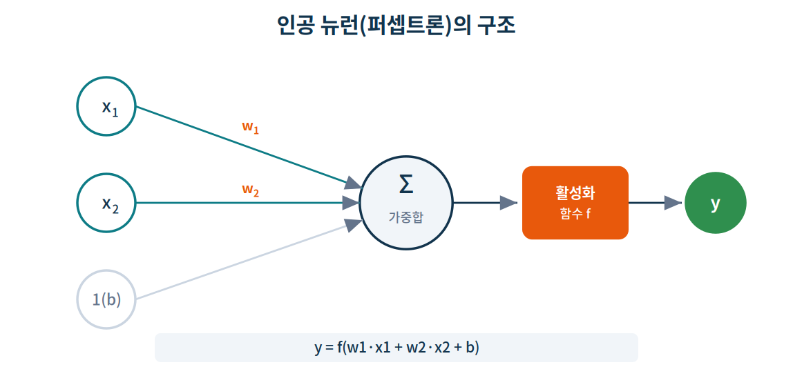
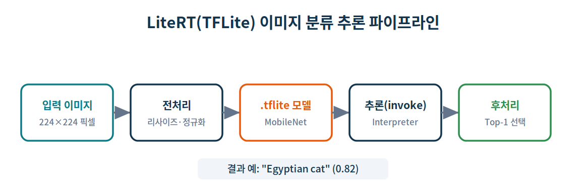

# 라즈베리 파이 4B에서 시작하는 AI 기초 실습

> **SBC 기반 임베디드 리눅스 & 로보틱스 과정** · 인공지능 입문 실습 자료
> **대상 보드:** Raspberry Pi 4B (ARM64 / Cortex‑A72) · **OS:** Ubuntu 22.04 LTS
> **소요 시간:** 약 8시간 (이론 + 실습) · **언어/도구:** Python 3.10, NumPy, Pillow, LiteRT(`ai-edge-litert`), gpiozero

---

## 0. 실습 개요

이 실습은 **GPU 없이 CPU만으로** 라즈베리 파이 4B 위에서 인공지능의 핵심 개념을 직접 코드로 확인합니다. "AI = 거대한 클라우드 서버"라는 선입견을 깨고, 손바닥만 한 SBC에서도 머신러닝 학습과 딥러닝 추론이 동작함을 체험하는 것이 목표입니다.

> 〔SBC〕 라즈베리 파이 4B에는 NVIDIA GPU·CUDA가 **없습니다.** 따라서 모든 연산은 4개의 ARM CPU 코어에서 수행됩니다. GPU 가속(TensorRT)은 다음 과정의 **Jetson Orin Nano** 편에서 다룹니다. 두 보드의 차이를 체감하는 것 자체가 이번 실습의 중요한 학습 포인트입니다.

### 학습 목표

이 실습을 마치면 다음을 할 수 있습니다.

1. AI / 머신러닝 / 딥러닝의 관계와 "데이터로 규칙을 학습한다"는 패러다임을 설명한다.
2. 파이썬 **가상환경(venv)** 위에 AI 라이브러리를 안전하게 설치한다.
3. **NumPy** 의 텐서 연산이 어떻게 신경망 계산의 기초가 되는지 이해한다.
4. **인공 뉴런(퍼셉트론)** 을 NumPy로 직접 구현하고 학습시킨다.
5. **LiteRT(TensorFlow Lite)** 로 사전 학습된 딥러닝 모델을 라즈베리 파이에서 추론한다(이미지 분류).
6. **전이 학습(Transfer Learning)** 으로 사전 학습 모델을 재활용해 나만의 분류기를 만들고, **미세조정(Fine‑tuning)** 의 개념과 워크플로를 이해한다.
7. **객체 탐지(Object Detection)** 와 **이미지 세그멘테이션(Segmentation)** 으로 "무엇이, 어디에" 있는지 추론한다.
8. AI 추론 결과로 **GPIO에 연결된 RGB LED를 제어**해, 인식(perception)과 동작(actuation)을 연결한다.
9. 추론 속도·발열을 측정하고 SBC의 성능 한계를 정량적으로 파악한다.

### 사전 지식

- Linux 기본 명령어(`cd`, `ls`, `mkdir`, `cat`) — 이전 세션에서 학습
- C 언어 또는 파이썬 기초 문법 (변수, 반복문, 함수)
- 이 자료는 **데스크톱 GUI 환경**(모니터·키보드 연결) 또는 **SSH 원격 접속** 어느 쪽에서도 진행할 수 있습니다.

---

## 실습 0. 환경 점검 (15분)

> **학습 목표:** 내 라즈베리 파이가 ARM64 아키텍처인지, Ubuntu 22.04인지, 파이썬이 준비됐는지 확인한다.

**0‑1.** 아키텍처와 OS 버전을 확인합니다.

```bash
$ uname -m
```
```
출력 ▶ aarch64
```

```bash
$ lsb_release -a
```
```
출력 ▶ Distributor ID: Ubuntu
       Description:    Ubuntu 22.04.5 LTS
       Release:        22.04
       Codename:       jammy
```

> ⚠️ `uname -m` 결과가 `armv7l` 로 나오면 **32비트 OS** 입니다. AI 라이브러리 대부분은 64비트(`aarch64`) wheel만 제공하므로, 반드시 **64비트 Ubuntu**를 사용해야 합니다.

**0‑2.** 파이썬 버전과 CPU 코어 수, 메모리를 확인합니다.

```bash
$ python3 --version
```
```
출력 ▶ Python 3.10.12
```

```bash
$ nproc
```
```
출력 ▶ 4
```

```bash
$ free -h
```
```
출력 ▶               total        used        free
       Mem:           3.7Gi       0.5Gi       2.9Gi
       Swap:          0.0Ki       0.0Ki       0.0Ki
```

> 〔SBC〕 라즈베리 파이 4B는 2GB / 4GB / 8GB 모델이 있습니다. 위 출력은 4GB 모델 예시입니다. AI 추론 시 메모리가 부족하면 8GB 모델을 권장하며, 부족할 경우 **swap** 설정으로 보완할 수 있습니다(문서 끝 트러블슈팅 표 참고).

✅ **체크포인트 0:** `aarch64`, `Ubuntu 22.04`, `Python 3.10` 세 가지가 모두 확인되면 다음 단계로 진행합니다.

---

## 실습 1. 파이썬 가상환경과 AI 라이브러리 설치 (40분)

> **학습 목표:** 시스템 파이썬을 오염시키지 않고, 프로젝트 전용 가상환경에 AI 라이브러리를 설치한다.

### 왜 가상환경(venv)을 쓰는가?

시스템 전체에 `pip install`을 하면 OS가 관리하는 패키지와 충돌해 시스템이 망가질 수 있습니다. 최신 Ubuntu/Debian은 이를 막기 위해 시스템 영역 설치를 기본 차단합니다(`externally-managed-environment` 오류). **가상환경은 프로젝트마다 독립된 라이브러리 공간**을 만들어 이 문제를 근본적으로 해결합니다.

**1‑1.** 가상환경 생성에 필요한 패키지를 설치합니다.

```bash
$ sudo apt update
$ sudo apt install -y python3-venv python3-pip python3-dev
```
```
출력 ▶ ... python3-venv is already the newest version ...
       0 upgraded, 0 newly installed ...
```

**1‑2.** 실습용 작업 폴더를 만들고 그 안에 가상환경을 생성합니다.

```bash
$ mkdir -p ~/ai_lab && cd ~/ai_lab
$ python3 -m venv ai_env
```

**1‑3.** 가상환경을 **활성화**합니다. 프롬프트 앞에 `(ai_env)`가 붙으면 성공입니다.

```bash
$ source ai_env/bin/activate
```
```
출력 ▶ (ai_env) pi@raspberrypi:~/ai_lab$
```

> 💡 가상환경은 터미널을 새로 열 때마다 다시 활성화해야 합니다. 비활성화는 `deactivate` 명령으로 합니다.

**1‑4.** pip를 최신화한 뒤, 수치·이미지 처리 라이브러리를 설치합니다.

```bash
(ai_env) $ pip install --upgrade pip
(ai_env) $ pip install numpy pillow
```
```
출력 ▶ Successfully installed numpy-2.x.x pillow-...
```

> 💡 이번 과정은 **딥러닝 추론** 중심입니다. 무거운 학습 프레임워크(TensorFlow 전체) 대신, 추론에 특화된 **LiteRT** 와 가벼운 NumPy·Pillow만으로 진행합니다. 이미지 분류·전이 학습·객체 탐지·세그멘테이션까지 이 조합으로 모두 다룹니다.

**1‑5.** 딥러닝 추론 엔진 **LiteRT** 를 설치합니다.

```bash
(ai_env) $ pip install ai-edge-litert
```
```
출력 ▶ Successfully installed ai-edge-litert-2.x.x
```

> 🔎 **최신 동향 (중요):** 과거 라즈베리 파이 딥러닝 추론에 쓰던 `tflite-runtime` 패키지는 Google에 의해 **LiteRT** 로 리브랜딩되었습니다. 앞으로의 모든 기능·성능 개선은 새 패키지인 **`ai-edge-litert`** 에만 반영됩니다.
> - **신규(권장):** `pip install ai-edge-litert` → `from ai_edge_litert.interpreter import Interpreter`
> - **구버전(레거시):** `pip install tflite-runtime` → `from tflite_runtime.interpreter import Interpreter`
>
> 두 패키지는 **동일한 Interpreter API** 를 제공하므로, 코드는 `import` 줄만 바꾸면 그대로 호환됩니다. 이 실습은 신규 패키지를 기준으로 합니다.

**1‑6.** 마지막 실습(AI로 LED 제어)에서 쓸 **GPIO 제어 라이브러리**를 설치합니다.

```bash
(ai_env) $ pip install gpiozero lgpio
```
```
출력 ▶ Successfully installed gpiozero-... lgpio-...
```

> 〔SBC〕 라즈베리 파이 OS에는 GPIO 라이브러리가 기본 포함되지만, **Ubuntu 22.04에는 없으므로** 직접 설치합니다. `gpiozero` 는 백엔드로 `lgpio` 를 사용하며, 이 조합이 Ubuntu에서 가장 안정적입니다. GPIO 접근에는 권한이 필요하므로, 실행 시 `sudo` 또는 사용자의 `gpio` 그룹 추가가 필요할 수 있습니다(실습 8 참고).

**1‑7.** 설치가 제대로 됐는지 한 줄로 검증합니다.

```bash
(ai_env) $ python -c "import numpy, PIL; from ai_edge_litert.interpreter import Interpreter; print('AI 환경 준비 완료')"
```
```
출력 ▶ AI 환경 준비 완료
```

> 〔SBC〕 라즈베리 파이는 x86 PC보다 설치가 느립니다. `numpy`·`pillow`는 ARM64용 미리 빌드된 wheel이 제공되어 보통 1~3분이면 끝나지만, 인터넷 속도와 SD카드 성능에 따라 더 걸릴 수 있습니다. **소스 컴파일이 시작되며 멈춘 듯 보이면** wheel을 못 찾은 것이니 아키텍처(`aarch64`)와 파이썬 버전(3.10)을 다시 확인하세요.

✅ **체크포인트 1:** `(ai_env)` 프롬프트에서 위 검증 명령이 "AI 환경 준비 완료"를 출력하면 성공입니다.

---

## 실습 2. NumPy로 배우는 AI의 수학 (50분)

> **학습 목표:** 모든 신경망 연산의 바탕인 **텐서(다차원 배열)** 와 **벡터·행렬 연산**을 NumPy로 다룬다.

딥러닝에서 데이터(이미지·소리·문장)는 전부 **숫자 배열(텐서)** 로 표현되고, 학습과 추론은 이 배열들의 **곱셈과 덧셈**으로 이루어집니다. 즉, NumPy를 이해하면 AI의 내부가 보입니다.

**2‑1.** 편집기로 실습 파일을 만듭니다.

```bash
(ai_env) $ nano numpy_basic.py
```

**2‑2.** 아래 코드를 입력합니다.

```python
import numpy as np

# (1) 벡터: 1차원 배열
a = np.array([1, 2, 3])
print("a =", a, "| shape:", a.shape, "| dtype:", a.dtype)

# (2) 행렬: 2차원 배열
M = np.array([[1, 2], [3, 4]])
print("M shape:", M.shape)

# (3) 행렬 × 벡터 (신경망의 핵심 연산)
v = np.array([10, 20])
print("M @ v =", M @ v)

# (4) 내적(dot product)
print("내적 dot:", np.dot(a, np.array([4, 5, 6])))

# (5) 브로드캐스팅: 모든 원소에 한 번에 연산
x = np.array([[1, 2, 3], [4, 5, 6]])
print("x + 100 =\n", x + 100)

# (6) 가중합 — 뉴런이 하는 계산과 똑같다
w = np.array([0.5, 0.5, 0.5])
print("가중합:", np.dot(x, w))
```

**2‑3.** 실행합니다.

```bash
(ai_env) $ python numpy_basic.py
```
```
출력 ▶ a = [1 2 3] | shape: (3,) | dtype: int64
       M shape: (2, 2)
       M @ v = [ 50 110]
       내적 dot: 32
       x + 100 =
        [[101 102 103]
        [104 105 106]]
       가중합: [3.  7.5]
```

### 무엇을 배웠나

- **shape** 는 텐서의 차원 구조입니다. `(3,)`은 원소 3개짜리 벡터, `(2,2)`는 2×2 행렬입니다.
- `M @ v` 의 결과 `[50, 110]` 은 `(1·10+2·20)=50`, `(3·10+4·20)=110` 입니다. 이 **행렬‑벡터 곱**이 바로 신경망 한 층(layer)의 계산입니다.
- **내적** `[1,2,3]·[4,5,6] = 1·4+2·5+3·6 = 32`. 이 한 번의 내적이 **뉴런 하나의 가중합**과 정확히 같은 연산입니다(실습 3에서 확인).
- **브로드캐스팅**은 반복문 없이 배열 전체에 연산을 적용하는 기능으로, 딥러닝의 속도 비결입니다.

✅ **체크포인트 2:** `M @ v` 가 `[50 110]`, 내적이 `32` 로 나오면 텐서 연산을 이해한 것입니다.

---

## 실습 3. 인공 뉴런(퍼셉트론)을 직접 만들기 (60분)

> **학습 목표:** 신경망의 최소 단위인 **뉴런 하나**를 NumPy로 구현하고, 데이터로 **학습**시킨다.

인공 뉴런은 입력값에 **가중치(weight)** 를 곱해 더하고(가중합), 거기에 **편향(bias)** 을 더한 뒤, **활성화 함수**를 통과시켜 출력을 냅니다. 아래 그림이 그 구조입니다.

<p align="center"></p>

수식으로는 다음과 같습니다.

```
y = f( w1·x1 + w2·x2 + b )
```

여기서 `f`는 활성화 함수입니다. 학습이란 **정답에 가까운 출력이 나오도록 w와 b를 조금씩 조정**하는 과정입니다.

**3‑1.** 실습 파일을 만듭니다.

```bash
(ai_env) $ nano perceptron.py
```

**3‑2.** 아래 코드를 입력합니다. **AND 논리 게이트**(둘 다 1일 때만 1)를 학습시키는 예제입니다.

```python
import numpy as np
np.random.seed(42)

# 학습 데이터: AND 게이트
X = np.array([[0, 0], [0, 1], [1, 0], [1, 1]])
y = np.array([0, 0, 0, 1])   # 둘 다 1일 때만 정답이 1

# 가중치와 편향 초기화
w = np.random.randn(2) * 0.1
b = 0.0
lr = 0.1                      # 학습률(learning rate)

def step(z):                 # 계단 활성화 함수
    return np.where(z >= 0, 1, 0)

# 학습 루프
for epoch in range(20):
    errors = 0
    for xi, yi in zip(X, y):
        z = np.dot(xi, w) + b        # ① 가중합
        pred = step(z)               # ② 활성화 → 예측
        err = yi - pred              # ③ 오차
        w += lr * err * xi           # ④ 가중치 갱신
        b += lr * err                # ⑤ 편향 갱신
        errors += abs(err)
    if errors == 0:
        print(f"학습 완료 (epoch {epoch})")
        break

print("최종 예측:", step(X @ w + b))
print("정답   :", y)
```

**3‑3.** 실행합니다.

```bash
(ai_env) $ python perceptron.py
```
```
출력 ▶ 학습 완료 (epoch 3)
       최종 예측: [0 0 0 1]
       정답   : [0 0 0 1]
```

### 무엇을 배웠나

- 뉴런의 핵심 계산 `np.dot(xi, w) + b` 는 실습 2의 **내적/가중합**과 정확히 같습니다.
- 학습은 ①가중합 → ②활성화 → ③오차 계산 → ④⑤가중치·편향 갱신을 **반복**하는 과정입니다.
- 단 3 epoch 만에 AND 게이트를 완벽히 학습했습니다. 예측이 정답과 일치합니다.

> 💡 **도전 과제:** `y = np.array([0, 1, 1, 1])` 로 바꾸면 **OR 게이트**가 됩니다. 학습이 되는지 확인해 보세요. 반면 `XOR`(`[0,1,1,0]`)은 **하나의 퍼셉트론으로는 절대 학습되지 않습니다.** 이 한계가 바로 여러 층을 쌓는 **딥러닝(다층 신경망)** 이 등장한 이유입니다.

✅ **체크포인트 3:** 최종 예측이 `[0 0 0 1]` 로 정답과 일치하면 성공입니다.

---

## 실습 4. 딥러닝 추론 — 라즈베리 파이로 이미지 분류 (70분)

> **학습 목표:** 사전 학습된 **딥러닝 모델(MobileNet)** 을 LiteRT로 불러와, 라즈베리 파이에서 직접 이미지를 분류한다.

거대한 딥러닝 모델을 라즈베리 파이에서 **학습**시키는 것은 비현실적입니다. 대신 실무에서는 **이미 학습된 가벼운 모델(.tflite)** 을 받아와 **추론(inference)** 만 수행합니다. 그 전체 흐름은 다음과 같습니다.

<p align="center"></p>

**4‑1.** 모델과 라벨 파일을 내려받습니다. 모바일·임베디드용으로 경량화된 **MobileNet** 모델을 사용합니다.

```bash
(ai_env) $ cd ~/ai_lab
(ai_env) $ wget -q https://storage.googleapis.com/download.tensorflow.org/models/tflite/mobilenet_v1_1.0_224_quant_and_labels.zip
(ai_env) $ unzip -o mobilenet_v1_1.0_224_quant_and_labels.zip
```
```
출력 ▶ Archive:  mobilenet_v1_1.0_224_quant_and_labels.zip
        inflating: mobilenet_v1_1.0_224_quant.tflite
        inflating: labels_mobilenet_quant_v1_224.txt
```

> 모델 파일은 약 4MB로 매우 작습니다. `_quant` 는 **양자화(quantization)** 된 모델이라는 뜻으로, 정수 연산만 사용해 CPU에서 빠르고 가볍게 동작합니다.

**4‑2.** 분류할 테스트 이미지를 준비합니다. 직접 찍은 사진을 써도 되지만, 실습을 곧바로 진행할 수 있도록 **공개 샘플 이미지(고양이)** 를 라즈베리 파이에서 직접 받아 `test.jpg` 로 저장합니다.

```bash
(ai_env) $ cd ~/ai_lab
# 공개 샘플 이미지(BMP)를 받아 JPG(test.jpg)로 변환 — PIL은 실습 1에서 설치함
(ai_env) $ wget -q https://raw.githubusercontent.com/google-coral/test_data/master/cat.bmp
(ai_env) $ python -c "from PIL import Image; Image.open('cat.bmp').convert('RGB').save('test.jpg')"
(ai_env) $ ls test.jpg
```
```
출력 ▶ test.jpg
```

> 💡 위 샘플은 고양이 사진이라 아래 4‑4의 결과처럼 `Egyptian cat` 으로 분류됩니다. 직접 찍은 사물·동물 사진(JPG)을 `test.jpg` 로 바꿔 두면 그 사진으로 분류해 볼 수 있습니다. 이 모델은 ImageNet 1000종을 인식합니다.

**4‑3.** 추론 스크립트를 작성합니다.

```bash
(ai_env) $ nano classify_image.py
```

```python
import time
import numpy as np
from PIL import Image
from ai_edge_litert.interpreter import Interpreter

MODEL  = "mobilenet_v1_1.0_224_quant.tflite"
LABELS = "labels_mobilenet_quant_v1_224.txt"
IMAGE  = "test.jpg"

# (1) 라벨(클래스 이름) 로드
with open(LABELS) as f:
    labels = [line.strip() for line in f]

# (2) 인터프리터 생성 — 4개 CPU 코어를 모두 사용
interpreter = Interpreter(model_path=MODEL, num_threads=4)
interpreter.allocate_tensors()
input_details  = interpreter.get_input_details()
output_details = interpreter.get_output_details()

# (3) 모델이 요구하는 입력 크기 확인 후 이미지 전처리
_, height, width, _ = input_details[0]['shape']
img = Image.open(IMAGE).convert('RGB').resize((width, height))
input_data = np.expand_dims(np.array(img, dtype=np.uint8), axis=0)

# (4) 추론 실행 및 시간 측정
interpreter.set_tensor(input_details[0]['index'], input_data)
start = time.time()
interpreter.invoke()
elapsed = (time.time() - start) * 1000

# (5) 결과 해석 — 상위 5개 출력
output = interpreter.get_tensor(output_details[0]['index'])[0]
top5 = output.argsort()[-5:][::-1]

print(f"\n추론 시간: {elapsed:.1f} ms\n")
print("Top-5 예측 결과:")
for i in top5:
    score = output[i] / 255.0          # 양자화 출력(0~255)을 확률로 환산
    print(f"  {labels[i]:25s} {score:.3f}")
```

**4‑4.** 실행합니다(고양이 사진 예시).

```bash
(ai_env) $ python classify_image.py
```
```
출력 ▶ 추론 시간: 78.4 ms

       Top-5 예측 결과:
         Egyptian cat            0.717
         tabby                   0.137
         tiger cat               0.106
         lynx                    0.012
         Persian cat             0.004
```

> 추론 시간(예: 78ms)과 점수는 사용한 이미지·보드 상태에 따라 달라집니다. 핵심은 **라즈베리 파이가 0.1초 이내에 1000종을 분류**해냈다는 점입니다.

### 무엇을 배웠나

- 딥러닝 추론의 4단계: **전처리 → 입력 설정 → `invoke()` → 출력 해석**.
- `Interpreter(..., num_threads=4)` 로 4개 코어를 활용해 속도를 높였습니다.
- 양자화 모델 덕분에 GPU 없이 CPU만으로 실시간에 가까운 추론이 가능합니다.

> 〔SBC〕 첫 추론은 모델 로딩 때문에 느리고, 두 번째부터 빨라집니다. 실제 속도를 재려면 같은 추론을 여러 번 반복해 평균을 내세요(실습 9).

✅ **체크포인트 4:** 사진 속 사물·동물에 맞는 라벨이 Top‑1 또는 Top‑5 안에 나오면 성공입니다.

---

## 실습 5. 전이 학습과 미세조정 — 사전 학습 모델 재활용하기 (60분)

> **학습 목표:** 사전 학습된 모델을 **특성 추출기**로 재활용해 나만의 분류기를 만들고(전이 학습), **미세조정**의 개념과 실무 워크플로를 이해한다.

실습 4에서는 모델이 미리 정한 1000종만 분류할 수 있었습니다. 그런데 "내 강아지 vs 내 고양이"처럼 **나만의 분류 문제**를 풀려면 어떻게 할까요? 라즈베리 파이에서 거대한 모델을 처음부터 학습시키는 것은 비현실적입니다. 그 해법이 **전이 학습(Transfer Learning)** 입니다.

### 전이 학습이란?

사전 학습 모델(MobileNet)은 ImageNet 100만 장으로 학습하며 **"이미지에서 의미 있는 특성을 뽑아내는 능력"** 을 이미 갖췄습니다. 마지막 분류층 직전까지는 "눈·털·바퀴·질감" 같은 일반적 시각 특성을 추출합니다. 전이 학습은 이 **특성 추출 능력은 그대로 빌려 쓰고**, 마지막 분류기만 내 데이터로 새로 학습하는 방법입니다.

> 비유: 사진 전문가(사전 학습 모델)가 "둥근 귀, 긴 수염, 줄무늬…" 같은 특징을 정리해주면, 우리는 그 특징표만 보고 "고양이/강아지"를 구분하는 간단한 규칙(작은 분류기)만 새로 배우면 됩니다.

이 방식의 장점은 분명합니다. 학습 데이터가 적어도(클래스당 수십 장) 동작하고, 라즈베리 파이 CPU에서도 **분류기 헤드만** 학습하므로 빠릅니다. 무엇보다 **실습 3의 퍼셉트론 학습이 그대로 재등장**합니다 — 이번엔 입력이 "원시 픽셀"이 아니라 "사전 학습 모델이 뽑은 특성"일 뿐입니다.

**5‑1.** 데이터를 준비합니다. **고양이·개 공개 데이터셋**을 라즈베리 파이에서 받아, 클래스별 폴더(`dataset/cat`, `dataset/dog`)로 구성합니다.

```bash
(ai_env) $ cd ~/ai_lab
# 구글 ML 교육용 고양이·개 데이터셋(약 65MB) 다운로드 및 압축 해제
(ai_env) $ wget -q https://storage.googleapis.com/mledu-datasets/cats_and_dogs_filtered.zip
(ai_env) $ unzip -q -o cats_and_dogs_filtered.zip
```
```
출력 ▶ (조용히 완료 — -q 옵션으로 로그를 숨김)
```

압축을 풀면 `cats_and_dogs_filtered/train/cats`, `.../train/dogs` 에 각각 수천 장의 JPG가 들어 있습니다. 이 중 **클래스당 30장씩**만 실습용 폴더로 복사합니다(학습이 금방 끝나도록 일부만 사용).

```bash
(ai_env) $ mkdir -p dataset/cat dataset/dog
(ai_env) $ ls cats_and_dogs_filtered/train/cats/*.jpg | head -30 | xargs -I{} cp {} dataset/cat/
(ai_env) $ ls cats_and_dogs_filtered/train/dogs/*.jpg | head -30 | xargs -I{} cp {} dataset/dog/
# 학습에 쓰지 않은 검증용 사진 한 장도 준비 (뒤의 predict_custom.py 용)
(ai_env) $ cp "cats_and_dogs_filtered/validation/dogs/$(ls cats_and_dogs_filtered/validation/dogs | head -1)" new_photo.jpg
(ai_env) $ ls dataset/cat dataset/dog | head
```
```
출력 ▶ dataset/cat:
       cat.0.jpg  cat.1.jpg  cat.2.jpg ...
       dataset/dog:
       dog.0.jpg  dog.1.jpg  dog.2.jpg ...
```

> 💡 더 정확한 분류기를 원하면 `head -30` 을 `head -100` 등으로 늘려 더 많은 사진을 복사하세요(과제 3번 참고). 직접 찍은 사진으로 채워도 됩니다 — **클래스별 폴더만 정확히 나누면** 됩니다.

**5‑2.** 특성 추출 스크립트를 작성합니다. 사전 학습 MobileNet의 출력(1001차원)을 각 이미지의 **특성 벡터**로 저장합니다.

```bash
(ai_env) $ nano extract_features.py
```

```python
import os, glob
import numpy as np
from PIL import Image
from ai_edge_litert.interpreter import Interpreter

MODEL = "mobilenet_v1_1.0_224_quant.tflite"      # 실습 4에서 받은 모델 재사용
interpreter = Interpreter(model_path=MODEL, num_threads=4)
interpreter.allocate_tensors()
inp = interpreter.get_input_details()[0]
out = interpreter.get_output_details()[0]
_, H, W, _ = inp['shape']

def feature(path):
    img = Image.open(path).convert('RGB').resize((W, H))
    x = np.expand_dims(np.array(img, dtype=np.uint8), axis=0)
    interpreter.set_tensor(inp['index'], x)
    interpreter.invoke()
    return interpreter.get_tensor(out['index'])[0].astype(np.float32)   # (1001,)

X, y, names = [], [], sorted(os.listdir("dataset"))
for label, cls in enumerate(names):              # cat=0, dog=1
    for path in glob.glob(f"dataset/{cls}/*.jpg"):
        X.append(feature(path))
        y.append(label)

X, y = np.array(X), np.array(y)
np.savez("features.npz", X=X, y=y, names=names)
print(f"특성 추출 완료: {X.shape[0]}장, 특성 차원 {X.shape[1]}, 클래스 {names}")
```

```bash
(ai_env) $ python extract_features.py
```
```
출력 ▶ 특성 추출 완료: 24장, 특성 차원 1001, 클래스 ['cat', 'dog']
```

> 〔SBC〕 이 단계는 이미지 한 장당 실습 4의 추론을 1회 수행합니다. 24장이면 수 초면 끝납니다. 추출한 특성은 `features.npz` 에 저장돼, 다음 단계에서 **추론 없이 빠르게** 재사용됩니다.

**5‑3.** 분류기 헤드를 학습합니다. **실습 3의 퍼셉트론을 다중 클래스로 확장한 소프트맥스 분류기**입니다. 입력만 픽셀에서 "사전 학습 특성"으로 바뀌었을 뿐, 학습 원리는 똑같습니다.

```bash
(ai_env) $ nano train_head.py
```

```python
import numpy as np

data = np.load("features.npz", allow_pickle=True)
X, y, names = data["X"], data["y"], list(data["names"])
n_class = len(names)

# 특성 정규화(평균 0, 표준편차 1) — 학습 안정화
mu, sd = X.mean(axis=0), X.std(axis=0) + 1e-8
Xn = (X - mu) / sd

Y = np.eye(n_class)[y]                       # 원-핫 인코딩
W = np.zeros((X.shape[1], n_class))
b = np.zeros(n_class)
lr = 0.1

def softmax(z):
    z = z - z.max(axis=1, keepdims=True)
    e = np.exp(z)
    return e / e.sum(axis=1, keepdims=True)

for epoch in range(300):                     # 헤드만 학습 → CPU에서도 순식간
    P = softmax(Xn @ W + b)                  # ① 예측 확률
    grad = P - Y                             # ② 교차엔트로피 기울기
    W -= lr * (Xn.T @ grad) / len(Xn)        # ③ 가중치 갱신
    b -= lr * grad.mean(axis=0)              # ④ 편향 갱신

acc = (softmax(Xn @ W + b).argmax(axis=1) == y).mean()
print(f"학습 정확도: {acc*100:.1f}%")
np.savez("head.npz", W=W, b=b, mu=mu, sd=sd, names=names)
print("분류기 헤드 저장 완료 → head.npz")
```

```bash
(ai_env) $ python train_head.py
```
```
출력 ▶ 학습 정확도: 100.0%
       분류기 헤드 저장 완료 → head.npz
```

> 💡 학습 데이터가 적으면 학습 정확도가 100%로 쉽게 오릅니다. 이는 **과적합(overfitting)** 일 수 있으니, 다음 단계에서 학습에 쓰지 않은 새 사진으로 검증하세요.

**5‑4.** 학습한 분류기로 새 사진을 예측합니다. **사전 학습 특성 추출 → 헤드 적용** 두 단계입니다.

```bash
(ai_env) $ nano predict_custom.py
```

```python
import sys
import numpy as np
from PIL import Image
from ai_edge_litert.interpreter import Interpreter

MODEL = "mobilenet_v1_1.0_224_quant.tflite"
interpreter = Interpreter(model_path=MODEL, num_threads=4)
interpreter.allocate_tensors()
inp = interpreter.get_input_details()[0]
out = interpreter.get_output_details()[0]
_, H, W_, _ = inp['shape']

head = np.load("head.npz", allow_pickle=True)
W, b, mu, sd, names = head["W"], head["b"], head["mu"], head["sd"], list(head["names"])

img = Image.open(sys.argv[1]).convert('RGB').resize((W_, H))
x = np.expand_dims(np.array(img, dtype=np.uint8), axis=0)
interpreter.set_tensor(inp['index'], x)
interpreter.invoke()
feat = interpreter.get_tensor(out['index'])[0].astype(np.float32)

z = ((feat - mu) / sd) @ W + b
p = np.exp(z - z.max()); p /= p.sum()
i = int(p.argmax())
print(f"예측: {names[i]} ({p[i]*100:.1f}%)")
```

```bash
(ai_env) $ python predict_custom.py new_photo.jpg
```
```
출력 ▶ 예측: dog (97.3%)
```

### 무엇을 배웠나

- **전이 학습 = 사전 학습 특성 추출기 재활용 + 새 분류기 헤드만 학습.** 데이터가 적고 연산이 약한 SBC에 딱 맞는 전략입니다.
- 분류기 헤드는 실습 3의 퍼셉트론과 **동일한 원리**(가중합 → 활성화 → 오차 → 갱신)입니다. 입력이 픽셀이 아니라 "의미 있는 특성"으로 바뀌어 적은 데이터로도 잘 학습됩니다.
- 특성을 한 번 추출해 저장(`features.npz`)하면, 헤드 학습은 반복해도 추론 없이 순식간에 끝납니다.

### 미세조정(Fine‑tuning)은 무엇이 다른가

전이 학습이 "특성 추출기는 **얼리고(freeze)** 헤드만 학습"이라면, **미세조정**은 한 걸음 더 나아갑니다.

| 구분 | 전이 학습(특성 추출) | 미세조정(Fine‑tuning) |
|---|---|---|
| 사전 학습 백본 | 동결(가중치 고정) | 상위 일부 층을 **다시 학습** |
| 학습 대상 | 새 분류기 헤드만 | 헤드 + 백본 상위 층 |
| 학습률 | 보통 | **매우 작게**(예: 1e‑5) |
| 연산량 | 적음 (CPU OK) | 큼 (GPU 권장) |
| 적합한 상황 | 데이터 적음, 일반 특성 충분 | 데이터 많음, 도메인이 특수 |

미세조정은 백본 전체를 통과하는 **역전파(backpropagation)** 가 필요해 연산량이 큽니다. 그래서 실무에서는 **데스크톱 GPU나 다음 과정의 Jetson에서 미세조정한 뒤**, 결과 모델을 `.tflite` 로 변환해 라즈베리 파이에 배포합니다. 라즈베리 파이의 역할은 "무거운 학습"이 아니라 "**가벼운 추론과 전이 학습 헤드 학습**"임을 기억하세요.

> 〔SBC〕 "학습은 강한 머신에서, 추론은 엣지(SBC)에서"가 엣지 AI의 핵심 분업 구조입니다. 오늘 실습한 전이 학습 헤드 학습은 그 경계선에 있는, SBC에서도 가능한 가벼운 학습의 예입니다.

✅ **체크포인트 5:** 내 데이터로 학습한 분류기가 새 사진의 클래스를 맞히면 성공입니다(데이터가 적으면 정확도는 들쭉날쭉할 수 있습니다).

---

## 실습 6. 객체 탐지 — "무엇이, 어디에" 있는가 (60분)

> **학습 목표:** 사전 학습된 **객체 탐지 모델(SSD MobileNet)** 로 한 이미지 안의 여러 사물을 동시에 찾고, **경계 상자(bounding box)** 를 그린다.

분류(실습 4)는 이미지 전체를 보고 "이건 고양이"라고 **한 가지 답**만 냅니다. 하지만 실제 로봇·자율주행에는 "사람이 **어디에**, 자동차가 **어디에**" 있는지가 필요합니다. **객체 탐지**는 한 이미지에서 여러 사물의 **종류 + 위치(상자) + 신뢰도**를 동시에 출력합니다.

| 구분 | 이미지 분류 | 객체 탐지 |
|---|---|---|
| 출력 | 이미지 1개당 라벨 1개 | 사물마다 (라벨, 상자, 점수) |
| 질문 | "무엇인가?" | "무엇이, **어디에**?" |
| 대표 모델 | MobileNet | SSD MobileNet, YOLO |

**6‑1.** 탐지 모델을 내려받습니다. COCO 데이터셋(90종 사물)으로 학습된 **SSD MobileNet** 을 사용합니다.

```bash
(ai_env) $ cd ~/ai_lab
(ai_env) $ wget -q https://storage.googleapis.com/download.tensorflow.org/models/tflite/coco_ssd_mobilenet_v1_1.0_quant_2018_06_29.zip
(ai_env) $ unzip -o coco_ssd_mobilenet_v1_1.0_quant_2018_06_29.zip
```
```
출력 ▶ Archive:  coco_ssd_mobilenet_v1_1.0_quant_2018_06_29.zip
        inflating: detect.tflite
        inflating: labelmap.txt
```

> 이 모델도 약 4MB로 작고 양자화돼 있어 CPU에서 동작합니다. 출력이 분류 모델과 달리 **4종**(상자·클래스·점수·개수)이라는 점이 핵심 차이입니다.

**6‑2.** 탐지할 이미지를 준비합니다. 여러 사물이 함께 있는 사진이 좋습니다. **공개 샘플(여러 사람과 연이 있는 해변 사진)** 을 받아 `street.jpg` 로 저장합니다.

```bash
(ai_env) $ cd ~/ai_lab
(ai_env) $ wget -q https://raw.githubusercontent.com/tensorflow/models/master/research/object_detection/test_images/image2.jpg -O street.jpg
(ai_env) $ ls street.jpg
```
```
출력 ▶ street.jpg
```

> 💡 이 사진에는 사람·연 등 여러 객체가 있어 다중 객체 탐지를 확인하기 좋습니다(탐지 개수는 임계값에 따라 달라집니다). 사람·자동차·동물이 함께 있는 직접 찍은 사진으로 바꿔도 됩니다.

**6‑3.** 탐지 스크립트를 작성합니다.

```bash
(ai_env) $ nano detect_objects.py
```

```python
import numpy as np
from PIL import Image, ImageDraw
from ai_edge_litert.interpreter import Interpreter

MODEL  = "detect.tflite"
LABELS = "labelmap.txt"
IMAGE  = "street.jpg"
THRESH = 0.5                          # 신뢰도 임계값

with open(LABELS) as f:
    labels = [l.strip() for l in f]

interpreter = Interpreter(model_path=MODEL, num_threads=4)
interpreter.allocate_tensors()
inp  = interpreter.get_input_details()[0]
outs = interpreter.get_output_details()
_, H, W, _ = inp['shape']

# (1) 전처리 — 원본 크기를 기억해 두었다가 상자를 되돌림
orig = Image.open(IMAGE).convert('RGB')
ow, oh = orig.size
img = orig.resize((W, H))
x = np.expand_dims(np.array(img, dtype=np.uint8), axis=0)

# (2) 추론
interpreter.set_tensor(inp['index'], x)
interpreter.invoke()

# (3) 출력 4종: 상자(정규화 ymin,xmin,ymax,xmax), 클래스, 점수, 개수
boxes   = interpreter.get_tensor(outs[0]['index'])[0]
classes = interpreter.get_tensor(outs[1]['index'])[0]
scores  = interpreter.get_tensor(outs[2]['index'])[0]

# (4) 임계값 넘는 것만 상자 그리기
draw = ImageDraw.Draw(orig)
found = 0
for i in range(len(scores)):
    if scores[i] < THRESH:
        continue
    ymin, xmin, ymax, xmax = boxes[i]
    l, t, r, b = int(xmin*ow), int(ymin*oh), int(xmax*ow), int(ymax*oh)
    name = labels[int(classes[i])]
    draw.rectangle([l, t, r, b], outline=(0, 255, 0), width=3)
    draw.text((l+3, t+3), f"{name} {scores[i]:.2f}", fill=(0, 255, 0))
    print(f"  {name:12s} {scores[i]:.2f}  box=({l},{t},{r},{b})")
    found += 1

orig.save("detected.jpg")
print(f"\n탐지된 사물: {found}개 → detected.jpg 저장")
```

```bash
(ai_env) $ python detect_objects.py
```
```
출력 ▶   person       0.92  box=(45,30,165,180)
         car          0.81  box=(150,90,285,170)
         dog          0.67  box=(60,140,130,260)

       탐지된 사물: 3개 → detected.jpg 저장
```

> 결과는 `detected.jpg` 에 초록색 상자로 표시됩니다. 점수와 상자 좌표는 사진에 따라 달라집니다. 핵심은 **모델이 한 번의 추론으로 여러 사물의 위치를 동시에** 찾아낸다는 점입니다.

> 〔SBC〕 라벨 인덱싱은 모델마다 1씩 어긋날 수 있습니다(`labelmap.txt` 첫 줄이 `???` 인 경우 등). 이름이 한 칸씩 밀려 나오면 `labels[int(classes[i]) + 1]` 또는 `- 1` 로 보정하세요.

### 무엇을 배웠나

- 객체 탐지의 출력은 분류와 달리 **상자·클래스·점수** 세트입니다. 정규화된 상자 좌표(0~1)에 원본 크기를 곱해 픽셀 좌표로 되돌립니다.
- **신뢰도 임계값(THRESH)** 으로 약한 탐지를 걸러냅니다. 값을 높이면 정확하지만 놓치는 게 늘고, 낮추면 많이 찾지만 오탐이 늘어납니다.
- 전처리 → `invoke()` → 출력 해석의 큰 흐름은 실습 4와 같습니다. **출력 텐서가 여러 개**라는 점만 다릅니다.

✅ **체크포인트 6:** `detected.jpg` 를 열어 사물 위에 상자와 라벨이 그려져 있으면 성공입니다.

---

## 실습 7. 이미지 세그멘테이션 — 픽셀 단위로 나누기 (50분)

> **학습 목표:** 사전 학습된 **세그멘테이션 모델(DeepLab v3)** 로 이미지의 **모든 픽셀**에 클래스를 매겨, 사물의 정확한 윤곽을 얻는다.

객체 탐지(실습 6)는 사물을 **네모 상자**로 감쌌습니다. 하지만 상자는 사물의 정확한 모양을 담지 못합니다. **세그멘테이션**은 한 단계 더 정밀하게, **픽셀 하나하나가 어떤 클래스인지** 분류합니다. 결과는 사물의 윤곽을 그대로 따낸 **마스크(mask)** 입니다.

| 구분 | 객체 탐지 | 세그멘테이션 |
|---|---|---|
| 위치 표현 | 네모 상자 | **픽셀 단위 마스크** |
| 정밀도 | 대략적 | 윤곽까지 정밀 |
| 대표 모델 | SSD MobileNet | DeepLab v3 |
| 활용 | 사물 개수·위치 | 배경 제거, 주행 영역 분할 |

**7‑1.** 세그멘테이션 모델을 내려받습니다. Pascal VOC(21종)로 학습된 **DeepLab v3 + MobileNet** 을 사용합니다.

```bash
(ai_env) $ cd ~/ai_lab
(ai_env) $ wget -q https://storage.googleapis.com/download.tensorflow.org/models/tflite/gpu/deeplabv3_257_mv_gpu.tflite -O deeplab.tflite
```
```
출력 ▶ (다운로드 완료, 약 2.8MB)
```

> 이 모델의 입력은 257×257, 출력은 **(257, 257, 21)** — 각 픽셀에 대해 21개 클래스의 점수입니다. 픽셀별로 가장 점수 높은 클래스를 고르면 마스크가 됩니다.

이어서 분할할 **사람 사진**을 받아 `person.jpg` 로 저장합니다. (세그멘테이션 결과로 사람 윤곽이 마스크로 분리됩니다.)

```bash
(ai_env) $ wget -q https://raw.githubusercontent.com/google-coral/test_data/master/grace_hopper.bmp
(ai_env) $ python -c "from PIL import Image; Image.open('grace_hopper.bmp').convert('RGB').save('person.jpg')"
(ai_env) $ ls person.jpg
```
```
출력 ▶ person.jpg
```

> 💡 사람이 또렷하게 나온 사진일수록 분할 결과가 깨끗합니다. 직접 찍은 인물 사진(JPG)을 `person.jpg` 로 바꿔도 됩니다.

**7‑2.** 세그멘테이션 스크립트를 작성합니다.

```bash
(ai_env) $ nano segment_image.py
```

```python
import numpy as np
from PIL import Image
from ai_edge_litert.interpreter import Interpreter

MODEL = "deeplab.tflite"
IMAGE = "person.jpg"

interpreter = Interpreter(model_path=MODEL, num_threads=4)
interpreter.allocate_tensors()
inp = interpreter.get_input_details()[0]
out = interpreter.get_output_details()[0]
_, H, W, _ = inp['shape']

# (1) 전처리 — 이 모델은 float 입력(-1~1 정규화)
orig = Image.open(IMAGE).convert('RGB')
img  = orig.resize((W, H))
x = np.array(img, dtype=np.float32) / 127.5 - 1.0
x = np.expand_dims(x, axis=0)

# (2) 추론
interpreter.set_tensor(inp['index'], x)
interpreter.invoke()
seg = interpreter.get_tensor(out['index'])[0]       # (257, 257, 21)

# (3) 픽셀별 argmax → 클래스 맵
seg_map = seg.argmax(axis=2).astype(np.uint8)       # (257, 257)
classes, counts = np.unique(seg_map, return_counts=True)
print("등장 클래스 인덱스:", dict(zip(classes.tolist(), counts.tolist())))

# (4) 클래스별 색을 입혀 컬러 마스크 생성
np.random.seed(0)
palette = (np.random.rand(21, 3) * 255).astype(np.uint8)
palette[0] = (0, 0, 0)                              # 배경은 검정
color_mask = Image.fromarray(palette[seg_map]).resize(orig.size)

# (5) 원본과 반투명 합성해 저장
overlay = Image.blend(orig, color_mask, alpha=0.5)
color_mask.save("mask.png")
overlay.save("segmented.png")
print("저장 완료 → mask.png(마스크), segmented.png(원본+마스크)")
```

```bash
(ai_env) $ python segment_image.py
```
```
출력 ▶ 등장 클래스 인덱스: {0: 50213, 15: 15836}
       저장 완료 → mask.png(마스크), segmented.png(원본+마스크)
```

> Pascal VOC에서 클래스 15는 **person(사람)** 입니다. 위 출력은 배경(0)과 사람(15)만 등장한 예입니다. `segmented.png` 를 열면 사람 영역이 한 가지 색으로 칠해진 것을 볼 수 있습니다.

> 〔SBC〕 세그멘테이션은 픽셀마다 21개 클래스를 계산하므로 분류·탐지보다 무겁습니다. 입력 크기가 257×257로 작은 것도 이 때문입니다. 첫 추론이 느리면 정상이며, 라즈베리 파이에서는 실시간(영상)보다는 **정지 이미지** 처리가 현실적입니다.

### 무엇을 배웠나

- 세그멘테이션 출력은 **(높이, 너비, 클래스 수)** 형태이며, 마지막 축으로 `argmax` 하면 픽셀별 클래스 맵이 됩니다.
- 클래스 맵에 색을 입혀(팔레트) 마스크를 만들고, 원본과 합성하면 결과를 직관적으로 확인할 수 있습니다.
- 분류 → 탐지 → 세그멘테이션으로 갈수록 **위치 정보가 정밀**해지고, 그만큼 **연산도 무거워집니다.** 작업 난이도에 맞는 모델을 고르는 것이 엣지 AI의 핵심입니다.

✅ **체크포인트 7:** `segmented.png` 에서 관심 사물(예: 사람)의 윤곽이 색으로 칠해져 있으면 성공입니다.

---

## 실습 8. AI 추론으로 LED 제어하기 — 인식과 동작을 잇다 (50분)

> **학습 목표:** AI 추론 결과를 GPIO에 연결된 **RGB LED** 제어로 연결해, "보고(perception) → 판단 → 움직이는(actuation)" 로봇의 기본 루프를 완성한다.

지금까지는 추론 결과를 **화면에 출력**만 했습니다. 로봇은 인식한 결과로 **실제 동작**을 해야 합니다. 이번 실습은 실습 4의 이미지 분류 결과에 따라 **RGB LED 색을 바꿉니다.** 이것이 임베디드 AI와 로보틱스를 잇는 가장 작은 완결 루프입니다.

```
[카메라/이미지] → [AI 추론(분류)] → [판단(색 매핑)] → [GPIO로 LED 점등]
   인식(perception)                    판단                  동작(actuation)
```

배선은 이전 GPIO 실습과 동일합니다(공통 캐소드 RGB LED 기준).

| 신호 | 핀(BCM) | 연결 |
|---|---|---|
| RGB LED – R | GPIO17 | 220Ω 저항 → R 핀 |
| RGB LED – G | GPIO27 | 220Ω 저항 → G 핀 |
| RGB LED – B | GPIO22 | 220Ω 저항 → B 핀 |
| 공통 | GND | 공통 캐소드(–) |

> 💡 이 핀 배치는 GPIO 실습에서 쓰던 것과 같습니다. 공통 애노드 LED라면 색 값이 반대로 동작하므로 `RGBLED(..., active_high=False)` 로 만드세요.

**8‑1.** 먼저 LED가 정상 동작하는지 단독으로 확인합니다.

```bash
(ai_env) $ nano led_test.py
```

```python
from gpiozero import RGBLED
from time import sleep

led = RGBLED(red=17, green=27, blue=22)    # BCM 번호

for color in [(1, 0, 0), (0, 1, 0), (0, 0, 1)]:   # 빨강 → 초록 → 파랑
    led.color = color
    print("LED:", color)
    sleep(1)

led.off()
print("테스트 종료")
```

```bash
(ai_env) $ python led_test.py
```
```
출력 ▶ LED: (1, 0, 0)
       LED: (0, 1, 0)
       LED: (0, 0, 1)
       테스트 종료
```

> 〔SBC〕 `RuntimeError` 나 권한 오류가 나면 GPIO 접근 권한 문제입니다. `sudo $(which python) led_test.py` 로 실행하거나, 사용자를 `gpio` 그룹에 추가하세요(트러블슈팅 참고).

**8‑2.** 분류 결과를 색으로 매핑합니다. 인식한 사물의 **종류(카테고리)** 에 따라 LED 색을 정합니다.

```bash
(ai_env) $ nano ai_led.py
```

```python
import sys
import numpy as np
from PIL import Image
from gpiozero import RGBLED
from ai_edge_litert.interpreter import Interpreter

MODEL  = "mobilenet_v1_1.0_224_quant.tflite"      # 실습 4 모델 재사용
LABELS = "labels_mobilenet_quant_v1_224.txt"
THRESH = 0.3

# (1) 카테고리별 LED 색 (R, G, B) 각 0~1
COLOR = {
    "animal":  (0, 1, 0),   # 초록
    "vehicle": (0, 0, 1),   # 파랑
    "person":  (1, 0, 0),   # 빨강
}
OFF = (0, 0, 0)

def to_category(label):
    label = label.lower()
    animals  = ["cat", "dog", "tabby", "lynx", "tiger", "bird", "horse"]
    vehicles = ["car", "truck", "bus", "bicycle", "motor"]
    if any(k in label for k in animals):  return "animal"
    if any(k in label for k in vehicles): return "vehicle"
    if "person" in label or "suit" in label: return "person"
    return None

# (2) 모델 로드
with open(LABELS) as f:
    labels = [l.strip() for l in f]
interpreter = Interpreter(model_path=MODEL, num_threads=4)
interpreter.allocate_tensors()
inp = interpreter.get_input_details()[0]
out = interpreter.get_output_details()[0]
_, H, W, _ = inp['shape']

# (3) 추론
img = Image.open(sys.argv[1]).convert('RGB').resize((W, H))
x = np.expand_dims(np.array(img, dtype=np.uint8), axis=0)
interpreter.set_tensor(inp['index'], x)
interpreter.invoke()
output = interpreter.get_tensor(out['index'])[0]
top = int(output.argmax())
score = output[top] / 255.0
label = labels[top]
category = to_category(label)

print(f"인식: {label} ({score:.2f}) → 카테고리: {category}")

# (4) 판단 → LED 점등
led = RGBLED(red=17, green=27, blue=22)
color = COLOR.get(category, OFF) if score >= THRESH else OFF
led.color = color
print(f"LED 색: {color}")

input("엔터를 누르면 LED를 끄고 종료합니다...")
led.off()
```

```bash
(ai_env) $ python ai_led.py test.jpg      # 실습 4에서 쓰던 고양이 사진
```
```
출력 ▶ 인식: Egyptian cat (0.72) → 카테고리: animal
       LED 색: (0, 1, 0)
       엔터를 누르면 LED를 끄고 종료합니다...
```

> 고양이 사진을 넣으면 LED가 **초록색**으로 켜집니다. 자동차 사진이면 파랑, 사람이면 빨강으로 바뀝니다. 인식 결과가 곧바로 물리적 동작으로 이어지는 것을 직접 확인하세요.

**8‑3.** (응용) 객체 탐지(실습 6)와 결합하면 **"사람이 보이면 빨간 경고등"** 도 만들 수 있습니다. `detect_objects.py` 에서 `person` 이 임계값 이상 탐지되면 `led.color = (1, 0, 0)`, 아니면 `led.off()` 로 바꾸면 됩니다.

### 무엇을 배웠나

- AI 추론(인식) → 규칙(판단) → GPIO(동작)로 이어지는 **로봇의 기본 제어 루프**를 구현했습니다.
- `gpiozero.RGBLED` 는 (R, G, B) 각 0~1 값으로 색을 지정합니다. PWM으로 밝기·혼합색도 표현할 수 있습니다(예: `(1, 0.5, 0)` 은 주황).
- 라벨을 **카테고리로 묶어** 판단하면, 1000종 라벨을 일일이 다루지 않고도 의미 있는 동작 규칙을 만들 수 있습니다.

> 〔SBC〕 이 구조가 바로 다음 과정의 **TurtleBot3·ROS2 로봇 제어**로 확장됩니다. 오늘은 LED였지만, 같은 패턴으로 모터·서보·부저를 제어하면 "보고 움직이는 로봇"이 됩니다. 인식의 출력을 동작의 입력으로 연결하는 사고방식이 핵심입니다.

✅ **체크포인트 8:** 서로 다른 종류의 사진(동물/자동차)을 넣었을 때 LED 색이 그에 맞게 바뀌면 성공입니다.

---

## 실습 9. 성능 측정과 SBC의 한계 이해 (45분)

> **학습 목표:** 추론 속도와 발열을 정량 측정하고, 라즈베리 파이(CPU)와 Jetson(GPU)의 차이를 이해한다.

**9‑1.** 추론을 50회 반복해 **평균 추론 시간**과 **초당 처리량(FPS)** 을 측정합니다. `classify_image.py` 를 복사해 수정합니다.

```bash
(ai_env) $ cp classify_image.py benchmark.py
(ai_env) $ nano benchmark.py
```

(4)번 추론 부분을 아래처럼 반복 측정으로 교체합니다.

```python
# (4) 추론 50회 반복 측정
interpreter.set_tensor(input_details[0]['index'], input_data)
interpreter.invoke()                       # 워밍업 1회(시간 측정 제외)

N = 50
start = time.time()
for _ in range(N):
    interpreter.invoke()
elapsed = (time.time() - start) / N * 1000

print(f"평균 추론 시간: {elapsed:.1f} ms")
print(f"처리량: {1000/elapsed:.1f} FPS")
```

```bash
(ai_env) $ python benchmark.py
```
```
출력 ▶ 평균 추론 시간: 52.3 ms
       처리량: 19.1 FPS
```

**9‑2.** 추론 중 **CPU 온도**를 확인합니다. Ubuntu에서는 시스템 파일로 온도를 읽을 수 있습니다(밀리도 단위이므로 1000으로 나눔).

```bash
$ cat /sys/class/thermal/thermal_zone0/temp
```
```
출력 ▶ 58240        ← 58.2 °C 라는 뜻
```

> 〔SBC〕 라즈베리 파이 OS라면 `vcgencmd measure_temp` 명령으로도 확인할 수 있지만, **Ubuntu에는 `vcgencmd` 가 기본 설치되어 있지 않습니다.** 위의 `/sys/class/thermal/...` 경로가 Ubuntu에서 가장 확실한 방법입니다.

**9‑3.** CPU 온도가 **80°C를 넘으면 라즈베리 파이는 자동으로 성능을 낮춥니다(thermal throttling).** 장시간 추론 시 방열판이나 팬이 없으면 속도가 점점 느려질 수 있습니다. 추론을 여러 번 돌리면서 온도 변화를 관찰해 보세요.

### 라즈베리 파이(CPU) vs Jetson Orin Nano(GPU) — 왜 다음 과정이 필요한가

| 항목 | Raspberry Pi 4B | Jetson Orin Nano |
|---|---|---|
| 연산 장치 | ARM CPU 4코어 | CPU + **GPU(CUDA)** + AI 가속기 |
| 가속 라이브러리 | LiteRT (CPU·XNNPACK) | **TensorRT / cuDNN** |
| 적합한 작업 | 가벼운 분류·소형 모델 추론 | 실시간 객체 탐지·고해상도 영상 |
| 이미지 분류 속도(상대) | 기준 (1×) | 수~수십 배 빠름 |

> 이번 실습으로 "AI는 작은 보드에서도 동작한다"를 확인했습니다. 하지만 **실시간 카메라 객체 탐지**처럼 무거운 작업은 CPU만으로는 벅찹니다. 다음 과정의 **Jetson Orin Nano + TensorRT** 편에서, **같은 모델이 GPU 가속으로 얼마나 빨라지는지** 직접 비교합니다.

✅ **체크포인트 9:** 평균 추론 시간과 CPU 온도를 측정해 기록했다면 성공입니다.

---

## 트러블슈팅

| 증상 | 원인 | 해결 |
|---|---|---|
| `error: externally-managed-environment` | 가상환경 밖에서 `pip install` | `source ai_env/bin/activate` 로 가상환경을 먼저 활성화. (부득이한 경우에만 `--break-system-packages` 옵션, 비권장) |
| `ERROR: ... is not a supported wheel on this platform` | 아키텍처/파이썬 버전 불일치 | `uname -m`(=`aarch64`), `python3 --version`(=3.10) 확인. 32비트 OS면 64비트로 재설치 |
| `pip install` 이 소스 컴파일을 시작하며 매우 느림 | 맞는 wheel을 못 찾음 | 64비트 OS·Python 3.10인지 확인. `pip install --upgrade pip` 후 재시도 |
| `ModuleNotFoundError: No module named 'ai_edge_litert'` | 가상환경 미활성화 또는 설치 실패 | 프롬프트에 `(ai_env)` 가 있는지 확인 후 `pip install ai-edge-litert` 재실행 |
| `MemoryError` / 설치 중 멈춤(2GB 모델) | RAM 부족 | swap 추가: `sudo fallocate -l 2G /swapfile && sudo chmod 600 /swapfile && sudo mkswap /swapfile && sudo swapon /swapfile` |
| `FileNotFoundError: test.jpg` | 이미지 파일 없음/경로 오류 | `ls ~/ai_lab/test.jpg` 로 파일 위치 확인. 실습 4‑2의 다운로드를 다시 실행 |
| `dataset/cat`·`dataset/dog` 가 비어 있음(특성 추출 0장) | 압축 해제 경로/복사 명령 오류 | `ls cats_and_dogs_filtered/train/cats | head` 로 원본 확인 후 실습 5‑1의 `cp` 명령 재실행. `~/ai_lab` 에서 실행했는지 확인 |
| `libopenblas.so.0: cannot open shared object file` | 수치 연산 라이브러리 누락 | `sudo apt install -y libopenblas-dev` 후 재실행 |
| 추론이 갈수록 느려짐 | 발열로 인한 throttling | 방열판/팬 장착, CPU 온도 확인(실습 9‑2) |
| `wget` 다운로드 실패 | 네트워크/방화벽 | 인터넷 연결 확인, 브라우저로 URL 접속해 수동 다운로드 후 보드로 복사 |
| `IndexError` / 탐지 라벨이 한 칸씩 밀림 | `labelmap.txt` 의 인덱스 오프셋 | `labels[int(classes[i]) + 1]` 또는 `- 1` 로 보정(실습 6) |
| 세그멘테이션 결과가 전부 배경(0) | 입력 정규화 누락 | DeepLab은 float 입력(`/127.5 - 1.0`)이 필수. uint8로 넣지 말 것(실습 7) |
| `ModuleNotFoundError: No module named 'gpiozero'`/`lgpio` | GPIO 라이브러리 미설치 | `pip install gpiozero lgpio` 후 재시도(실습 1‑6) |
| `RuntimeError`/`PermissionError` (GPIO 접근) | GPIO 장치 권한 부족 | `sudo $(which python) 스크립트.py` 로 실행하거나 `sudo usermod -aG gpio $USER` 후 재로그인(실습 8) |
| LED 색이 반대로 켜짐(켜져야 할 때 꺼짐) | 공통 애노드 LED | `RGBLED(17, 27, 22, active_high=False)` 로 생성 |

---

## 최종 체크리스트

실습을 마치며 아래 항목을 스스로 점검하세요.

- [ ] `uname -m` 으로 보드가 `aarch64` 임을 확인했다
- [ ] 가상환경 `ai_env` 를 만들고 활성화할 수 있다
- [ ] `numpy`, `pillow`, `ai-edge-litert`, `gpiozero` 를 설치했다
- [ ] NumPy로 행렬‑벡터 곱과 내적을 계산했다
- [ ] 퍼셉트론으로 AND 게이트를 학습시켜 `[0 0 0 1]` 을 얻었다
- [ ] LiteRT로 이미지를 분류해 Top‑5 결과를 확인했다
- [ ] 전이 학습으로 내 데이터에 맞는 분류기 헤드를 학습시켰다
- [ ] 전이 학습과 미세조정의 차이를 설명할 수 있다
- [ ] 객체 탐지로 사진에 경계 상자를 그렸다
- [ ] 세그멘테이션으로 픽셀 단위 마스크를 얻었다
- [ ] AI 분류 결과에 따라 RGB LED 색을 바꿨다
- [ ] 평균 추론 시간과 CPU 온도를 측정했다
- [ ] 라즈베리 파이(CPU)와 Jetson(GPU)의 차이를 설명할 수 있다

---

## 과제

1. **(필수)** 실습 3의 퍼셉트론을 수정해 **OR 게이트**(`y=[0,1,1,1]`)를 학습시키고, 학습이 완료되는 epoch 수를 기록하세요. 이어서 **XOR**(`y=[0,1,1,0]`)을 시도하면 왜 학습이 되지 않는지 한 문단으로 설명하세요.

2. **(필수)** 실습 4의 이미지 분류기로 **서로 다른 사물 사진 5장**을 분류하고, 각 사진의 Top‑1 라벨과 점수를 표로 정리하세요. 모델이 **틀린 경우**가 있다면 왜 그랬을지 추측해 보세요.

3. **(필수)** 실습 5의 전이 학습으로 **나만의 2종 분류기**(예: 사과/바나나)를 만들고, 학습에 쓰지 않은 새 사진 3장으로 검증해 정확도를 적으세요. 데이터를 클래스당 5장 → 20장으로 늘리면 결과가 어떻게 달라지나요?

4. **(선택)** 실습 6의 객체 탐지에서 **신뢰도 임계값(THRESH)** 을 0.3, 0.5, 0.7로 바꿔가며 탐지 개수와 오탐을 비교하세요. 같은 사진에 대해 분류·탐지·세그멘테이션 결과가 각각 무엇을 알려주는지 한 문단으로 비교하세요.

5. **(선택)** 실습 8을 확장해, 실습 6의 객체 탐지와 결합한 **"사람이 보이면 빨간 경고등"** 을 구현하세요. `person` 탐지 여부에 따라 LED가 빨강/꺼짐으로 바뀌도록 만들어 보세요.

6. **(선택)** 실습 9의 벤치마크를 `num_threads` 값을 1, 2, 4로 바꿔가며 측정하고, 코어 수에 따라 추론 속도가 어떻게 변하는지 그래프나 표로 정리하세요.

---

## 다음 세션 예고

다음 시간에는 **NVIDIA Jetson Orin Nano** 로 무대를 옮깁니다.

- **GPU 가속 추론:** 오늘과 동일한 이미지 분류·객체 탐지를 **TensorRT** 로 실행해 속도를 직접 비교
- **실시간 영상 처리:** 오늘은 정지 이미지였지만, USB·CSI 카메라 영상에서 객체 탐지·세그멘테이션을 **실시간**으로 수행
- **CUDA / cuDNN / TensorRT** 가속 스택의 구조 이해
- **인식 → 동작의 확장:** 오늘 LED로 구현한 "보고 → 판단 → 움직이는" 루프를, 이후 ROS2·TurtleBot3 과정에서 **모터·서보 제어**로 확장

오늘 라즈베리 파이에서 익힌 "전처리 → 추론 → 후처리" 파이프라인과, 추론 결과로 GPIO를 제어한 경험은 Jetson과 로봇 제어에서도 그대로 쓰입니다. **같은 개념, 더 강력한 하드웨어** — 그 차이를 체감해 봅시다.

---

*이 자료는 SBC 기반 임베디드 리눅스 & 로보틱스 교육 과정의 일부입니다. Ubuntu 22.04 LTS / Raspberry Pi 4B 기준으로 작성되었습니다.*
